# 资产总览

<cite>
**本文档引用的文件**
- [AssetManagement.vue](file://src/components/mobile/asset/AssetManagement.vue)
- [AssetCard.vue](file://src/components/mobile/asset/AssetCard.vue)
- [FloatingActionMenu.vue](file://src/components/common/FloatingActionMenu.vue)
- [assetService.ts](file://src/services/asset/assetService.ts)
- [stockService.ts](file://src/services/asset/stockService.ts)
- [asset.ts](file://src/types/asset/asset.ts)
- [stock.ts](file://src/types/asset/stock.ts)
- [calculations.ts](file://src/utils/calculations.ts)
- [index.js](file://src/database/index.js)
</cite>

## 更新摘要
**变更内容**
- 集成现代化服务层架构，提供更流畅的用户体验
- 新增专门的资产服务、股票服务模块
- 完善资产价值计算逻辑，支持复杂的财务计算
- 增强资产卡片组件，支持资产代码显示和更丰富的数据绑定
- 集成新的FloatingActionMenu组件，替代旧的浮动操作菜单系统
- 优化资产总览的数据展示能力，提供更直观的资产信息
- 增强导航系统，支持多层级页面跳转
- 优化数据加载机制，提供更好的性能表现
- 新增历史资产视图功能，支持资产状态切换

## 目录
1. [简介](#简介)
2. [项目结构](#项目结构)
3. [核心组件](#核心组件)
4. [架构概览](#架构概览)
5. [详细组件分析](#详细组件分析)
6. [服务层架构](#服务层架构)
7. [数据类型定义](#数据类型定义)
8. [计算工具函数](#计算工具函数)
9. [依赖关系分析](#依赖关系分析)
10. [性能考虑](#性能考虑)
11. [故障排除指南](#故障排除指南)
12. [结论](#结论)
13. [附录](#附录)

## 简介

资产总览功能是金融应用中的核心模块，负责展示用户的各类资产情况。该功能实现了现代化的服务层架构设计，采用分层架构模式，支持通用资产、股票资产的分类展示，并提供了完整的资产价值计算逻辑和用户交互体验。**最新更新**集成了专门的服务层架构，包括资产服务、股票服务等模块，提供更流畅的用户体验和更丰富的资产信息展示。

## 项目结构

资产总览功能采用现代化的分层架构设计，主要由以下文件组成：

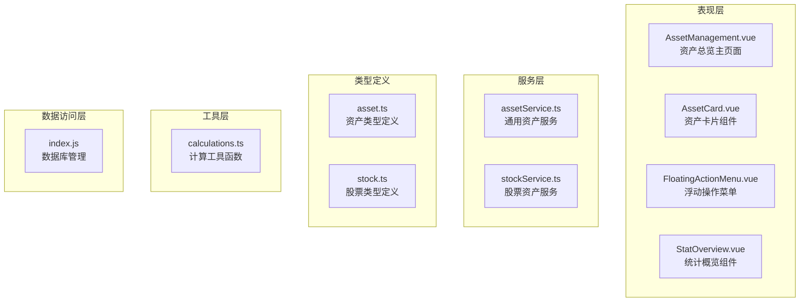

**图表来源**
- [AssetManagement.vue:1-413](file://src/components/mobile/asset/AssetManagement.vue#L1-L413)
- [AssetCard.vue:1-158](file://src/components/mobile/asset/AssetCard.vue#L1-L158)
- [FloatingActionMenu.vue:1-151](file://src/components/common/FloatingActionMenu.vue#L1-L151)

## 核心组件

### 资产总览主页面

AssetManagement.vue 是资产总览功能的核心组件，采用现代化的Vue 3 Composition API设计，负责：
- 资产数据的加载和展示，使用服务层API获取数据
- 响应式网格布局的实现，支持1-3列自适应布局
- **新增**：集成FloatingActionMenu组件，提供新增资产的快捷入口
- 资产分类的处理逻辑，支持通用资产、股票资产
- **新增**：历史资产视图切换功能，支持资产状态过滤
- **新增**：StatOverview组件集成，提供资产统计概览

### 资产卡片组件

**更新** AssetCard.vue 提供了统一的资产展示界面，具有以下特性：
- 可自定义的颜色主题系统，支持渐变背景效果
- 图标支持图片和字符两种形式，自动检测图标类型
- **新增**：资产代码显示功能，支持股票代码等标识符
- **增强**：主要金额的双行显示，支持格式化显示
- **增强**：点击事件处理机制，支持资产详情导航

### 浮动操作菜单

**新增** FloatingActionMenu.vue 实现了Material Design风格的浮动操作按钮，支持动态按钮数量：
- **新增**：支持单按钮直击和多按钮展开菜单两种模式
- **新增**：流畅的展开收起动画效果
- **新增**：按钮文字提示功能，支持悬停显示
- **新增**：响应式适配，支持不同设备尺寸

**章节来源**
- [AssetManagement.vue:69-329](file://src/components/mobile/asset/AssetManagement.vue#L69-L329)
- [AssetCard.vue:20-65](file://src/components/mobile/asset/AssetCard.vue#L20-L65)
- [FloatingActionMenu.vue:33-59](file://src/components/common/FloatingActionMenu.vue#L33-L59)

## 架构概览

资产总览功能采用现代化的分层架构设计，确保了良好的可维护性和扩展性：

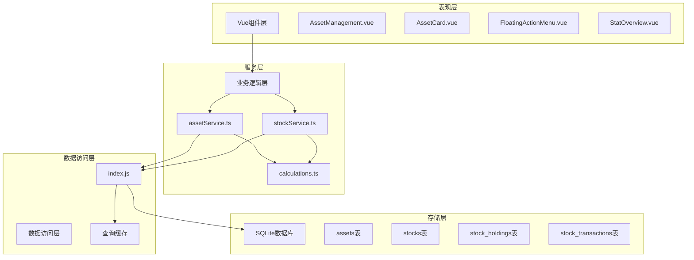

**图表来源**
- [AssetManagement.vue:75-78](file://src/components/mobile/asset/AssetManagement.vue#L75-L78)
- [assetService.ts:6-7](file://src/services/asset/assetService.ts#L6-L7)
- [stockService.ts:6-17](file://src/services/asset/stockService.ts#L6-L17)

## 详细组件分析

### 资产总览主页面分析

#### 响应式网格系统

资产总览采用了基于CSS Grid的响应式布局系统，支持1-3列自适应布局：

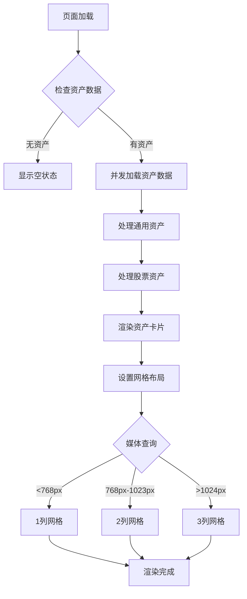

**图表来源**
- [AssetManagement.vue:353-413](file://src/components/mobile/asset/AssetManagement.vue#L353-L413)

#### 资产价值计算逻辑

系统实现了两种类型的资产价值计算，采用现代化的服务层架构：

| 资产类型 | 计算公式 | 服务层实现 | 字段映射 |
|---------|---------|-----------|---------|
| 通用资产 | `amount` | assetService.ts | 直接使用数据库中的金额字段 |
| 股票资产 | `costPrice × quantity` | stockService.ts | 成本价 × 股数 |

#### 历史资产视图功能

**新增** 历史资产视图功能，支持资产状态切换：

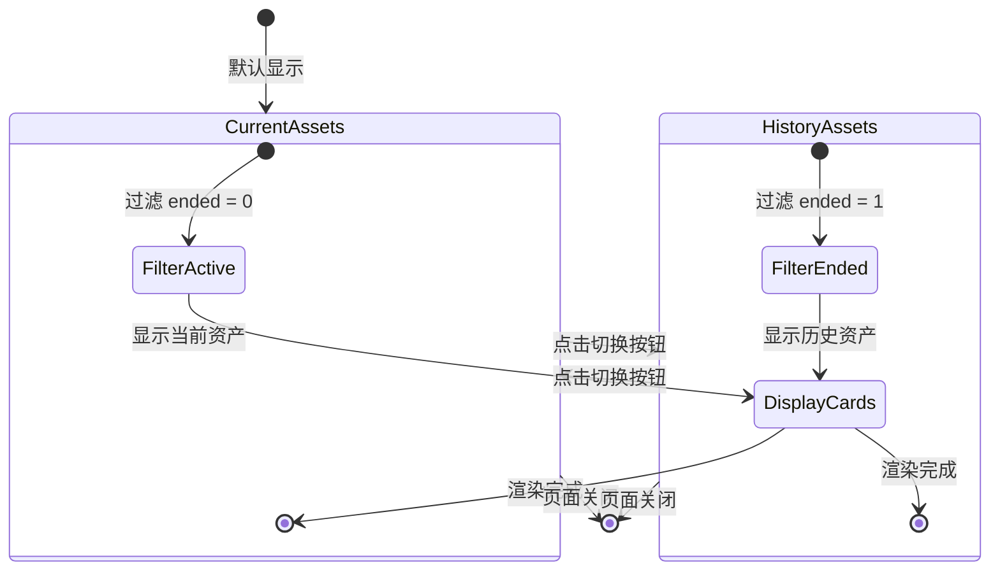

**图表来源**
- [AssetManagement.vue:110-114](file://src/components/mobile/asset/AssetManagement.vue#L110-L114)

#### 无资产状态处理

当用户没有任何资产时，系统会显示友好的空状态界面：

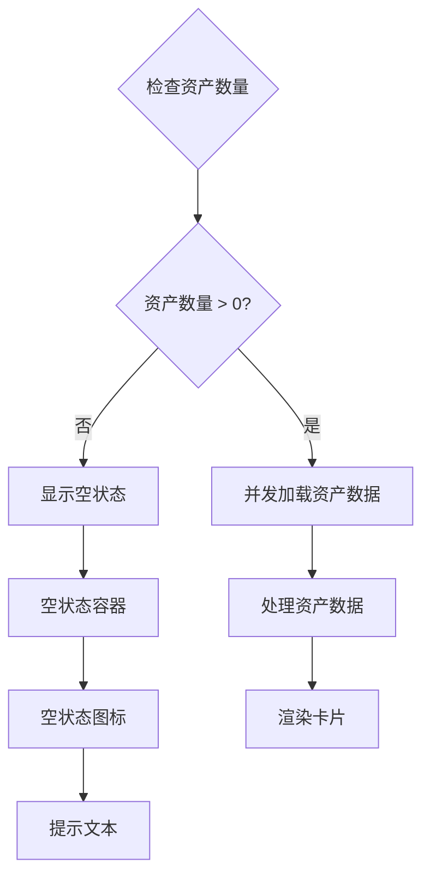

**图表来源**
- [AssetManagement.vue:11-15](file://src/components/mobile/asset/AssetManagement.vue#L11-L15)

**章节来源**
- [AssetManagement.vue:115-146](file://src/components/mobile/asset/AssetManagement.vue#L115-L146)
- [AssetManagement.vue:110-114](file://src/components/mobile/asset/AssetManagement.vue#L110-L114)

### 资产卡片组件分析

#### 设计模式和架构

**更新** AssetCard.vue 采用了Vue 3 Composition API 的设计模式，支持现代化的组件开发：

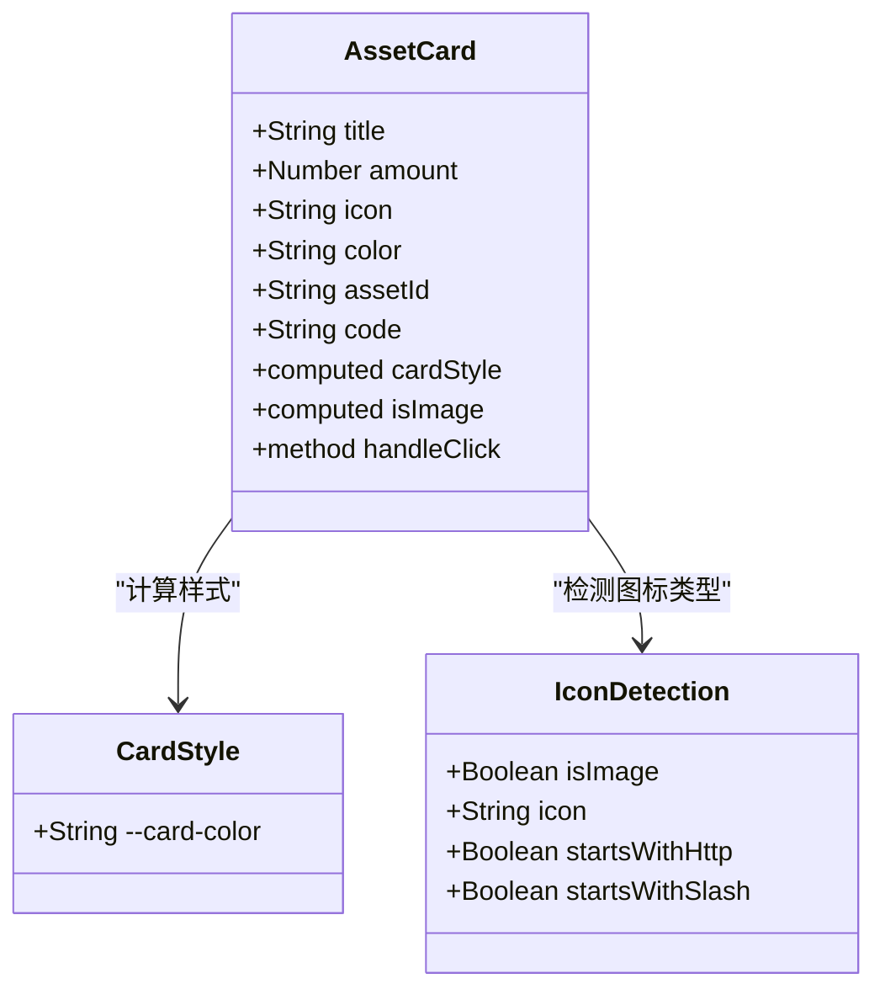

**图表来源**
- [AssetCard.vue:20-65](file://src/components/mobile/asset/AssetCard.vue#L20-L65)

#### 图标和颜色主题系统

组件支持灵活的图标和颜色配置，采用现代化的渐变背景设计：

| 属性 | 类型 | 默认值 | 说明 |
|------|------|--------|------|
| title | String | '默认样式' | 资产名称显示 |
| amount | Number | 0 | 主要金额显示（格式化为两位小数） |
| icon | String | '💳' | 图标内容（支持图片URL或字符） |
| color | String | '#1890ff' | 卡片主题颜色，支持渐变效果 |
| code | String | '' | 资产代码显示（如股票代码） |

#### 金额显示格式化

系统采用统一的金额格式化策略：
- 主要金额：显示为 ¥XX.XX 的格式，使用 `toFixed(2)` 方法
- 自动四舍五入到分位

#### 点击事件处理机制

**更新** 增强的点击事件处理机制支持不同类型的资产导航：

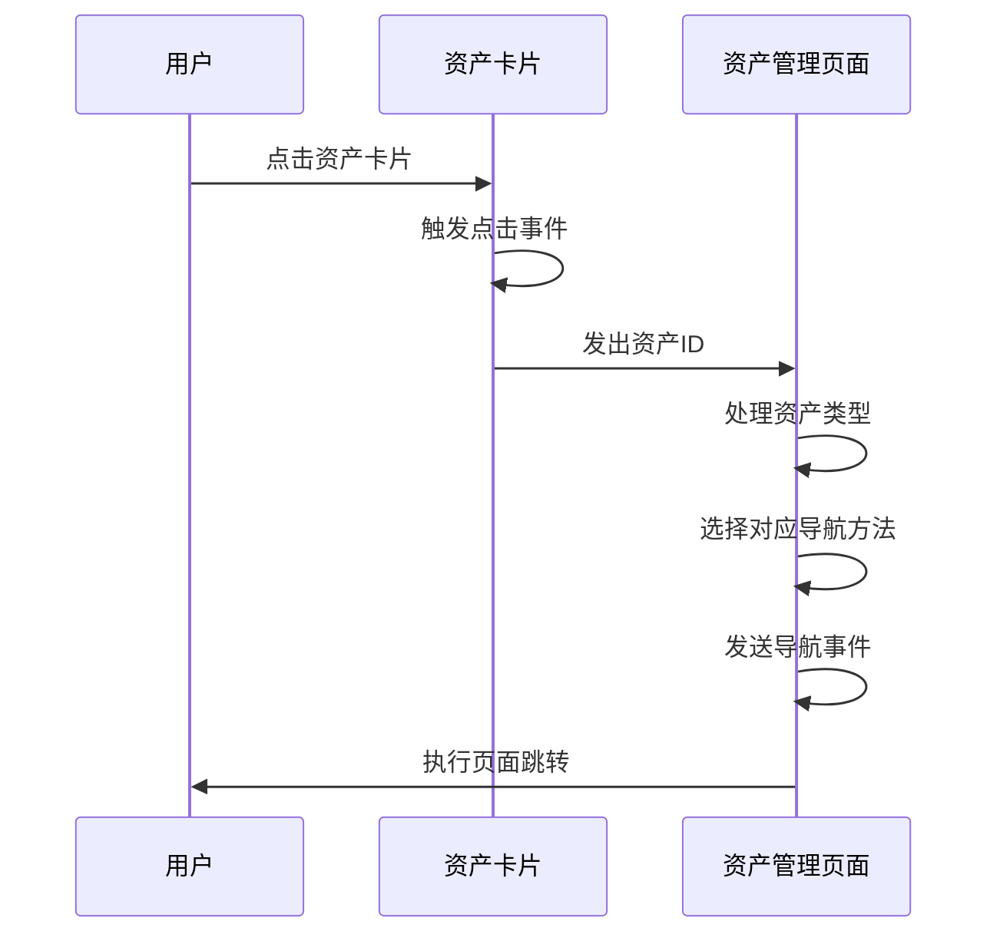

**图表来源**
- [AssetCard.vue:62-64](file://src/components/mobile/asset/AssetCard.vue#L62-L64)
- [AssetManagement.vue:297-310](file://src/components/mobile/asset/AssetManagement.vue#L297-L310)

**章节来源**
- [AssetCard.vue:133-158](file://src/components/mobile/asset/AssetCard.vue#L133-L158)
- [AssetCard.vue:58-65](file://src/components/mobile/asset/AssetCard.vue#L58-L65)

### 浮动操作菜单分析

#### 交互设计模式

**新增** FloatingActionMenu.vue 实现了Material Design风格的浮动操作按钮，支持动态按钮数量：

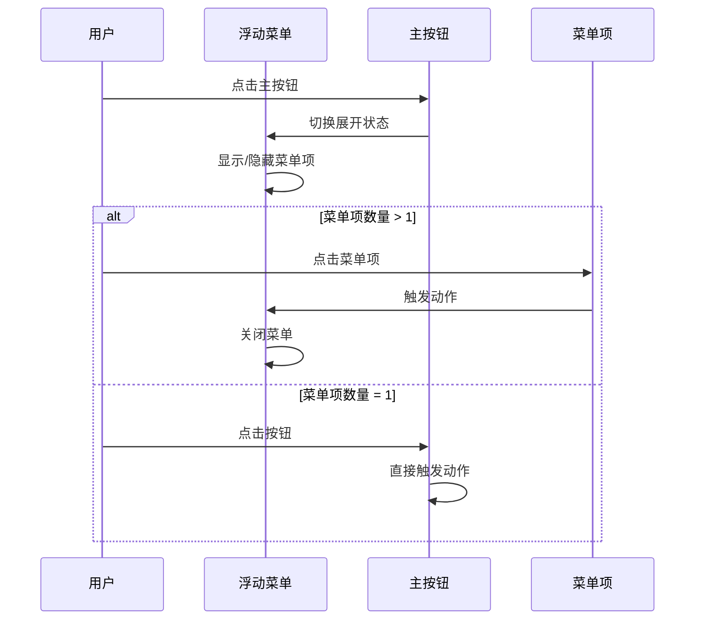

**图表来源**
- [FloatingActionMenu.vue:12-29](file://src/components/common/FloatingActionMenu.vue#L12-L29)

#### 动画和过渡效果

菜单系统包含了流畅的动画过渡效果：
- 淡入淡出动画（fadeIn）
- 缩放变换效果，初始缩放0.8倍
- 悬停状态的视觉反馈，放大1.1倍
- 文字提示的滑入动画，从右向左平移

#### 响应式适配

浮动菜单在不同设备上都有良好的适配：
- 移动端：固定定位，底部间距80px
- 平板和桌面：保持相同的交互模式
- 触摸友好的尺寸设计（48px直径）
- **新增**：支持动态按钮数量配置

**章节来源**
- [FloatingActionMenu.vue:61-151](file://src/components/common/FloatingActionMenu.vue#L61-L151)

### 数据加载和错误处理机制

#### 异步数据加载流程

系统采用了并发的数据加载策略，使用现代化的服务层架构：

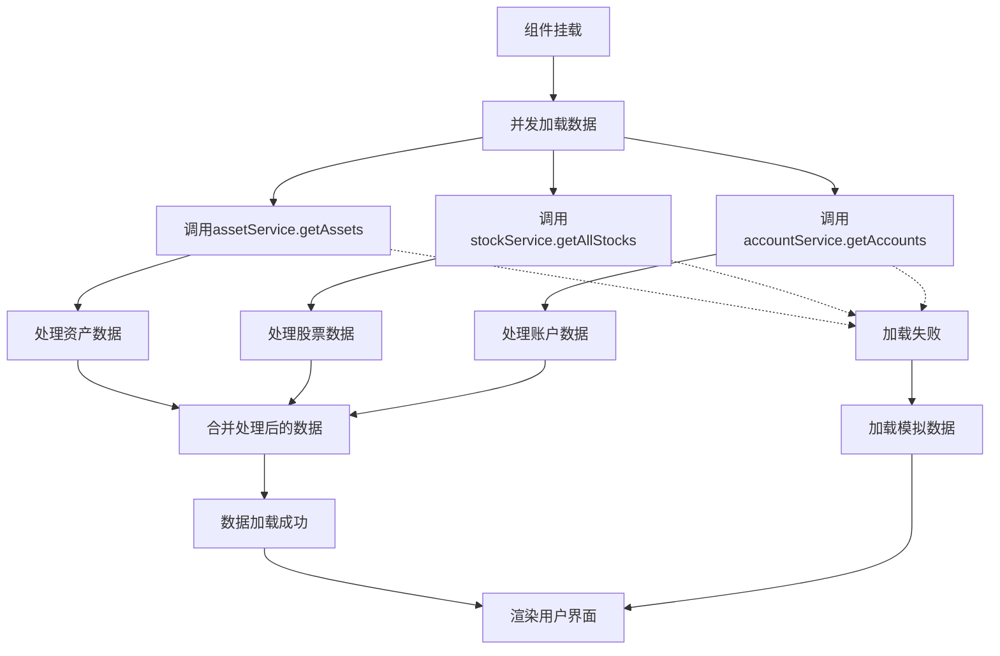

**图表来源**
- [AssetManagement.vue:208-246](file://src/components/mobile/asset/AssetManagement.vue#L208-L246)

#### 错误处理策略

系统实现了多层次的错误处理机制：
1. **服务层错误处理**：每个服务模块独立处理数据库操作错误
2. **网络异常处理**：在Web环境中优雅降级
3. **数据验证**：对关键字段进行验证和清理
4. **用户反馈**：通过控制台日志和错误提示

#### 模拟数据机制

当数据库加载失败时，系统会自动切换到模拟数据模式：
- 股票数据：空数组占位
- 账户数据：空数组占位
- 界面保持一致的用户体验

**章节来源**
- [AssetManagement.vue:248-291](file://src/components/mobile/asset/AssetManagement.vue#L248-L291)

## 服务层架构

### 服务层设计原则

**新增** 资产总览功能集成了现代化的服务层架构，采用以下设计原则：

- **单一职责原则**：每个服务模块专注于特定的业务领域
- **依赖注入**：通过构造函数注入数据库连接和工具函数
- **错误隔离**：每个服务模块独立处理业务逻辑错误
- **数据验证**：在服务层进行数据输入验证

### 资产服务层

assetService.ts 提供通用资产的完整业务逻辑：

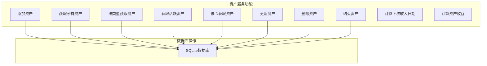

**图表来源**
- [assetService.ts:86-218](file://src/services/asset/assetService.ts#L86-L218)

### 股票服务层

stockService.ts 提供复杂的股票资产业务逻辑：

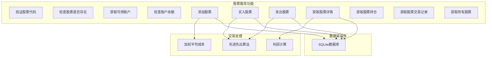

**图表来源**
- [stockService.ts:24-138](file://src/services/asset/stockService.ts#L24-L138)

**章节来源**
- [assetService.ts:1-218](file://src/services/asset/assetService.ts#L1-L218)
- [stockService.ts:1-200](file://src/services/asset/stockService.ts#L1-L200)

## 数据类型定义

### 资产类型定义

**新增** 专门的类型定义文件，提供强类型支持：

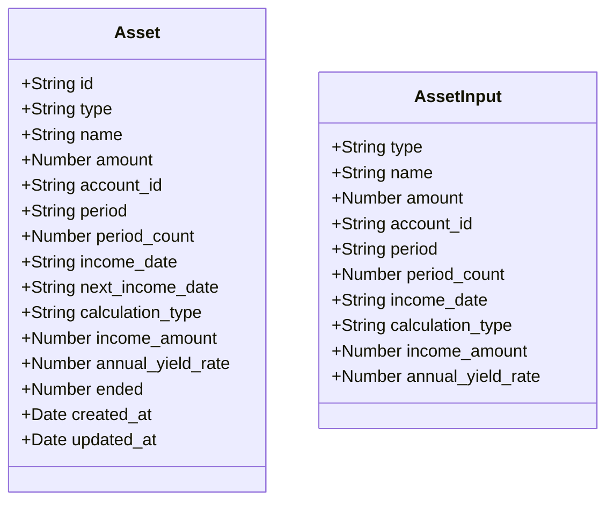

**图表来源**
- [asset.ts:8-39](file://src/types/asset/asset.ts#L8-L39)

### 股类型定义

**新增** 股票资产的完整类型定义：

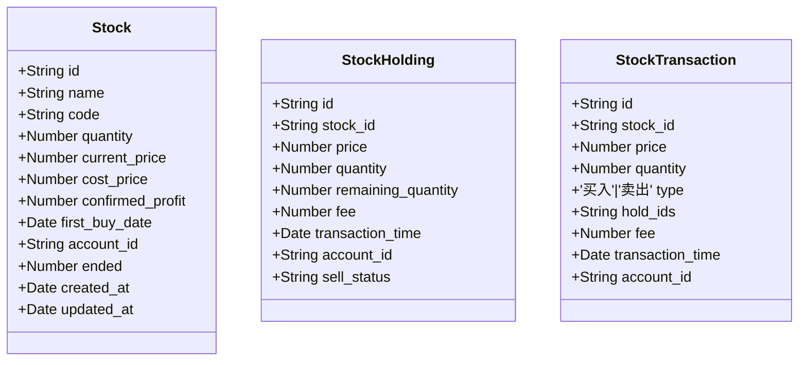

**图表来源**
- [stock.ts:8-97](file://src/types/asset/stock.ts#L8-L97)

**章节来源**
- [asset.ts:1-39](file://src/types/asset/asset.ts#L1-L39)
- [stock.ts:1-97](file://src/types/asset/stock.ts#L1-L97)

## 计算工具函数

### 计算工具函数

**新增** 专门的计算工具模块，提供复杂数学计算：

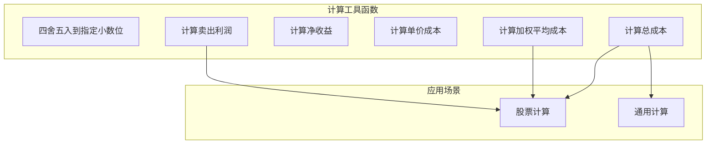

**图表来源**
- [calculations.ts:8-102](file://src/utils/calculations.ts#L8-L102)

### 数学计算算法

系统实现了多种数学计算算法：

| 计算类型 | 函数名 | 算法描述 | 应用场景 |
|---------|--------|---------|---------|
| 基础运算 | roundToDecimals | 四舍五入到指定小数位 | 金额格式化 |
| 股票计算 | calculateTotalCost | (price × quantity) + fee | 买入成本计算 |
| 股票计算 | calculateWeightedCostPrice | 加权平均成本 | 追加购买成本 |
| 股票计算 | calculateSellProfit | (sellPrice - costPrice) × quantity - fee | 卖出利润计算 |

**章节来源**
- [calculations.ts:1-102](file://src/utils/calculations.ts#L1-L102)

## 依赖关系分析

### 组件间依赖关系

**更新** 服务层架构改变了原有的依赖关系：

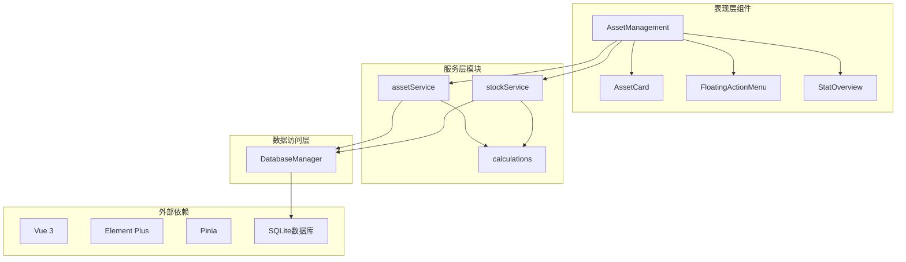

**图表来源**
- [AssetManagement.vue:75-78](file://src/components/mobile/asset/AssetManagement.vue#L75-L78)
- [assetService.ts:6-7](file://src/services/asset/assetService.ts#L6-L7)
- [stockService.ts:6-17](file://src/services/asset/stockService.ts#L6-L17)

### 服务层依赖分析

**新增** 服务层模块间的依赖关系：

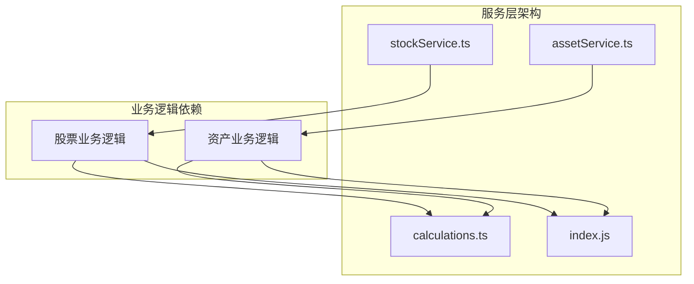

**图表来源**
- [assetService.ts:1-218](file://src/services/asset/assetService.ts#L1-L218)
- [stockService.ts:1-200](file://src/services/asset/stockService.ts#L1-L200)

### 数据库依赖分析

系统使用了现代化的数据库管理类，支持多种部署环境：

| 功能模块 | 数据表 | 查询操作 | 写入操作 | 环境支持 |
|---------|--------|----------|----------|---------|
| 资产管理 | assets | SELECT | INSERT, UPDATE, DELETE | Capacitor SQLite, SQL.js |
| 股票管理 | stocks, stock_holdings, stock_transactions | SELECT | INSERT, UPDATE | Capacitor SQLite, SQL.js |
| 账户管理 | accounts, transactions | SELECT | INSERT, UPDATE | Capacitor SQLite, SQL.js |

**章节来源**
- [index.js:21-32](file://src/database/index.js#L21-L32)
- [AssetManagement.vue:211-216](file://src/components/mobile/asset/AssetManagement.vue#L211-L216)

## 性能考虑

### 响应式布局优化

系统采用了渐进增强的响应式设计：
- **移动端优先**：默认1列网格布局，优化触摸体验
- **平板适配**：768px及以上显示2列，平衡空间利用
- **桌面优化**：1024px及以上显示3列，最大化信息密度
- **性能优化**：使用CSS Grid而非JavaScript布局计算
- **动画优化**：使用硬件加速的CSS3动画

### 数据加载性能

**更新** 采用现代化的并发数据加载策略：

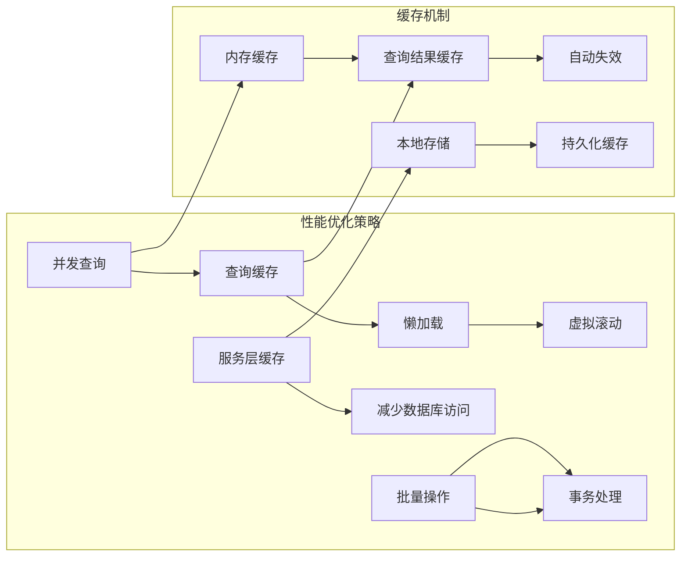

### 内存管理

系统实现了智能的内存管理策略：
- **组件卸载清理**：自动清理事件监听器和定时器
- **缓存大小限制**：防止内存泄漏，支持LRU缓存淘汰
- **异步操作管理**：避免长时间阻塞UI线程
- **服务层生命周期管理**：优化服务实例的创建和销毁

### 服务层性能优化

**新增** 服务层架构带来的性能提升：
- **模块化设计**：每个服务模块独立优化，避免全局影响
- **数据库连接池**：共享数据库连接，减少连接开销
- **批量操作支持**：支持事务批量处理，提高写入效率
- **计算缓存**：复杂数学计算结果缓存，避免重复计算

## 故障排除指南

### 常见问题诊断

#### 资产数据加载失败

**症状**：页面显示空状态或加载错误
**可能原因**：
1. **服务层连接失败**：数据库连接异常
2. **表结构不匹配**：数据表结构发生变化
3. **权限问题**：数据库访问权限不足

**解决方案**：
1. 检查服务层日志，确认数据库连接状态
2. 验证数据表结构完整性
3. 确认数据库权限设置

#### 资产卡片显示异常

**症状**：卡片布局错乱或样式不正确
**可能原因**：
1. **CSS变量未正确设置**：主题颜色变量缺失
2. **图标路径无效**：图片图标URL不可访问
3. **数据格式不正确**：金额数据格式异常

**解决方案**：
1. 检查CSS变量定义，确认 `--card-color` 设置
2. 验证图标URL有效性，支持HTTP和相对路径
3. 确认数据格式符合预期，数字类型转换

#### 服务层调用失败

**症状**：资产操作无响应或报错
**可能原因**：
1. **服务实例未正确注入**：依赖注入失败
2. **数据库事务异常**：事务执行失败
3. **业务逻辑验证失败**：输入数据验证错误

**解决方案**：
1. 检查服务层依赖注入配置
2. 验证数据库事务的原子性
3. 确认业务逻辑的输入验证规则

#### 浮动菜单交互问题

**症状**：菜单无法展开或点击无响应
**可能原因**：
1. **事件监听器冲突**：多个菜单实例冲突
2. **样式覆盖问题**：CSS优先级导致样式异常
3. **JavaScript错误**：菜单状态管理错误

**解决方案**：
1. 检查事件绑定状态，避免重复绑定
2. 验证样式优先级，确保z-index正确
3. 查看浏览器控制台错误，调试菜单状态

**章节来源**
- [AssetManagement.vue:248-291](file://src/components/mobile/asset/AssetManagement.vue#L248-L291)
- [FloatingActionMenu.vue:56-58](file://src/components/common/FloatingActionMenu.vue#L56-L58)

## 结论

资产总览功能通过现代化的分层架构设计，为用户提供了优秀的资产管理体验。**最新更新**集成了专门的服务层架构和新的FloatingActionMenu组件，显著提升了系统的可维护性和扩展性。系统的主要优势包括：

1. **模块化设计**：清晰的组件分离和职责划分，支持服务层架构
2. **响应式布局**：适应多种设备屏幕尺寸，支持1-3列自适应布局
3. **性能优化**：并发数据加载、智能缓存机制、硬件加速动画
4. **用户体验**：流畅的动画效果、直观的交互设计、历史资产视图
5. **错误处理**：完善的异常处理和降级策略，支持服务层错误隔离
6. **强类型支持**：完整的TypeScript类型定义，提供编译时类型检查
7. **业务逻辑封装**：专业的资产、股票服务层，支持复杂业务场景
8. **现代化组件**：集成FloatingActionMenu组件，提供更好的用户交互体验

该功能为后续的功能扩展奠定了坚实的基础，包括资产详情展示、交易记录管理、高级分析功能等。

## 附录

### 样式定制指南

#### 主题颜色定制

可以通过修改CSS变量来自定义主题颜色：
```css
:root {
  --card-color: #409eff; /* 卡片主色调 */
  --background-color: #f5f7fa; /* 页面背景色 */
  --text-primary: #333333; /* 主要文字颜色 */
  --text-secondary: #666666; /* 次要文字颜色 */
  --shadow-color: rgba(64, 158, 255, 0.3); /* 阴影颜色 */
}
```

#### 布局参数调整

网格布局的关键参数可以在以下位置调整：
- `grid-template-columns`: 控制列数（1-3列）
- `gap`: 控制卡片间距（10px）
- `min-height`: 控制最小高度（77vh）

#### 动画效果定制

浮动菜单的动画效果可以通过修改CSS动画属性来定制：
- `animation-duration`: 动画持续时间（0.3s）
- `transform`: 变换效果，支持scale和translate
- `opacity`: 透明度变化，支持0.7到1.0范围

### 代码实现示例

#### 资产卡片组件使用示例

```vue
<!-- 通用资产卡片 -->
<AssetCard 
  :title="资产名称"
  :amount="资产金额"
  :icon="资产图标"
  :color="主题颜色"
  :code="资产代码"
  :assetId="资产ID"
  @click="处理点击事件"
/>

<!-- 股票资产卡片 -->
<AssetCard 
  :title="股票名称"
  :amount="成本价 × 股数"
  :icon="📈"
  :color="股票主题色"
  :code="股票代码"
  :assetId="股票ID"
  @click="跳转到股票详情"
/>
```

#### 服务层调用示例

```typescript
// 资产服务调用
import { getAssets, addAsset } from '@/services/asset/assetService'

const assets = await getAssets()
await addAsset({
  type: '定期存款',
  name: '银行定期存款',
  amount: 50000,
  account_id: 'account_123'
})

// 股票服务调用
import { getAllStocks, buyStock } from '@/services/asset/stockService'

const stocks = await getAllStocks()
await buyStock('stock_123', {
  price: 150,
  quantity: 100,
  fee: 10,
  transaction_time: new Date(),
  account_id: 'account_123'
})
```

#### 数据绑定示例

```typescript
// 资产数据绑定
const assetData = {
  id: '资产ID',
  name: '资产名称',
  amount: 10000, // 金额
  icon: '💼', // 图标
  color: '#52c41a', // 颜色
  code: 'ASSET001' // 资产代码
}

// 股票数据绑定
const stockData = {
  id: '股票ID',
  name: '股票名称',
  costPrice: 100, // 成本价
  quantity: 100, // 股数
  currentPrice: 120, // 当前价
  icon: '📈',
  color: '#faad14',
  code: '000001' // 股票代码
}

// 收益计算
const calculateReturns = (stock: Stock) => {
  const costAmount = stock.costPrice * stock.quantity
  const holdReturn = (stock.currentPrice - stock.costPrice) * stock.quantity
  const totalReturn = holdReturn + (stock.confirmedProfit || 0)
  
  return {
    costAmount,
    holdReturn,
    totalReturn
  }
}
```

#### 历史资产视图切换

```typescript
// 切换当前/历史资产视图
const toggleAssetsView = () => {
  showEndedAssets.value = !showEndedAssets.value
}

// 过滤资产状态
const displayGeneralAssets = computed(() => {
  return generalAssets.value.filter(asset => {
    const isEnded = asset.ended === 1
    return showEndedAssets.value ? isEnded : !isEnded
  })
})
```

#### 浮动操作菜单配置

```typescript
// 菜单按钮配置
const actionButtons = computed(() => {
  const buttons = [
    {
      text: '新增通用资产',
      icon: Goods,
      action: navigateToAddAsset
    },
    {
      text: '新增股票',
      icon: TrendCharts,
      action: navigateToAddStock
    },
    {
      text: '新增基金',
      icon: DataAnalysis,
      action: navigateToAddFund
    }
  ];
  return buttons;
});

// 单按钮模式
const singleActionButton = [
  {
    text: '新增资产',
    icon: Goods,
    action: navigateToAddAsset
  }
];
```