# 资产总览

<cite>
**本文档引用的文件**
- [AssetManagement.vue](file://src/components/mobile/asset/AssetManagement.vue)
- [AssetCard.vue](file://src/components/mobile/asset/AssetCard.vue)
- [StockDetailPage.vue](file://src/components/mobile/asset/StockDetailPage.vue)
- [FloatingActionMenu.vue](file://src/components/common/FloatingActionMenu.vue)
- [index.js](file://src/database/index.js)
- [AddAssetPage.vue](file://src/components/mobile/asset/AddAssetPage.vue)
- [AddStockPage.vue](file://src/components/mobile/asset/AddStockPage.vue)
- [AddFundPage.vue](file://src/components/mobile/asset/AddFundPage.vue)
- [FundDetailPage.vue](file://src/components/mobile/asset/FundDetailPage.vue)
- [BuyStockPage.vue](file://src/components/mobile/asset/BuyStockPage.vue)
- [SellStockPage.vue](file://src/components/mobile/asset/SellStockPage.vue)
- [App.vue](file://src/App.vue)
- [AppContent.vue](file://src/components/common/AppContent.vue)
</cite>

## 更新摘要
**变更内容**
- 新增股票资产点击导航功能，点击股票卡片直接跳转到股票详情页面
- 更新资产卡片组件的点击事件处理机制
- 增强导航系统以支持股票详情页面的参数传递
- 完善股票交易相关的页面组件

## 目录
1. [简介](#简介)
2. [项目结构](#项目结构)
3. [核心组件](#核心组件)
4. [架构概览](#架构概览)
5. [详细组件分析](#详细组件分析)
6. [依赖关系分析](#依赖关系分析)
7. [性能考虑](#性能考虑)
8. [故障排除指南](#故障排除指南)
9. [结论](#结论)
10. [附录](#附录)

## 简介

资产总览功能是金融应用中的核心模块，负责展示用户的各类资产情况。该功能实现了响应式的网格布局系统，支持通用资产、股票资产和基金资产的分类展示，并提供了完整的资产价值计算逻辑和用户交互体验。**最新更新**集成了股票详情导航功能，点击股票资产将直接跳转到股票详情页面，提供更流畅的用户体验。

## 项目结构

资产总览功能主要由以下文件组成：

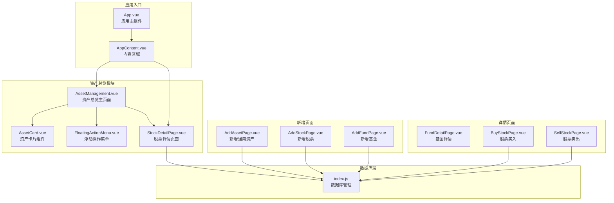

**图表来源**
- [AssetManagement.vue:1-471](file://src/components/mobile/asset/AssetManagement.vue#L1-L471)
- [AssetCard.vue:1-180](file://src/components/mobile/asset/AssetCard.vue#L1-L180)
- [StockDetailPage.vue:1-633](file://src/components/mobile/asset/StockDetailPage.vue#L1-L633)
- [FloatingActionMenu.vue:1-151](file://src/components/common/FloatingActionMenu.vue#L1-L151)
- [index.js:1-935](file://src/database/index.js#L1-L935)

**章节来源**
- [AssetManagement.vue:1-471](file://src/components/mobile/asset/AssetManagement.vue#L1-L471)
- [App.vue:33-89](file://src/App.vue#L33-L89)

## 核心组件

### 资产总览主页面

AssetManagement.vue 是资产总览功能的核心组件，负责：
- 资产数据的加载和展示
- 响应式网格布局的实现
- 浮动操作菜单的集成
- 资产分类的处理逻辑
- **新增**：股票资产点击导航功能

### 资产卡片组件

AssetCard.vue 提供了统一的资产展示界面，具有以下特性：
- 可自定义的颜色主题系统
- 图标支持图片和字符两种形式
- 主要金额和次要金额的双行显示
- **更新**：增强的点击事件处理机制

### 股票详情页面

StockDetailPage.vue 是新增的核心页面组件，提供：
- 股票基本信息展示
- 持有记录、买入记录、卖出记录的详细展示
- 股票交易操作功能
- 实时收益计算和显示

### 数据库管理系统

index.js 实现了跨平台的数据库访问层，支持：
- Capacitor SQLite（原生平台）
- SQL.js（Web平台）
- 自动连接管理和缓存机制
- 批处理和事务支持

**章节来源**
- [AssetManagement.vue:75-228](file://src/components/mobile/asset/AssetManagement.vue#L75-L228)
- [AssetCard.vue:21-66](file://src/components/mobile/asset/AssetCard.vue#L21-L66)
- [StockDetailPage.vue:172-429](file://src/components/mobile/asset/StockDetailPage.vue#L172-L429)
- [index.js:21-800](file://src/database/index.js#L21-L800)

## 架构概览

资产总览功能采用分层架构设计，确保了良好的可维护性和扩展性：

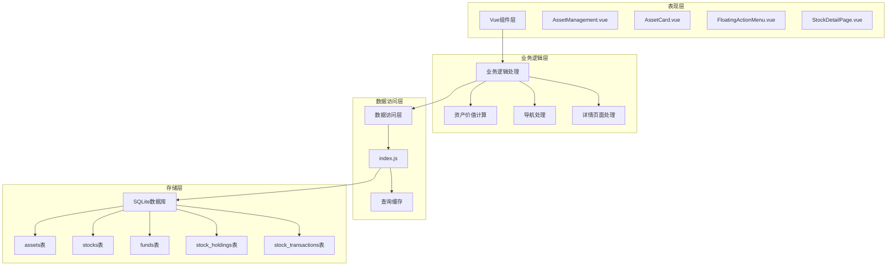

**图表来源**
- [AssetManagement.vue:141-183](file://src/components/mobile/asset/AssetManagement.vue#L141-L183)
- [index.js:199-264](file://src/database/index.js#L199-L264)

## 详细组件分析

### 资产总览主页面分析

#### 响应式网格系统

资产总览采用了基于CSS Grid的响应式布局系统：

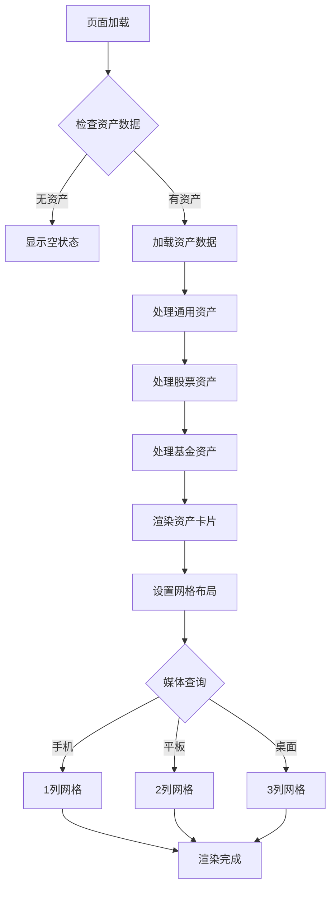

**图表来源**
- [AssetManagement.vue:252-381](file://src/components/mobile/asset/AssetManagement.vue#L252-L381)

#### 资产价值计算逻辑

系统实现了三种类型的资产价值计算：

| 资产类型 | 计算公式 | 字段映射 |
|---------|---------|---------|
| 通用资产 | `amount` | 直接使用数据库中的金额字段 |
| 股票资产 | `costPrice × quantity` | 成本价 × 股数 |
| 基金资产 | `cost_nav × shares` | 成本净值 × 份额 |

#### 无资产状态处理

当用户没有任何资产时，系统会显示友好的空状态界面：

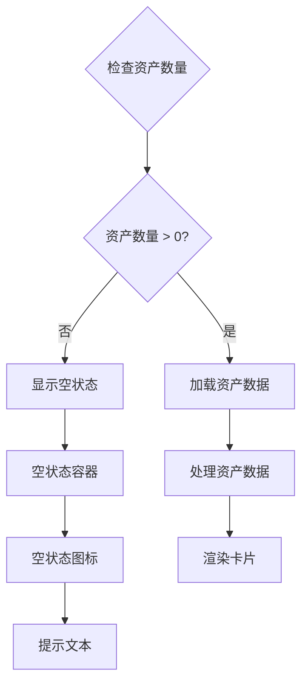

**图表来源**
- [AssetManagement.vue:5-7](file://src/components/mobile/asset/AssetManagement.vue#L5-L7)

#### 股票资产导航功能

**更新** 新增的股票资产点击导航功能实现了无缝的用户体验：

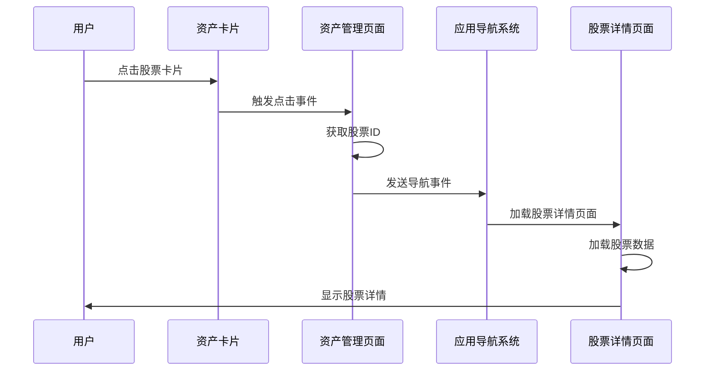

**图表来源**
- [AssetManagement.vue:247-250](file://src/components/mobile/asset/AssetManagement.vue#L247-L250)
- [App.vue:140-158](file://src/App.vue#L140-L158)

**章节来源**
- [AssetManagement.vue:27-46](file://src/components/mobile/asset/AssetManagement.vue#L27-L46)
- [AssetManagement.vue:145-183](file://src/components/mobile/asset/AssetManagement.vue#L145-L183)
- [AssetManagement.vue:247-250](file://src/components/mobile/asset/AssetManagement.vue#L247-L250)

### 资产卡片组件分析

#### 设计模式和架构

AssetCard.vue 采用了Vue 3 Composition API 的设计模式：

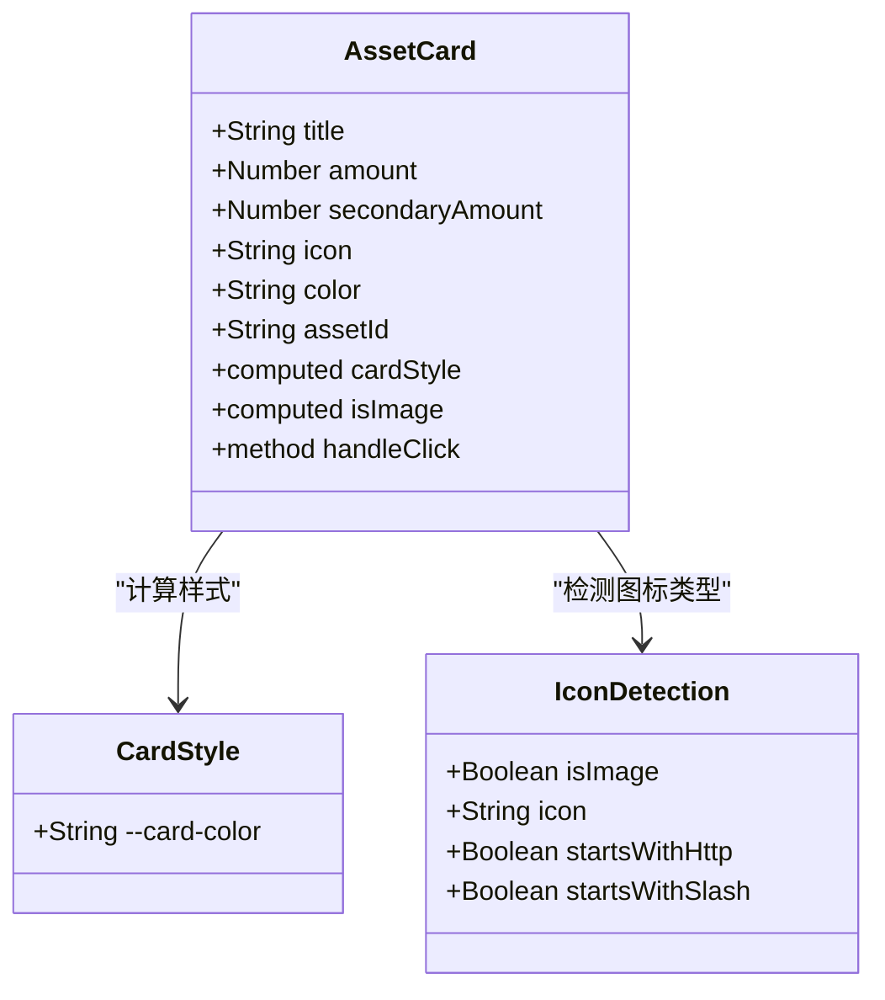

**图表来源**
- [AssetCard.vue:24-65](file://src/components/mobile/asset/AssetCard.vue#L24-L65)

#### 图标和颜色主题系统

组件支持灵活的图标和颜色配置：

| 属性 | 类型 | 默认值 | 说明 |
|------|------|--------|------|
| title | String | '默认样式' | 资产名称显示 |
| amount | Number | 0 | 主要金额显示（格式化为两位小数） |
| secondaryAmount | Number | 0 | 次要金额显示（如成本价） |
| icon | String | '💳' | 图标内容（支持图片URL或字符） |
| color | String | '#1890ff' | 卡片主题颜色 |
| assetId | String | '' | 资产标识符 |

#### 金额显示格式化

系统采用统一的金额格式化策略：
- 主要金额：显示为 ¥XX.XX 的格式
- 次要金额：显示为 ¥XX.XX 的格式
- 自动四舍五入到分位

#### 点击事件处理机制

**更新** 增强的点击事件处理机制支持不同类型的资产导航：

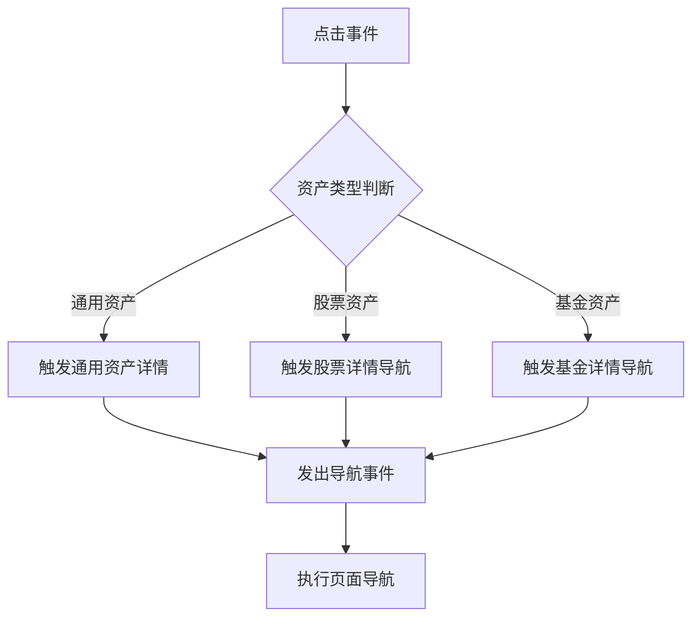

**图表来源**
- [AssetCard.vue:63-65](file://src/components/mobile/asset/AssetCard.vue#L63-L65)
- [AssetManagement.vue:242-255](file://src/components/mobile/asset/AssetManagement.vue#L242-L255)

**章节来源**
- [AssetCard.vue:136-145](file://src/components/mobile/asset/AssetCard.vue#L136-L145)
- [AssetCard.vue:53-65](file://src/components/mobile/asset/AssetCard.vue#L53-L65)

### 股票详情页面分析

#### 页面架构设计

StockDetailPage.vue 采用了完整的页面架构设计：

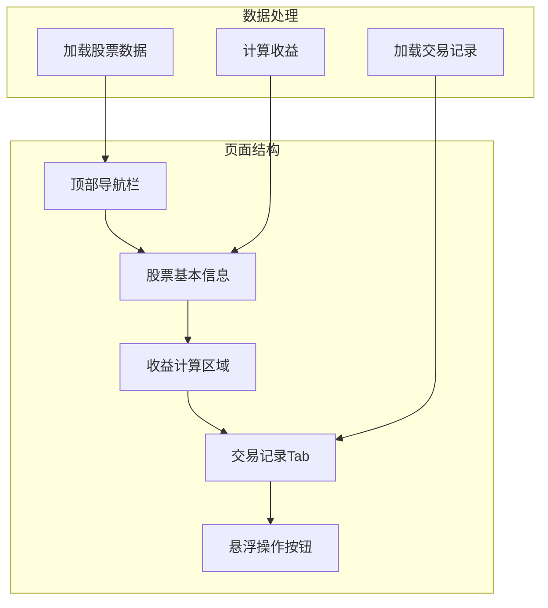

**图表来源**
- [StockDetailPage.vue:1-633](file://src/components/mobile/asset/StockDetailPage.vue#L1-L633)

#### 收益计算逻辑

页面实现了精确的收益计算系统：

| 计算项目 | 公式 | 字段来源 |
|---------|------|---------|
| 成本金额 | `quantity × cost_price` | 股票持有数量 × 成本价 |
| 持有收益 | `(current_price - cost_price) × quantity` | 当前价差 × 股数 |
| 确认收益 | 数据库中的已确认收益 | 已完成交易的收益 |
| 总收益 | 持有收益 + 确认收益 | 两者相加 |

#### 交易记录管理

页面支持三种类型的交易记录展示：
- **持有记录**：显示股票的持有状态和剩余数量
- **买入记录**：显示买入价格、数量和手续费
- **卖出记录**：显示卖出价格、数量和手续费

**章节来源**
- [StockDetailPage.vue:172-429](file://src/components/mobile/asset/StockDetailPage.vue#L172-L429)

### 浮动操作菜单分析

#### 交互设计模式

FloatingActionMenu.vue 实现了Material Design风格的浮动操作按钮：

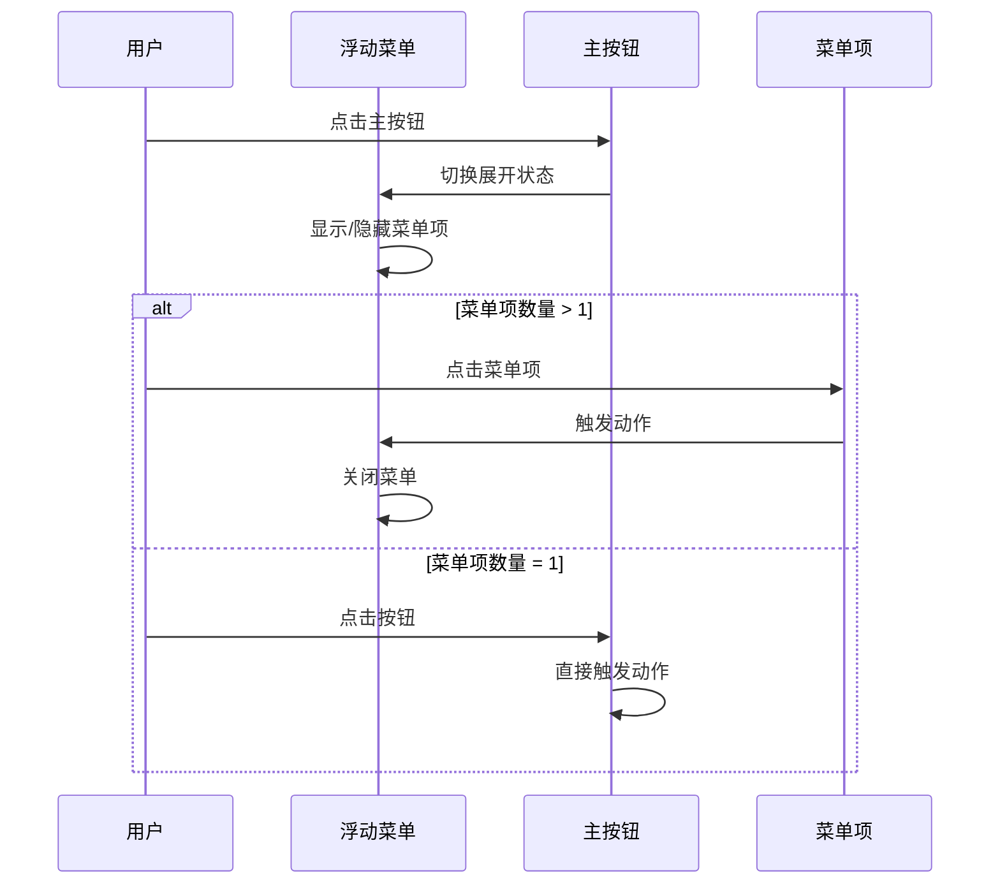

**图表来源**
- [FloatingActionMenu.vue:12-29](file://src/components/common/FloatingActionMenu.vue#L12-L29)

#### 动画和过渡效果

菜单系统包含了流畅的动画过渡效果：
- 淡入淡出动画（fadeIn）
- 缩放变换效果
- 悬停状态的视觉反馈
- 文字提示的滑入动画

#### 响应式适配

浮动菜单在不同设备上都有良好的适配：
- 移动端：固定定位，底部间距80px
- 平板和桌面：保持相同的交互模式
- 触摸友好的尺寸设计（48px直径）

**章节来源**
- [FloatingActionMenu.vue:13-58](file://src/components/common/FloatingActionMenu.vue#L13-L58)
- [FloatingActionMenu.vue:141-150](file://src/components/common/FloatingActionMenu.vue#L141-L150)

### 数据加载和错误处理机制

#### 异步数据加载流程

系统采用了并发的数据加载策略以提升性能：

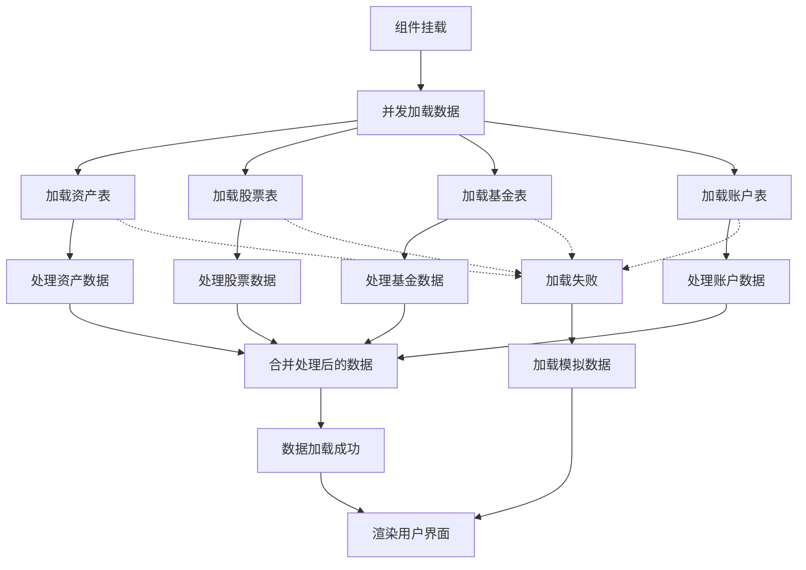

**图表来源**
- [AssetManagement.vue:141-183](file://src/components/mobile/asset/AssetManagement.vue#L141-L183)

#### 错误处理策略

系统实现了多层次的错误处理机制：

1. **数据库查询错误**：捕获并记录错误，使用模拟数据作为后备
2. **网络异常处理**：在Web环境中优雅降级
3. **数据验证**：对关键字段进行验证和清理
4. **用户反馈**：通过控制台日志和错误提示

#### 模拟数据机制

当数据库加载失败时，系统会自动切换到模拟数据模式：
- 股票数据：空数组占位
- 账户数据：空数组占位
- 界面保持一致的用户体验

**章节来源**
- [AssetManagement.vue:178-195](file://src/components/mobile/asset/AssetManagement.vue#L178-L195)
- [index.js:254-263](file://src/database/index.js#L254-L263)

## 依赖关系分析

### 组件间依赖关系

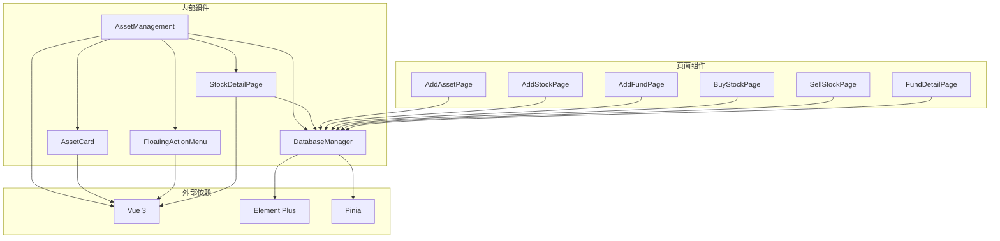

**图表来源**
- [AssetManagement.vue:77-79](file://src/components/mobile/asset/AssetManagement.vue#L77-L79)
- [App.vue:34-52](file://src/App.vue#L34-L52)

### 导航系统依赖分析

**更新** 新增的导航系统支持多层级页面跳转：

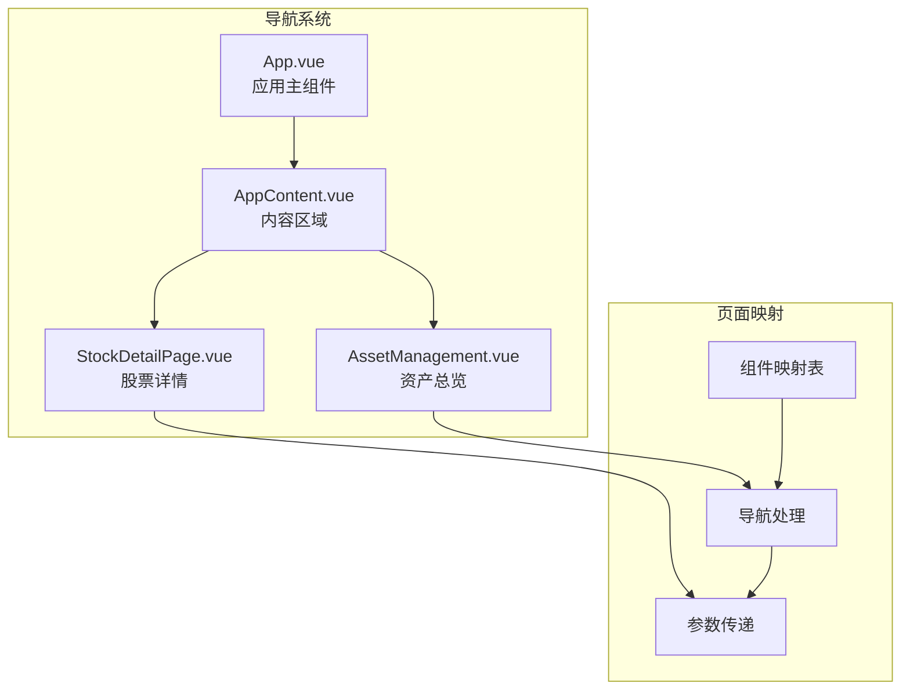

**图表来源**
- [App.vue:68-95](file://src/App.vue#L68-L95)
- [App.vue:140-158](file://src/App.vue#L140-L158)

### 数据库依赖分析

系统使用了单一的数据库管理类来处理所有数据访问需求：

| 功能模块 | 数据表 | 查询操作 | 写入操作 |
|---------|--------|----------|----------|
| 资产管理 | assets | SELECT | INSERT, UPDATE, DELETE |
| 股票管理 | stocks, stock_holdings, stock_transactions | SELECT | INSERT, UPDATE |
| 基金管理 | funds, fund_holdings, fund_transactions | SELECT | INSERT, UPDATE |
| 账户管理 | accounts, transactions | SELECT | INSERT, UPDATE |

**章节来源**
- [index.js:469-602](file://src/database/index.js#L469-L602)
- [AssetManagement.vue:148-153](file://src/components/mobile/asset/AssetManagement.vue#L148-L153)

## 性能考虑

### 响应式布局优化

系统采用了渐进增强的响应式设计：
- **移动端优先**：默认1列网格布局
- **平板适配**：768px及以上显示2列
- **桌面优化**：1024px及以上显示3列
- **性能优化**：使用CSS Grid而非JavaScript布局计算

### 数据加载性能

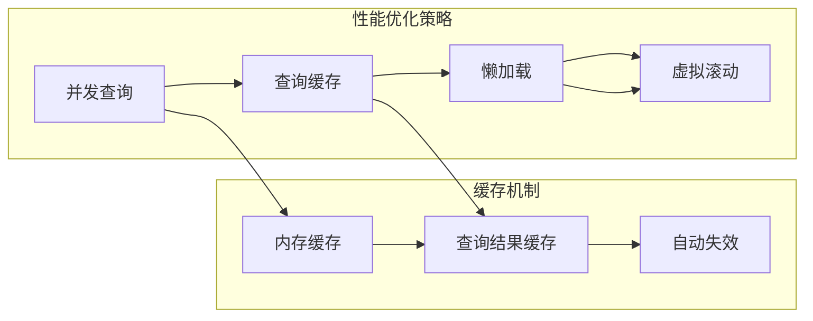

### 内存管理

系统实现了智能的内存管理策略：
- **组件卸载清理**：自动清理事件监听器
- **缓存大小限制**：防止内存泄漏
- **异步操作管理**：避免长时间阻塞UI线程

### 股票详情页面优化

**更新** 股票详情页面采用了多项性能优化措施：
- **延迟加载**：交易记录按需加载
- **数据分页**：大量交易记录分页显示
- **缓存策略**：股票基本信息缓存
- **防抖处理**：频繁操作的防抖优化

## 故障排除指南

### 常见问题诊断

#### 资产数据加载失败

**症状**：页面显示空状态或加载错误
**可能原因**：
1. 数据库连接失败
2. 表结构不匹配
3. 权限问题

**解决方案**：
1. 检查数据库连接状态
2. 验证表结构完整性
3. 确认数据库权限设置

#### 资产卡片显示异常

**症状**：卡片布局错乱或样式不正确
**可能原因**：
1. CSS变量未正确设置
2. 图标路径无效
3. 数据格式不正确

**解决方案**：
1. 检查CSS变量定义
2. 验证图标URL有效性
3. 确认数据格式符合预期

#### 股票详情页面导航失败

**症状**：点击股票卡片无反应或跳转错误
**可能原因**：
1. 导航事件未正确发出
2. 参数传递错误
3. 页面组件未正确注册

**解决方案**：
1. 检查资产卡片的点击事件处理
2. 验证股票ID参数的正确性
3. 确认StockDetailPage组件已正确注册

#### 浮动菜单交互问题

**症状**：菜单无法展开或点击无响应
**可能原因**：
1. 事件监听器冲突
2. 样式覆盖问题
3. JavaScript错误

**解决方案**：
1. 检查事件绑定状态
2. 验证样式优先级
3. 查看浏览器控制台错误

**章节来源**
- [AssetManagement.vue:178-182](file://src/components/mobile/asset/AssetManagement.vue#L178-L182)
- [FloatingActionMenu.vue:56-58](file://src/components/common/FloatingActionMenu.vue#L56-L58)

## 结论

资产总览功能通过精心设计的组件架构和响应式布局，为用户提供了优秀的资产管理体验。**最新更新**集成了股票详情导航功能，显著提升了用户体验。系统的主要优势包括：

1. **模块化设计**：清晰的组件分离和职责划分
2. **响应式布局**：适应多种设备屏幕尺寸
3. **性能优化**：并发数据加载和智能缓存机制
4. **用户体验**：流畅的动画效果和直观的交互设计
5. **错误处理**：完善的异常处理和降级策略
6. **导航系统**：完整的页面跳转和参数传递机制
7. **股票详情**：详细的股票信息展示和交易管理

该功能为后续的功能扩展奠定了坚实的基础，包括资产详情展示、交易记录管理、股票交易等高级功能。

## 附录

### 样式定制指南

#### 主题颜色定制

可以通过修改CSS变量来自定义主题颜色：
```css
:root {
  --card-color: #409eff; /* 卡片主色调 */
  --background-color: #f5f7fa; /* 页面背景色 */
  --text-primary: #333333; /* 主要文字颜色 */
  --text-secondary: #666666; /* 次要文字颜色 */
}
```

#### 布局参数调整

网格布局的关键参数可以在以下位置调整：
- `grid-template-columns`: 控制列数
- `gap`: 控制卡片间距
- `min-height`: 控制最小高度

#### 动画效果定制

浮动菜单的动画效果可以通过修改CSS动画属性来定制：
- `animation-duration`: 动画持续时间
- `transform`: 变换效果
- `opacity`: 透明度变化

### 代码实现示例

#### 资产卡片组件使用示例

```vue
<!-- 通用资产卡片 -->
<AssetCard 
  :title="资产名称"
  :amount="资产金额"
  :secondary-amount="月收入"
  :icon="资产图标"
  :color="主题颜色"
  :assetId="资产ID"
  @click="处理点击事件"
/>

<!-- 股票资产卡片 -->
<AssetCard 
  :title="股票名称"
  :amount="成本价 × 股数"
  :secondary-amount="成本价"
  :icon="📈"
  :color="股票主题色"
  :assetId="股票ID"
  @click="跳转到股票详情"
/>
```

#### 导航系统使用示例

```javascript
// 资产导航
const navigateToAssetDetail = (assetId) => {
  emit('navigate', { key: 'assetDetail', params: { assetId } });
};

// 股票详情导航
const navigateToStockDetail = (stockId) => {
  emit('navigate', { key: 'stockDetail', params: { stockId } });
};

// 基金详情导航
const navigateToFundDetail = (fundId) => {
  emit('navigate', { key: 'fundDetail', params: { fundId } });
};
```

#### 股票详情页面参数传递

```javascript
// 在App.vue中设置股票详情页面参数
if (activeMenu.value === 'stockDetail' && navParams.value.stockId) {
  props.stockId = navParams.value.stockId;
}

// 在StockDetailPage.vue中接收参数
const props = defineProps({
  stockId: {
    type: String,
    required: true
  }
});
```

#### 数据绑定示例

```javascript
// 资产数据绑定
const assetData = {
  id: '资产ID',
  name: '资产名称',
  amount: 10000, // 金额
  monthlyIncome: 500, // 月收入
  icon: '💼', // 图标
  color: '#52c41a' // 颜色
};

// 股票数据绑定
const stockData = {
  id: '股票ID',
  name: '股票名称',
  costPrice: 100, // 成本价
  quantity: 100, // 股数
  currentPrice: 120, // 当前价
  icon: '📈',
  color: '#faad14'
};

// 收益计算
const calculateReturns = (stock) => {
  const costAmount = stock.costPrice * stock.quantity;
  const holdReturn = (stock.currentPrice - stock.costPrice) * stock.quantity;
  const totalReturn = holdReturn + (stock.confirmedProfit || 0);
  
  return {
    costAmount,
    holdReturn,
    totalReturn
  };
};
```