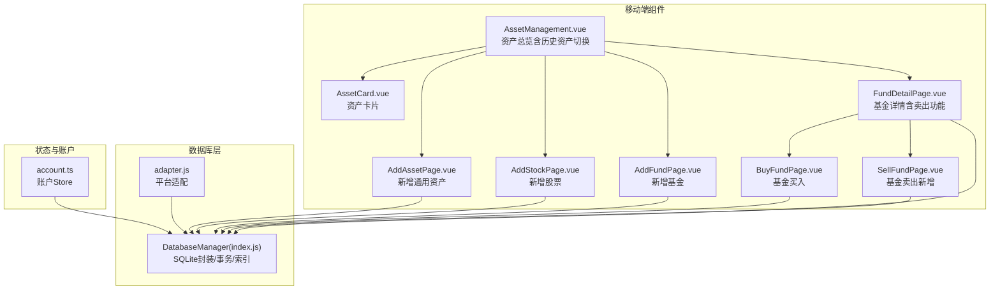
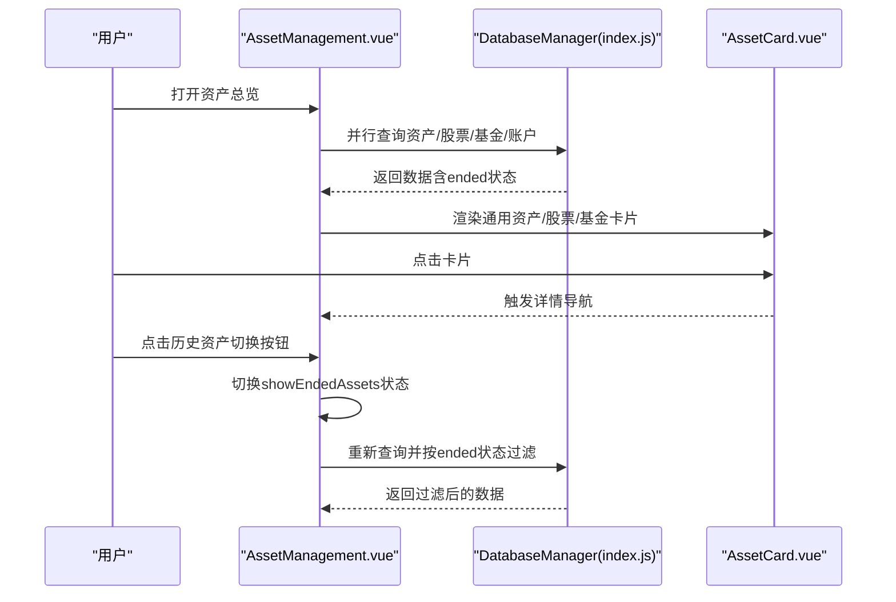
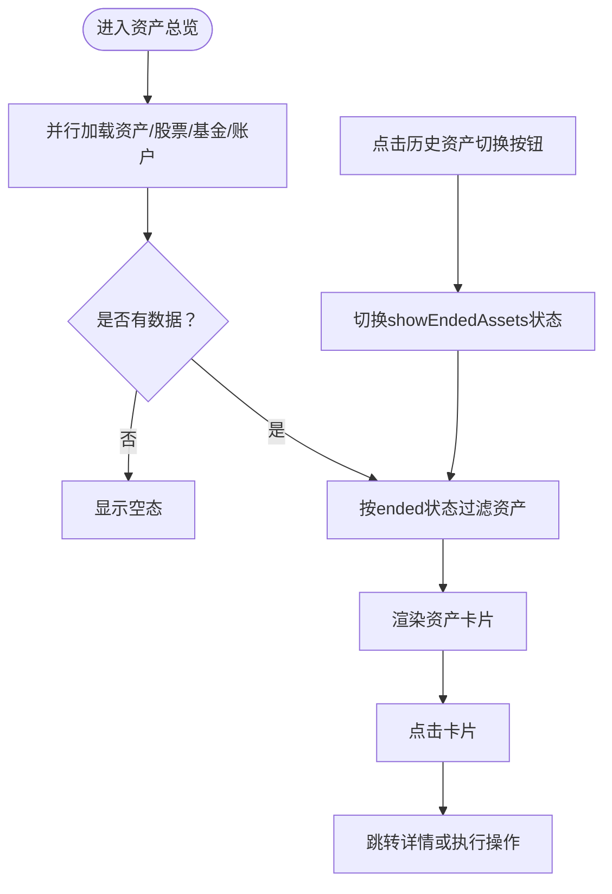
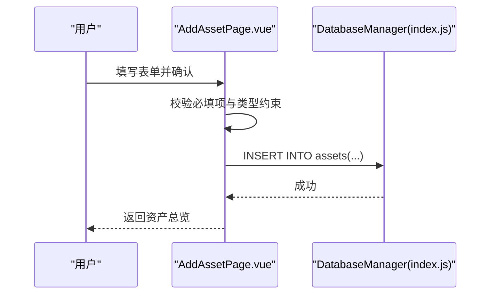
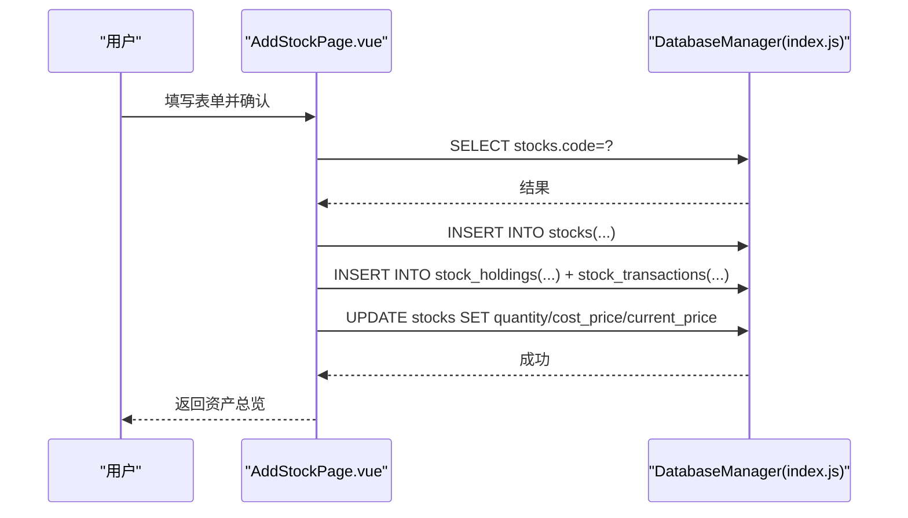
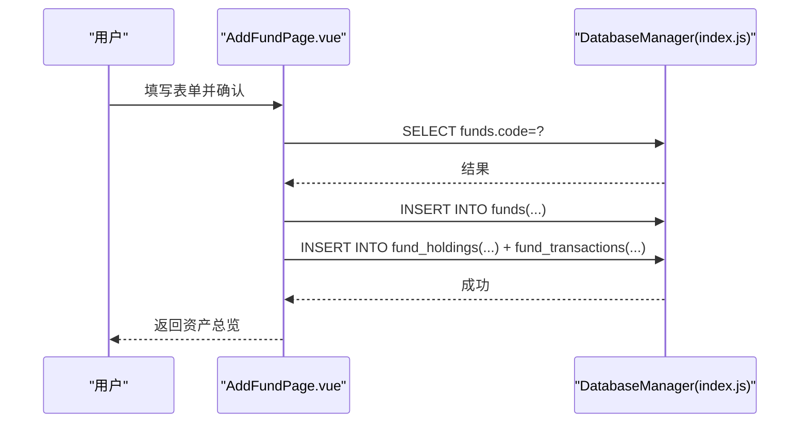
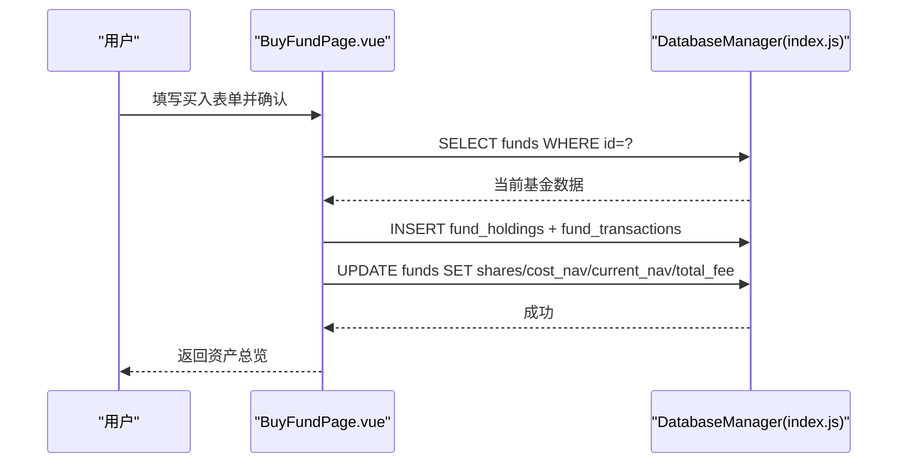
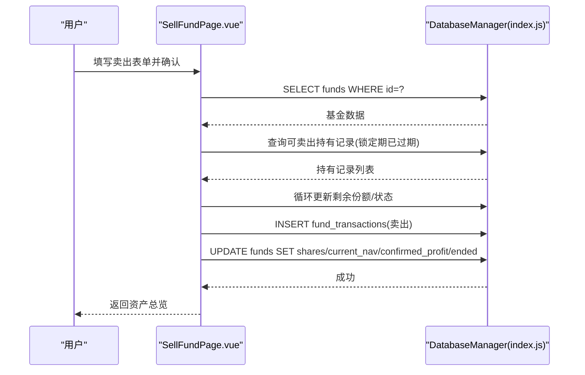
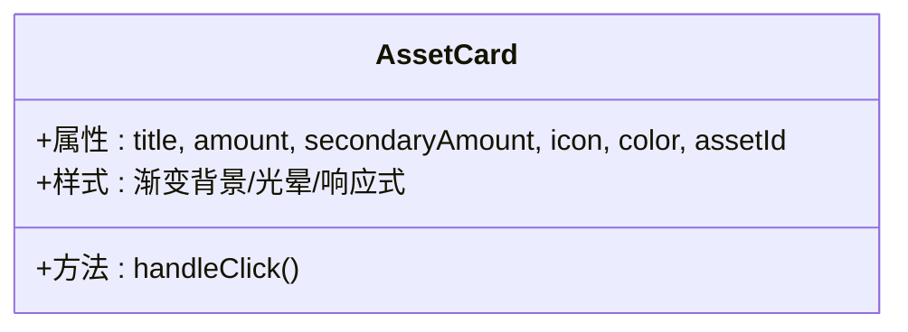
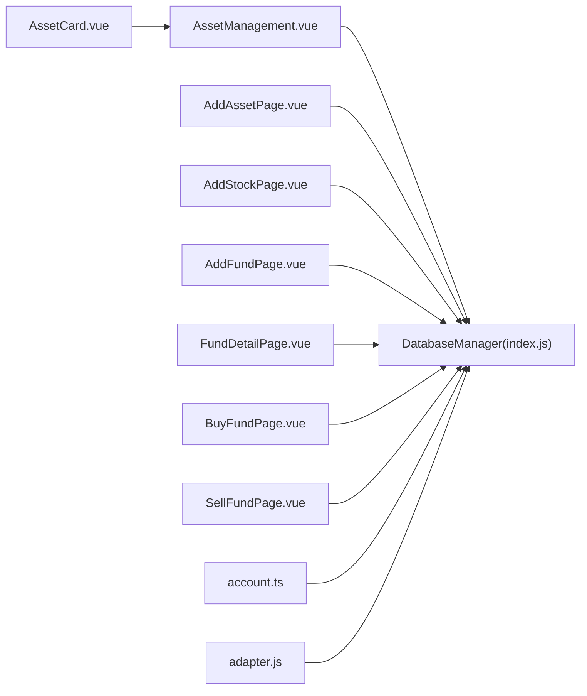

# 资产管理

<cite>
**本文引用的文件**
- [AssetManagement.vue](file://src/components/mobile/asset/AssetManagement.vue)
- [AssetCard.vue](file://src/components/mobile/asset/AssetCard.vue)
- [AddAssetPage.vue](file://src/components/mobile/asset/AddAssetPage.vue)
- [AddStockPage.vue](file://src/components/mobile/asset/AddStockPage.vue)
- [AddFundPage.vue](file://src/components/mobile/asset/AddFundPage.vue)
- [FundDetailPage.vue](file://src/components/mobile/asset/FundDetailPage.vue)
- [BuyFundPage.vue](file://src/components/mobile/asset/BuyFundPage.vue)
- [SellFundPage.vue](file://src/components/mobile/asset/SellFundPage.vue)
- [index.js](file://src/database/index.js)
- [account.ts](file://src/stores/account.ts)
- [adapter.js](file://src/database/adapter.js)
- [categories.ts](file://src/data/categories.ts)
</cite>

## 目录
1. [简介](#简介)
2. [项目结构](#项目结构)
3. [核心组件](#核心组件)
4. [架构总览](#架构总览)
5. [详细组件分析](#详细组件分析)
6. [依赖关系分析](#依赖关系分析)
7. [性能考量](#性能考量)
8. [故障排查指南](#故障排查指南)
9. [结论](#结论)
10. [附录](#附录)

## 简介
本文件面向开发者与产品人员，系统化梳理"资产管理"模块的设计与实现，覆盖资产总览、股票管理、基金全流程、资产卡片组件、价值计算算法、资产分类与标签、数据导入导出建议以及业务影响与扩展指引。文档以仓库现有代码为依据，结合数据库层与状态层，给出可操作的实现路径与最佳实践。

**更新** 本次更新增强了资产管理功能，新增历史资产跟踪切换功能，优化了资产筛选逻辑，并集成了完整的基金卖出功能。

## 项目结构
资产管理模块位于移动端组件目录下，围绕"资产总览页 + 资产卡片 + 新增资产/股票/基金 + 基金详情与买卖"构建，配合数据库层进行数据持久化与事务控制。

**图表来源**
- [AssetManagement.vue:1-466](file://src/components/mobile/asset/AssetManagement.vue#L1-L466)
- [SellFundPage.vue:1-306](file://src/components/mobile/asset/SellFundPage.vue#L1-L306)

**章节来源**
- [AssetManagement.vue:1-466](file://src/components/mobile/asset/AssetManagement.vue#L1-L466)
- [index.js:544-566](file://src/database/index.js#L544-L566)

## 核心组件
- 资产总览页：聚合通用资产、股票、基金三类卡片，支持浮动菜单新增入口与详情跳转，新增历史资产跟踪切换功能。
- 资产卡片：统一展示资产标题、主金额与次级金额（如成本价），支持点击回调。
- 新增资产/股票/基金：表单校验、账户过滤、写入数据库与交易记录。
- 基金详情与买卖：持有记录、买入/卖出记录、收益计算、锁定期处理、事务提交，新增完整的卖出功能。

**更新** 新增历史资产跟踪切换功能，支持通过 `ended` 字段区分当前和历史资产状态。

**章节来源**
- [AssetManagement.vue:112-145](file://src/components/mobile/asset/AssetManagement.vue#L112-L145)
- [AssetCard.vue:24-65](file://src/components/mobile/asset/AssetCard.vue#L24-L65)
- [SellFundPage.vue:104-214](file://src/components/mobile/asset/SellFundPage.vue#L104-L214)

## 架构总览
资产管理采用"组件 + 数据库管理 + 账户状态"的分层架构：
- 组件层：负责UI与交互，触发导航与数据请求，支持历史资产切换。
- 数据层：统一通过数据库管理类进行查询、插入、批量与事务执行；支持Capacitor SQLite与Web sql.js两种后端。
- 状态层：账户Store负责账户列表与余额调整、转账等操作，保障资金变动一致性。

**图表来源**
- [AssetManagement.vue:120-145](file://src/components/mobile/asset/AssetManagement.vue#L120-L145)
- [index.js:198-264](file://src/database/index.js#L198-L264)

## 详细组件分析

### 资产总览与卡片
- 资产总览：分别加载通用资产、股票、基金数据，为空时显示占位；浮动菜单提供新增入口。
- 资产卡片：支持图标/图片、主金额（如市值/成本金额）、次级金额（如成本价）、颜色主题与点击事件。
- **历史资产切换**：新增 `showEndedAssets` 状态，支持在"当前资产"和"历史资产"之间切换。

**更新** 新增历史资产跟踪功能，通过 `ended` 字段区分资产状态。

**图表来源**
- [AssetManagement.vue:120-145](file://src/components/mobile/asset/AssetManagement.vue#L120-L145)

**章节来源**
- [AssetManagement.vue:101-227](file://src/components/mobile/asset/AssetManagement.vue#L101-L227)
- [AssetCard.vue:24-65](file://src/components/mobile/asset/AssetCard.vue#L24-L65)

### 新增通用资产
- 表单字段：名称、类型、金额、关联账户、周期。
- 账户过滤：公积金类型资产需绑定公积金账户。
- 写入逻辑：校验通过后插入资产表，成功后返回总览。

**图表来源**
- [AddAssetPage.vue:96-135](file://src/components/mobile/asset/AddAssetPage.vue#L96-L135)
- [index.js:272-309](file://src/database/index.js#L272-L309)

**章节来源**
- [AddAssetPage.vue:70-135](file://src/components/mobile/asset/AddAssetPage.vue#L70-L135)

### 新增股票
- 表单字段：名称、代码、价格、数量、手续费、时间、账户。
- 重复校验：同一股票代码不可重复添加。
- 写入逻辑：创建股票记录；买入时创建持有记录与交易记录，并更新成本价与持有数量。

**图表来源**
- [AddStockPage.vue:85-203](file://src/components/mobile/asset/AddStockPage.vue#L85-L203)
- [index.js:354-374](file://src/database/index.js#L354-L374)

**章节来源**
- [AddStockPage.vue:117-196](file://src/components/mobile/asset/AddStockPage.vue#L117-L196)

### 新增基金
- 表单字段：名称、代码、确认净值、份额、手续费、锁定期、交易时间、账户。
- 重复校验：同一基金代码不可重复添加。
- 写入逻辑：创建基金记录；买入时创建持有记录与交易记录；卖出时按锁定期与剩余份额规则扣减。

**图表来源**
- [AddFundPage.vue:93-223](file://src/components/mobile/asset/AddFundPage.vue#L93-L223)
- [index.js:354-374](file://src/database/index.js#L354-L374)

**章节来源**
- [AddFundPage.vue:128-216](file://src/components/mobile/asset/AddFundPage.vue#L128-L216)

### 基金详情与交易
- 基金详情：展示成本金额、成本费用、成本净值、当前净值、持有份额、确认/持有/总收益。
- 持有记录：净值、份额、剩余份额、手续费、状态、锁定期与结束日。
- 买入：按份额与净值计算摊薄成本，更新持有记录与基金表。
- **卖出功能**：按最早买入优先原则扣减剩余份额，支持部分卖出与锁定期校验，更新确认收益。

**更新** 新增完整的基金卖出功能，支持历史资产跟踪和锁定期管理。

**图表来源**
- [FundDetailPage.vue:280-412](file://src/components/mobile/asset/FundDetailPage.vue#L280-L412)

**图表来源**
- [BuyFundPage.vue:105-177](file://src/components/mobile/asset/BuyFundPage.vue#L105-L177)
- [index.js:354-374](file://src/database/index.js#L354-L374)

**章节来源**
- [BuyFundPage.vue:134-177](file://src/components/mobile/asset/BuyFundPage.vue#L134-L177)

**图表来源**
- [SellFundPage.vue:104-214](file://src/components/mobile/asset/SellFundPage.vue#L104-L214)
- [index.js:354-374](file://src/database/index.js#L354-L374)

**章节来源**
- [SellFundPage.vue:137-214](file://src/components/mobile/asset/SellFundPage.vue#L137-L214)

### 资产卡片组件设计
- 属性：标题、主金额、次级金额、图标（文本或图片）、颜色、资产ID。
- 行为：点击事件透传，支持上层路由跳转。
- 样式：渐变背景、径向光晕、响应式布局与悬停缩放。

**图表来源**
- [AssetCard.vue:24-65](file://src/components/mobile/asset/AssetCard.vue#L24-L65)

**章节来源**
- [AssetCard.vue:1-180](file://src/components/mobile/asset/AssetCard.vue#L1-L180)

### 资产价值计算算法
- 通用资产：主金额=金额；次级金额=周期性收入（如适用）。
- 股票：主金额=持有数量×成本价；次级金额=成本价。
- 基金：主金额=持有份额×当前净值；次级金额=成本净值。
- 收益计算（基金）：
  - 持有收益 =（当前净值 − 成本净值）× 持有份额
  - 确认收益 = 卖出时按卖出净值与成本净值差额累计
  - 总收益 = 持有收益 + 确认收益

**更新** 新增历史资产状态标记，通过 `ended` 字段区分资产状态。

**章节来源**
- [AssetManagement.vue:27-41](file://src/components/mobile/asset/AssetManagement.vue#L27-L41)
- [FundDetailPage.vue:300-318](file://src/components/mobile/asset/FundDetailPage.vue#L300-L318)

### 资产分类与标签系统
- 分类数据：定义分类结构（名称、图标、类型等），用于初始化与展示。
- 资产类型：通用资产支持多种类型（如工资、租金、利息、公积金等），用于筛选与统计。

**章节来源**
- [categories.ts:1-45](file://src/data/categories.ts#L1-L45)
- [AddAssetPage.vue:14-24](file://src/components/mobile/asset/AddAssetPage.vue#L14-L24)

### 数据导入导出（建议方案）
- 导出：基于数据库查询，将资产/股票/基金/交易记录导出为CSV/JSON，便于备份与迁移。
- 导入：解析文件后，按表结构批量写入，注意重复键冲突与锁定期校验。
- 注意：当前仓库未提供现成的导入导出组件，建议在"更多功能"页面扩展。

**更新** 新增历史资产数据的导入导出考虑，支持 `ended` 状态字段。

[本节为通用建议，不直接分析具体文件]

## 依赖关系分析
- 组件依赖数据库管理类进行CRUD与事务；平台差异由适配器抽象。
- 账户Store提供账户列表与余额调整、转账等能力，保障资金链路一致。
- 资产总览与详情页通过导航事件与数据库联动，形成闭环。

**图表来源**
- [AssetManagement.vue:79](file://src/components/mobile/asset/AssetManagement.vue#L79)
- [index.js:1-935](file://src/database/index.js#L1-L935)
- [account.ts:1-273](file://src/stores/account.ts#L1-L273)
- [adapter.js:1-34](file://src/database/adapter.js#L1-L34)

**章节来源**
- [index.js:418-776](file://src/database/index.js#L418-L776)

## 性能考量
- 连接复用与并发：数据库管理类维护单例连接，避免重复建立；查询支持缓存键与清理。
- 批处理与事务：批量写入与事务执行减少IO次数，保证一致性。
- 索引优化：对常用查询字段建立索引，提升读取性能。
- Web持久化：sql.js在内存中运行，提供延迟持久化至localStorage，兼顾性能与可靠性。

**更新** 新增历史资产查询优化，通过 `ended` 字段索引提升筛选性能。

**章节来源**
- [index.js:12-18](file://src/database/index.js#L12-L18)
- [index.js:56-190](file://src/database/index.js#L56-L190)
- [index.js:316-347](file://src/database/index.js#L316-L347)
- [index.js:354-374](file://src/database/index.js#L354-L374)
- [index.js:418-776](file://src/database/index.js#L418-L776)

## 故障排查指南
- 数据库连接失败：检查平台适配器与数据库初始化流程，确认连接状态与异常日志。
- 事务执行失败：核对事务语句数组与参数绑定，确保字段顺序与类型匹配。
- 账户余额不足：在余额调整与转账时检查余额计算与边界条件。
- 基金卖出限制：检查锁定期与剩余份额，确保按最早买入优先扣减。
- **历史资产切换问题**：检查 `ended` 字段状态，确认资产是否正确标记为历史状态。

**更新** 新增历史资产跟踪相关故障排查指导。

**章节来源**
- [index.js:198-264](file://src/database/index.js#L198-L264)
- [index.js:354-374](file://src/database/index.js#L354-L374)
- [account.ts:145-185](file://src/stores/account.ts#L145-L185)
- [SellFundPage.vue:137-154](file://src/components/mobile/asset/SellFundPage.vue#L137-L154)

## 结论
资产管理模块以清晰的组件分层与完善的数据库事务为基础，实现了资产总览、股票与基金的全生命周期管理。通过可扩展的卡片组件与统一的数据层，开发者可在不破坏现有结构的前提下，灵活扩展新资产类型、优化计算策略与增强报表能力。**本次更新显著增强了资产管理功能，新增历史资产跟踪切换、优化资产筛选逻辑，并集成了完整的基金卖出功能，为用户提供更全面的资产管理体验。**

## 附录
- 业务场景示例
  - 新增通用资产：填写名称、类型、金额与账户，系统自动校验并入库。
  - 股票买入：输入价格与数量，系统创建持有记录并更新成本价。
  - 基金买入：输入净值与份额，系统按摊薄成本更新持有与基金表。
  - **基金卖出**：按锁定期与剩余份额规则扣减，生成卖出记录并更新确认收益，支持历史资产跟踪。
  - **历史资产切换**：通过切换按钮在当前资产和历史资产之间自由切换，支持按状态筛选。
- 资产变动对账户与财务状况的影响
  - 资产增加：对应账户余额调整或资产表增长，影响总资产与流动性指标。
  - 股票/基金交易：产生手续费与确认收益，影响当期损益与净值波动。
  - 锁定期：卖出受限，影响短期流动性与变现能力。
  - **历史资产标记**：资产结束后自动标记为历史状态，不影响当前财务状况但提供历史追踪。

**更新** 新增历史资产跟踪和卖出功能的业务场景示例。

[本节为概念性总结，不直接分析具体文件]