# 资产管理

<cite>
**本文引用的文件**
- [AssetManagement.vue](file://src/components/mobile/asset/AssetManagement.vue)
- [StatOverview.vue](file://src/components/common/StatOverview.vue)
- [AssetCard.vue](file://src/components/mobile/asset/AssetCard.vue)
- [AddAssetPage.vue](file://src/components/mobile/asset/AddAssetPage.vue)
- [AddStockPage.vue](file://src/components/mobile/asset/AddStockPage.vue)
- [AddFundPage.vue](file://src/components/mobile/asset/AddFundPage.vue)
- [FundDetailPage.vue](file://src/components/mobile/asset/FundDetailPage.vue)
- [BuyFundPage.vue](file://src/components/mobile/asset/BuyFundPage.vue)
- [SellFundPage.vue](file://src/components/mobile/asset/SellFundPage.vue)
- [AssetDetailPage.vue](file://src/components/mobile/asset/AssetDetailPage.vue)
- [assetService.ts](file://src/services/asset/assetService.ts)
- [fundService.ts](file://src/services/asset/fundService.ts)
- [stockService.ts](file://src/services/asset/stockService.ts)
- [liabilityService.ts](file://src/services/liability/liabilityService.ts)
- [calculations.ts](file://src/utils/calculations.ts)
- [asset.ts](file://src/types/asset/asset.ts)
- [fund.ts](file://src/types/asset/fund.ts)
- [stock.ts](file://src/types/asset/stock.ts)
- [liability.ts](file://src/types/liability/liability.ts)
- [index.js](file://src/database/index.js)
- [account.ts](file://src/stores/account.ts)
- [adapter.js](file://src/database/adapter.js)
- [dictionaries.ts](file://src/utils/dictionaries.ts)
</cite>

## 更新摘要
**变更内容**
- 新增灵活资产计算方法：支持固定金额计算和年收益率计算两种模式，增强资产创建功能的计算类型选择
- 数据库schema扩展：新增计算字段支持，包括 calculation_type、income_amount、annual_yield_rate 等字段
- 计算逻辑优化：新增 calculatePerAssetIncome 函数，支持按周期计算收益金额
- 资产详情增强：在资产详情页面展示计算类型和收益信息
- 字典配置更新：新增 calculationTypes 字典，支持计算类型的选择

## 目录
1. [简介](#简介)
2. [项目结构](#项目结构)
3. [核心组件](#核心组件)
4. [架构总览](#架构总览)
5. [详细组件分析](#详细组件分析)
6. [服务层架构](#服务层架构)
7. [类型系统与计算工具](#类型系统与计算工具)
8. [数据库Schema设计](#数据库schema设计)
9. [依赖关系分析](#依赖关系分析)
10. [性能考量](#性能考量)
11. [故障排查指南](#故障排查指南)
12. [结论](#结论)
13. [附录](#附录)

## 简介
本文件面向开发者与产品人员，系统化梳理"资产管理"模块的设计与实现，覆盖资产总览、股票管理、基金全流程、资产卡片组件、价值计算算法、资产分类与标签、数据导入导出建议以及业务影响与扩展指引。文档以仓库现有代码为依据，结合新增的服务层架构、类型系统和计算工具类，给出可操作的实现路径与最佳实践。

**更新** 本次更新重点反映了应用变更：新增通用资产服务层架构，包括 assetService.ts、fundService.ts、stockService.ts、liabilityService.ts 等完整服务模块，以及新的计算工具类和类型系统扩展。同时，资产总览组件现已集成StatOverview组件，提供更简洁的统计展示。新增灵活资产计算方法，支持固定金额计算和年收益率计算两种模式。

## 项目结构
资产管理模块位于移动端组件目录下，围绕"资产总览页 + 资产卡片 + 新增资产/股票/基金 + 基金详情与买卖"构建，配合数据库层进行数据持久化与事务控制。新增的服务层架构提供了清晰的业务逻辑封装和类型安全。

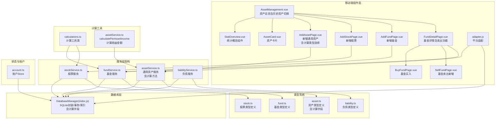

**图表来源**
- [AssetManagement.vue:1-413](file://src/components/mobile/asset/AssetManagement.vue#L1-L413)
- [StatOverview.vue:1-119](file://src/components/common/StatOverview.vue#L1-L119)
- [assetService.ts:1-218](file://src/services/asset/assetService.ts#L1-L218)
- [fundService.ts:1-416](file://src/services/asset/fundService.ts#L1-L416)
- [stockService.ts:1-405](file://src/services/asset/stockService.ts#L1-L405)
- [liabilityService.ts:1-182](file://src/services/liability/liabilityService.ts#L1-L182)

**章节来源**
- [AssetManagement.vue:1-413](file://src/components/mobile/asset/AssetManagement.vue#L1-L413)
- [StatOverview.vue:1-119](file://src/components/common/StatOverview.vue#L1-L119)
- [assetService.ts:1-218](file://src/services/asset/assetService.ts#L1-L218)
- [fundService.ts:1-416](file://src/services/asset/fundService.ts#L1-L416)
- [stockService.ts:1-405](file://src/services/asset/stockService.ts#L1-L405)
- [liabilityService.ts:1-182](file://src/services/liability/liabilityService.ts#L1-L182)

## 核心组件
- **资产总览页**：集成StatOverview组件，聚合通用资产、股票、基金三类卡片，支持浮动菜单新增入口与详情跳转，新增历史资产跟踪切换功能。
- **统计概览组件**：提供总资产金额和资产数量的实时统计展示，通过聚合多类资产数据实现准确的统计逻辑。
- **资产卡片**：统一展示资产标题、主金额与次级金额（如成本价），支持点击回调。
- **新增通用资产**：表单校验、账户过滤、调用服务层进行业务处理与数据库写入，新增计算类型选择功能。
- **资产详情页面**：展示资产基本信息、计算类型、收益记录等详细信息。
- **新增股票/基金**：表单校验、账户过滤、调用服务层进行业务处理与数据库写入。
- **基金详情与买卖**：持有记录、买入/卖出记录、收益计算、锁定期处理、事务提交，新增完整的卖出功能。
- **服务层架构**：独立的业务逻辑服务，提供类型安全的API接口，封装数据库操作和业务规则。

**更新** 新增灵活资产计算方法，支持固定金额计算和年收益率计算两种模式，增强资产创建功能的计算类型选择。

**章节来源**
- [AssetManagement.vue:3-7](file://src/components/mobile/asset/AssetManagement.vue#L3-L7)
- [StatOverview.vue:1-119](file://src/components/common/StatOverview.vue#L1-L119)
- [AssetCard.vue:24-65](file://src/components/mobile/asset/AssetCard.vue#L24-L65)
- [AddAssetPage.vue:32-42](file://src/components/mobile/asset/AddAssetPage.vue#L32-L42)
- [AssetDetailPage.vue:13-43](file://src/components/mobile/asset/AssetDetailPage.vue#L13-L43)
- [assetService.ts:55-81](file://src/services/asset/assetService.ts#L55-L81)
- [fundService.ts:78-151](file://src/services/asset/fundService.ts#L78-L151)
- [stockService.ts:70-138](file://src/services/asset/stockService.ts#L70-L138)

## 架构总览
资产管理采用"组件 + 服务层 + 类型系统 + 计算工具 + 数据库管理 + 账户状态"的分层架构：
- 组件层：负责UI与交互，触发导航与数据请求，支持历史资产切换。
- 服务层：提供业务逻辑封装，包含资产、股票、基金、负债等完整服务模块，确保业务规则的一致性。
- 类型系统：定义强类型的接口和输入输出结构，提供编译时类型检查。
- 计算工具：封装复用的计算逻辑，如成本价计算、收益计算等。
- 数据层：统一通过数据库管理类进行查询、插入、批量与事务执行。
- 状态层：账户Store负责账户列表与余额调整、转账等操作。

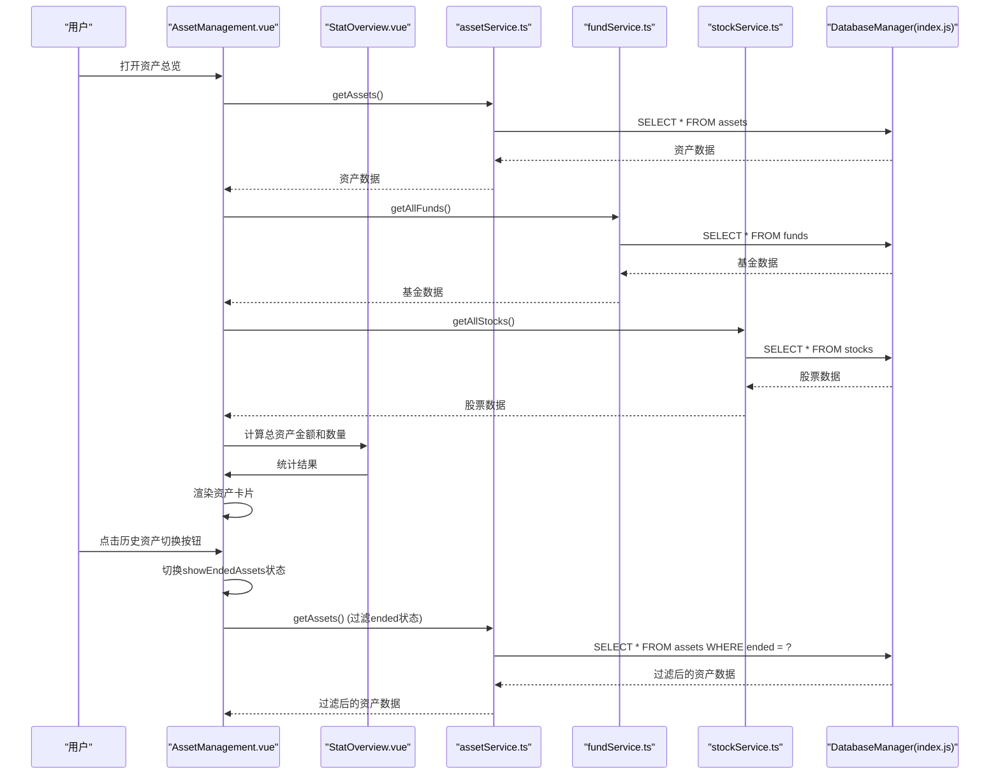

**图表来源**
- [AssetManagement.vue:204-246](file://src/components/mobile/asset/AssetManagement.vue#L204-L246)
- [StatOverview.vue:29-33](file://src/components/common/StatOverview.vue#L29-L33)
- [assetService.ts:117-119](file://src/services/asset/assetService.ts#L117-L119)
- [fundService.ts:24-26](file://src/services/asset/fundService.ts#L24-L26)
- [stockService.ts:24-26](file://src/services/asset/stockService.ts#L24-L26)

## 详细组件分析

### 资产总览与统计概览
- **统计概览组件**：集成StatOverview组件，提供总资产金额和资产数量的实时统计展示，通过聚合多类资产数据实现准确的统计逻辑。
- **资产总览**：分别加载通用资产、股票、基金数据，为空时显示占位；浮动菜单提供新增入口。
- **资产卡片**：支持图标/图片、主金额（如市值/成本金额）、次级金额（如成本价）、颜色主题与点击事件。
- **历史资产切换**：新增 `showEndedAssets` 状态，支持在"当前资产"和"历史资产"之间切换。

**更新** 新增StatOverview组件集成，提供更简洁的统计展示和更准确的计算逻辑。

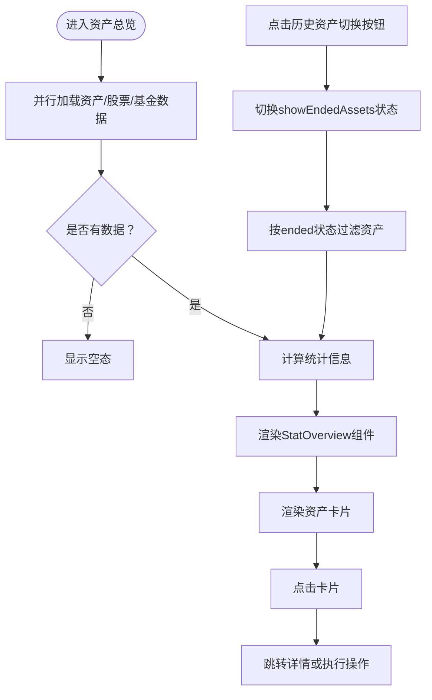

**图表来源**
- [AssetManagement.vue:3-7](file://src/components/mobile/asset/AssetManagement.vue#L3-L7)
- [AssetManagement.vue:204-246](file://src/components/mobile/asset/AssetManagement.vue#L204-L246)

**章节来源**
- [AssetManagement.vue:1-85](file://src/components/mobile/asset/AssetManagement.vue#L1-L85)
- [StatOverview.vue:1-119](file://src/components/common/StatOverview.vue#L1-L119)
- [AssetCard.vue:24-65](file://src/components/mobile/asset/AssetCard.vue#L24-L65)

### 新增通用资产
- 表单字段：名称、类型、金额、关联账户、计算类型、每期收益、年收益率、周期、周期数量、收益日。
- 账户过滤：公积金类型资产需绑定公积金账户。
- **计算类型选择**：支持"按金额计算"和"按年收益率计算"两种模式。
- **服务层集成**：调用 `addAsset` 服务函数，自动计算下次收益日期并写入数据库。

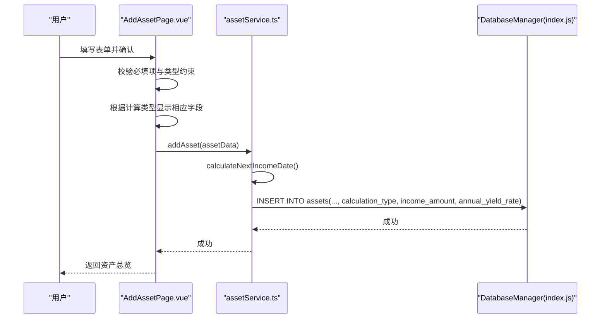

**图表来源**
- [AddAssetPage.vue:147-219](file://src/components/mobile/asset/AddAssetPage.vue#L147-L219)
- [assetService.ts:86-112](file://src/services/asset/assetService.ts#L86-L112)
- [assetService.ts:13-48](file://src/services/asset/assetService.ts#L13-L48)

**章节来源**
- [AddAssetPage.vue:32-42](file://src/components/mobile/asset/AddAssetPage.vue#L32-L42)
- [AddAssetPage.vue:147-219](file://src/components/mobile/asset/AddAssetPage.vue#L147-L219)
- [assetService.ts:86-112](file://src/services/asset/assetService.ts#L86-L112)

### 资产详情页面
- **基本信息展示**：资产名称、类型、金额、周期、剩余期数、收益日、下一收益日。
- **计算信息**：展示计算类型（固定金额/年收益率）、每期收益金额、年收益率等。
- **收益记录**：展示历史收益记录，包括收益金额和备注信息。
- **操作按钮**：支持结束资产操作，将资产标记为历史状态。

**更新** 新增计算类型和收益信息的展示，增强资产详情的完整性。

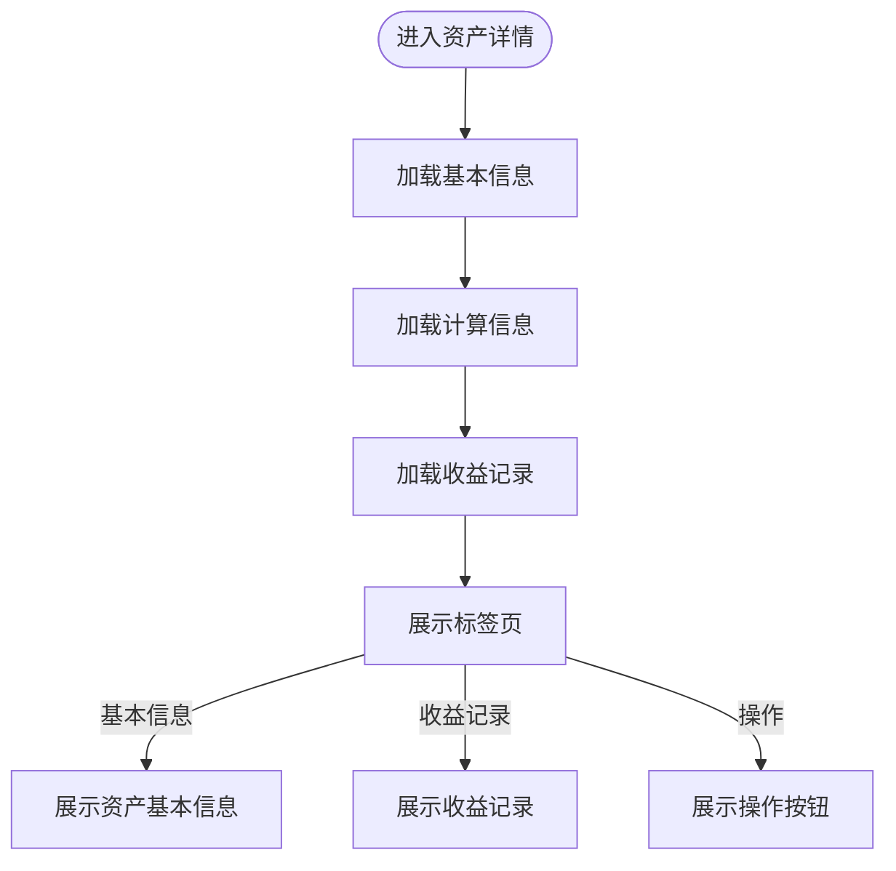

**图表来源**
- [AssetDetailPage.vue:13-78](file://src/components/mobile/asset/AssetDetailPage.vue#L13-L78)
- [AssetDetailPage.vue:185-200](file://src/components/mobile/asset/AssetDetailPage.vue#L185-L200)

**章节来源**
- [AssetDetailPage.vue:13-78](file://src/components/mobile/asset/AssetDetailPage.vue#L13-L78)
- [AssetDetailPage.vue:185-200](file://src/components/mobile/asset/AssetDetailPage.vue#L185-L200)

### 新增股票
- 表单字段：名称、代码、价格、数量、手续费、时间、账户。
- 重复校验：同一股票代码不可重复添加。
- **服务层集成**：调用 `addStock` 服务函数，创建股票记录、持有记录与交易记录。

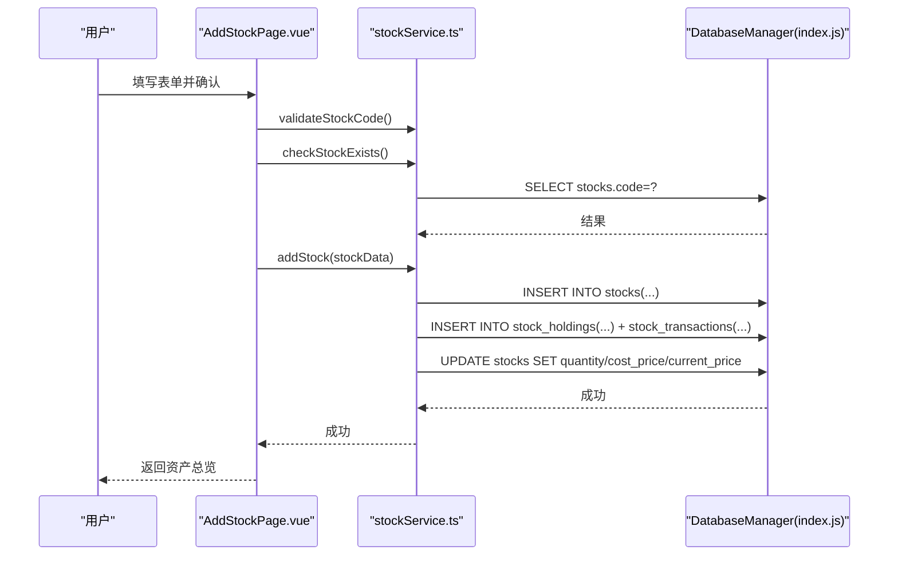

**图表来源**
- [AddStockPage.vue:81-145](file://src/components/mobile/asset/AddStockPage.vue#L81-L145)
- [stockService.ts:70-138](file://src/services/asset/stockService.ts#L70-L138)
- [stockService.ts:31-46](file://src/services/asset/stockService.ts#L31-L46)

**章节来源**
- [AddStockPage.vue:117-196](file://src/components/mobile/asset/AddStockPage.vue#L117-L196)
- [stockService.ts:70-138](file://src/services/asset/stockService.ts#L70-L138)

### 新增基金
- 表单字段：名称、代码、确认净值、份额、手续费、锁定期、交易时间、账户。
- 重复校验：同一基金代码不可重复添加。
- **服务层集成**：调用 `addFund` 服务函数，创建基金记录、持有记录与交易记录。

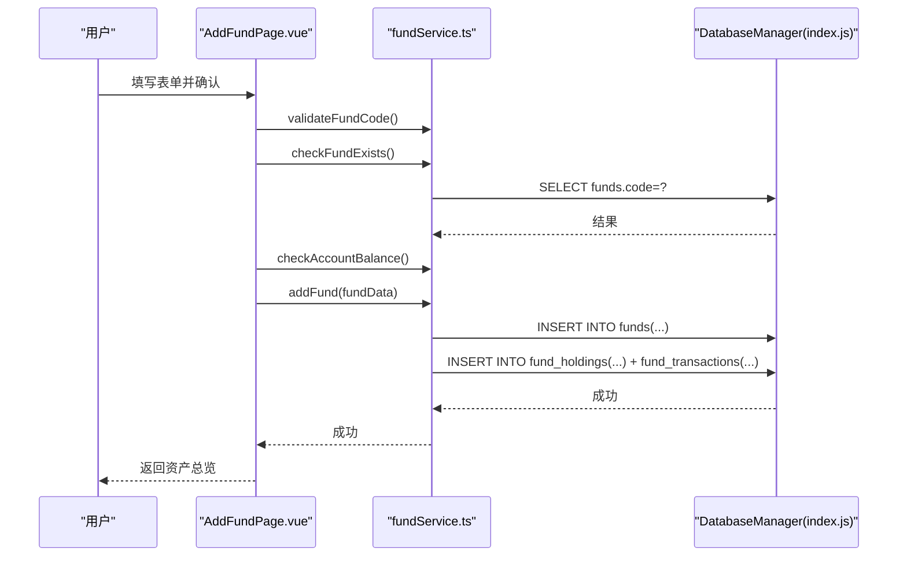

**图表来源**
- [AddFundPage.vue:93-169](file://src/components/mobile/asset/AddFundPage.vue#L93-L169)
- [fundService.ts:78-151](file://src/services/asset/fundService.ts#L78-L151)
- [fundService.ts:31-46](file://src/services/asset/fundService.ts#L31-L46)

**章节来源**
- [AddFundPage.vue:128-216](file://src/components/mobile/asset/AddFundPage.vue#L128-L216)
- [fundService.ts:78-151](file://src/services/asset/fundService.ts#L78-L151)

### 基金详情与交易
- 基金详情：展示成本金额、成本费用、成本净值、当前净值、持有份额、确认/持有/总收益。
- 持有记录：净值、份额、剩余份额、手续费、状态、锁定期与结束日。
- 买入：按份额与净值计算摊薄成本，更新持有记录与基金表。
- **卖出功能**：按最早买入优先原则扣减剩余份额，支持部分卖出与锁定期校验，更新确认收益。

**更新** 新增完整的基金卖出功能，支持历史资产跟踪和锁定期管理。

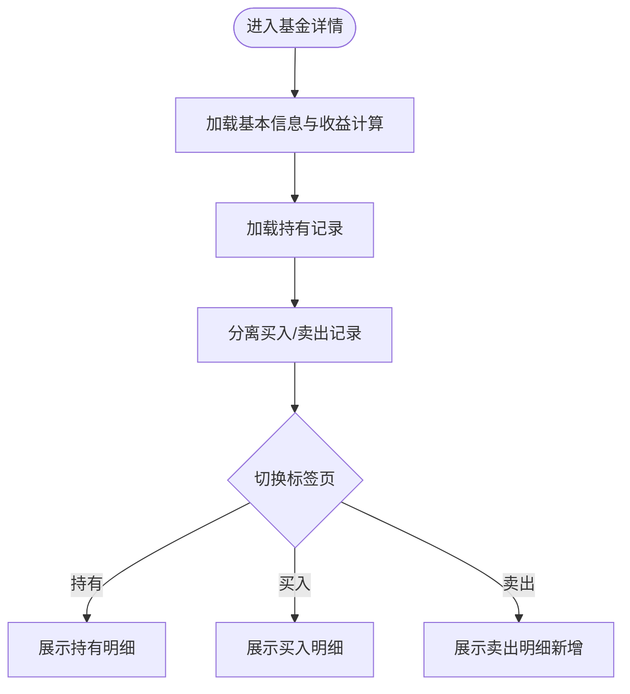

**图表来源**
- [FundDetailPage.vue:280-412](file://src/components/mobile/asset/FundDetailPage.vue#L280-L412)

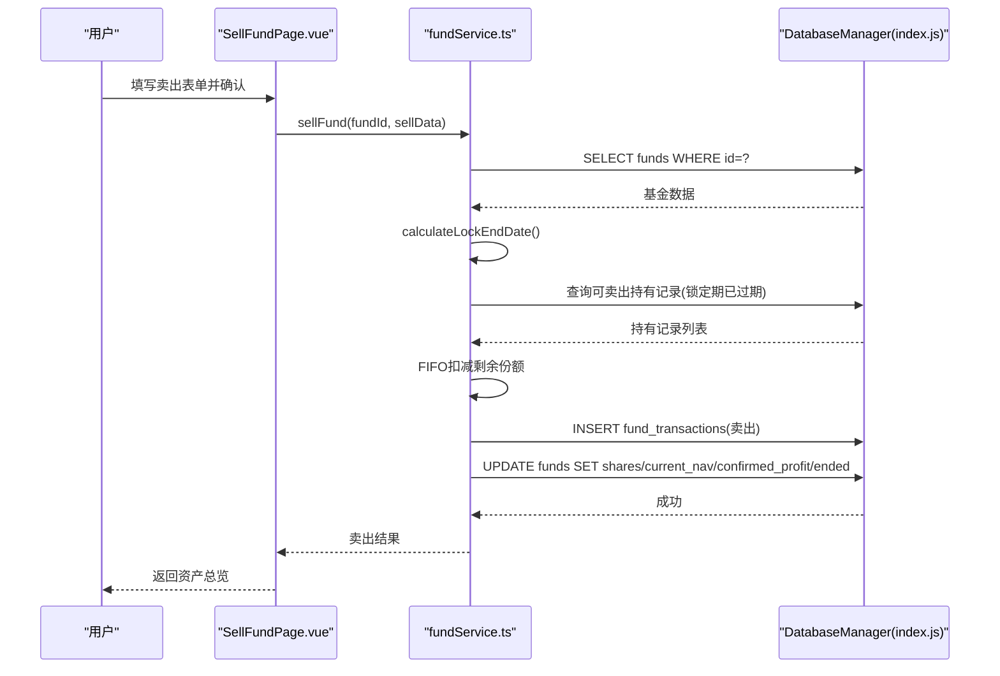

**图表来源**
- [SellFundPage.vue:104-214](file://src/components/mobile/asset/SellFundPage.vue#L104-L214)
- [fundService.ts:200-350](file://src/services/asset/fundService.ts#L200-L350)

**章节来源**
- [SellFundPage.vue:137-214](file://src/components/mobile/asset/SellFundPage.vue#L137-L214)
- [fundService.ts:200-350](file://src/services/asset/fundService.ts#L200-L350)

### 资产卡片组件设计
- 属性：标题、主金额、次级金额、图标（文本或图片）、颜色、资产ID。
- 行为：点击事件透传，支持上层路由跳转。
- 样式：渐变背景、径向光晕、响应式布局与悬停缩放。

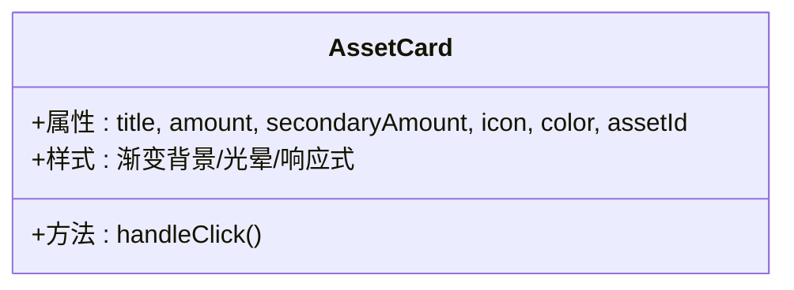

**图表来源**
- [AssetCard.vue:24-65](file://src/components/mobile/asset/AssetCard.vue#L24-L65)

**章节来源**
- [AssetCard.vue:1-180](file://src/components/mobile/asset/AssetCard.vue#L1-L180)

### 资产价值计算算法
- **统计计算**：通过totalAssetAmount计算属性聚合通用资产、股票、基金的总价值，实现准确的统计逻辑。
- **资产统计**：通过totalAssetCount计算属性统计当前显示的资产总数。
- **灵活资产计算**：新增 calculatePerAssetIncome 函数，支持按计算类型计算每期收益金额。
- 通用资产：主金额=金额；次级金额=周期性收入（如适用）。
- 股票：主金额=持有数量×成本价；次级金额=成本价。
- 基金：主金额=持有份额×当前净值；次级金额=成本净值。
- 收益计算（通用资产）：
  - 固定金额计算：每期收益 = income_amount
  - 年收益率计算：每期收益 = 本金 × 年收益率 ÷ 周期基数
- 收益计算（基金）：
  - 持有收益 =（当前净值 − 成本净值）× 持有份额
  - 确认收益 = 卖出时按卖出净值与成本净值差额累计
  - 总收益 = 持有收益 + 确认收益

**更新** 新增灵活资产计算方法，支持固定金额计算和年收益率计算两种模式，增强资产价值计算的灵活性。

**章节来源**
- [AssetManagement.vue:155-164](file://src/components/mobile/asset/AssetManagement.vue#L155-L164)
- [assetService.ts:55-81](file://src/services/asset/assetService.ts#L55-L81)
- [FundDetailPage.vue:300-318](file://src/components/mobile/asset/FundDetailPage.vue#L300-L318)

### 资产分类与标签系统
- 分类数据：定义分类结构（名称、图标、类型等），用于初始化与展示。
- 资产类型：通用资产支持多种类型（如工资、租金、利息、公积金等），用于筛选与统计。
- **计算类型**：新增 calculationTypes 字典，支持"按金额计算"和"按年收益率计算"两种模式。

**章节来源**
- [dictionaries.ts:28-52](file://src/utils/dictionaries.ts#L28-L52)
- [AddAssetPage.vue:14-24](file://src/components/mobile/asset/AddAssetPage.vue#L14-L24)

### 数据导入导出（建议方案）
- 导出：基于数据库查询，将资产/股票/基金/交易记录导出为CSV/JSON，便于备份与迁移。
- 导入：解析文件后，按表结构批量写入，注意重复键冲突与锁定期校验。
- 注意：当前仓库未提供现成的导入导出组件，建议在"更多功能"页面扩展。

**更新** 新增历史资产数据的导入导出考虑，支持 `ended` 状态字段。

## 服务层架构
新增的服务层架构提供了清晰的业务逻辑封装，每个服务模块都包含完整的CRUD操作、业务验证和事务处理。

### 通用资产服务 (assetService.ts)
- **核心功能**：通用资产的增删改查、状态管理、收益日期计算、收益金额计算。
- **关键方法**：
  - `addAsset()`：新增通用资产，自动计算下次收益日期
  - `getAssets()`：获取所有资产
  - `getAssetsByType()`：按类型获取资产
  - `getActiveAssets()`：获取当前有效资产
  - `endAsset()`：标记资产为历史状态
  - `calculatePerAssetIncome()`：计算每期收益金额，支持两种计算模式

### 基金服务 (fundService.ts)
- **核心功能**：基金的完整生命周期管理，包括买入、卖出、详情查询。
- **关键方法**：
  - `addFund()`：新增基金并创建初始持有记录
  - `buyFund()`：追加购买基金份额
  - `sellFund()`：卖出基金份额，支持FIFO算法
  - `getFundDetail()`：获取基金详细信息
  - `getFundHoldings()`：获取持有记录
  - `getFundTransactions()`：获取交易记录

### 股票服务 (stockService.ts)
- **核心功能**：股票的完整生命周期管理，包括买入、卖出、详情查询。
- **关键方法**：
  - `addStock()`：新增股票并创建初始持有记录
  - `buyStock()`：追加购买股票数量
  - `sellStock()`：卖出股票，支持FIFO算法
  - `getStockDetail()`：获取股票详细信息
  - `getStockHoldings()`：获取持有记录
  - `getStockTransactions()`：获取交易记录

### 负债服务 (liabilityService.ts)
- **核心功能**：负债管理，包括新增、还款、状态更新。
- **关键方法**：
  - `addLiability()`：新增负债
  - `makeRepayment()`：执行还款操作
  - `getLiabilities()`：获取所有负债
  - `getRepayments()`：获取还款记录

**章节来源**
- [assetService.ts:1-218](file://src/services/asset/assetService.ts#L1-L218)
- [fundService.ts:1-416](file://src/services/asset/fundService.ts#L1-L416)
- [stockService.ts:1-405](file://src/services/asset/stockService.ts#L1-L405)
- [liabilityService.ts:1-182](file://src/services/liability/liabilityService.ts#L1-L182)

## 类型系统与计算工具
新增的类型系统提供了强类型的接口定义，确保服务层的类型安全。

### 类型定义
- **资产类型 (asset.ts)**：定义通用资产的基础结构和输入接口，新增计算字段
- **基金类型 (fund.ts)**：定义基金、持有记录、交易记录的完整类型体系
- **股票类型 (stock.ts)**：定义股票、持有记录、交易记录的完整类型体系
- **负债类型 (liability.ts)**：定义负债和还款的类型定义

### 计算工具 (calculations.ts)
封装了复用的金融计算逻辑：
- `calculateTotalCost()`：计算总成本（价格×数量+手续费）
- `calculateCostPrice()`：计算单位成本（含手续费）
- `calculateWeightedCostPrice()`：计算加权平均成本
- `calculateSellProfit()`：计算卖出利润
- `calculateFundWeightedNavCostPrice()`：计算基金加权NAV成本

**章节来源**
- [asset.ts:1-39](file://src/types/asset/asset.ts#L1-L39)
- [fund.ts:1-107](file://src/types/asset/fund.ts#L1-L107)
- [stock.ts:1-97](file://src/types/asset/stock.ts#L1-L97)
- [liability.ts:1-58](file://src/types/liability/liability.ts#L1-L58)
- [calculations.ts:1-102](file://src/utils/calculations.ts#L1-L102)

## 数据库Schema设计
数据库Schema进行了重要扩展，新增计算字段支持灵活的资产计算模式。

### 资产表 (assets) 结构
- **新增字段**：
  - `calculation_type`：计算类型，支持"按金额计算"和"按年收益率计算"
  - `income_amount`：每期收益金额，默认0
  - `annual_yield_rate`：年收益率，默认0
- **现有字段**：保持原有字段不变，确保向后兼容

### 数据库初始化与迁移
- **初始化**：创建assets表时包含新增的计算字段
- **迁移**：为现有数据库添加计算字段，使用ALTER TABLE语句
- **向后兼容**：新增字段具有默认值，不影响现有数据

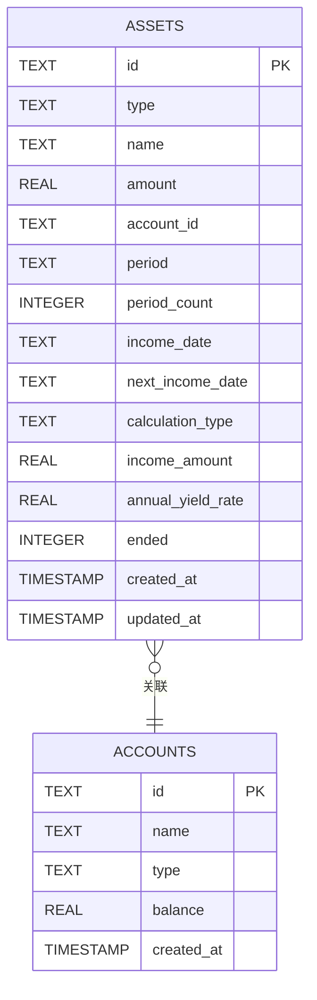

**图表来源**
- [index.js:489-506](file://src/database/index.js#L489-L506)
- [index.js:769-782](file://src/database/index.js#L769-L782)

**章节来源**
- [index.js:489-506](file://src/database/index.js#L489-L506)
- [index.js:769-782](file://src/database/index.js#L769-L782)

## 依赖关系分析
- 组件依赖服务层进行业务逻辑处理；服务层依赖数据库管理类进行CRUD与事务。
- 类型系统为整个架构提供类型安全保障。
- 计算工具被服务层广泛使用，确保计算逻辑的一致性。
- 账户Store提供账户列表与余额调整、转账等能力。

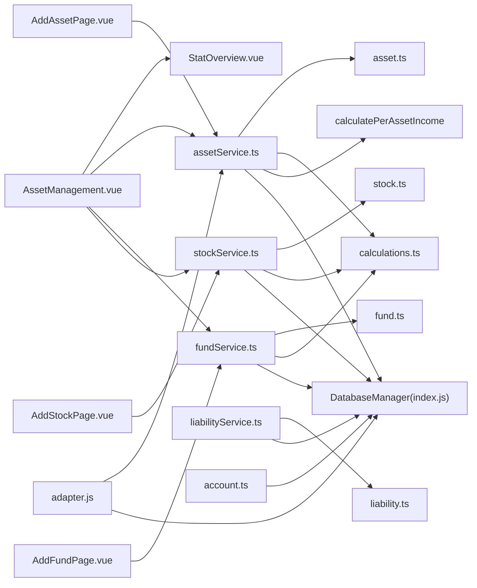

**图表来源**
- [AssetManagement.vue:92-98](file://src/components/mobile/asset/AssetManagement.vue#L92-L98)
- [AddAssetPage.vue:96](file://src/components/mobile/asset/AddAssetPage.vue#L96)
- [AssetDetailPage.vue:87](file://src/components/mobile/asset/AssetDetailPage.vue#L87)
- [AddStockPage.vue:45-47](file://src/components/mobile/asset/AddStockPage.vue#L45-L47)
- [AddFundPage.vue:54](file://src/components/mobile/asset/AddFundPage.vue#L54)

**章节来源**
- [index.js:418-776](file://src/database/index.js#L418-L776)

## 性能考量
- 连接复用与并发：数据库管理类维护单例连接，避免重复建立；查询支持缓存键与清理。
- 批处理与事务：批量写入与事务执行减少IO次数，保证一致性。
- 索引优化：对常用查询字段建立索引，提升读取性能。
- Web持久化：sql.js在内存中运行，提供延迟持久化至localStorage，兼顾性能与可靠性。
- **服务层优化**：服务层提供统一的业务逻辑封装，减少重复计算和数据库查询。
- **统计性能**：StatOverview组件通过计算属性实现响应式更新，避免不必要的重新计算。
- **计算性能**：新增的 calculatePerAssetIncome 函数使用简单数学运算，性能开销极小。

**更新** 新增计算字段和计算函数的性能考量，计算逻辑简单高效。

**章节来源**
- [index.js:12-18](file://src/database/index.js#L12-L18)
- [index.js:56-190](file://src/database/index.js#L56-L190)
- [index.js:316-347](file://src/database/index.js#L316-L347)
- [assetService.ts:117-119](file://src/services/asset/assetService.ts#L117-L119)
- [assetService.ts:55-81](file://src/services/asset/assetService.ts#L55-L81)

## 故障排查指南
- 数据库连接失败：检查平台适配器与数据库初始化流程，确认连接状态与异常日志。
- 事务执行失败：核对事务语句数组与参数绑定，确保字段顺序与类型匹配。
- 账户余额不足：在余额调整与转账时检查余额计算与边界条件。
- 基金卖出限制：检查锁定期与剩余份额，确保按最早买入优先扣减。
- **历史资产切换问题**：检查 `ended` 字段状态，确认资产是否正确标记为历史状态。
- **StatOverview组件问题**：检查统计数据的计算逻辑，确保总资产金额和数量的准确性。
- **服务层调用错误**：检查服务函数的参数类型和业务规则验证。
- **类型系统错误**：确保传入服务层的参数符合对应的类型定义。
- **计算类型问题**：检查 calculation_type 字段值，确保为"按金额计算"或"按年收益率计算"。
- **收益计算异常**：检查 income_amount 和 annual_yield_rate 字段值，确保为正数且合理。

**更新** 新增计算类型和收益计算相关的故障排查指导。

**章节来源**
- [index.js:198-264](file://src/database/index.js#L198-L264)
- [index.js:354-374](file://src/database/index.js#L354-L374)
- [account.ts:145-185](file://src/stores/account.ts#L145-L185)
- [SellFundPage.vue:137-154](file://src/components/mobile/asset/SellFundPage.vue#L137-L154)
- [assetService.ts:55-81](file://src/services/asset/assetService.ts#L55-L81)

## 结论
资产管理模块经过重构，现已具备完整的三层架构：组件层、服务层和数据层。新增的服务层架构提供了清晰的业务逻辑封装、强类型的安全保障和可复用的计算工具。通过可扩展的服务模块与统一的数据层，开发者可在不破坏现有结构的前提下，灵活扩展新资产类型、优化计算策略与增强报表能力。

本次更新显著增强了资产管理功能，新增历史资产跟踪切换、优化资产筛选逻辑、集成StatOverview统计组件，并集成了完整的基金卖出功能。最重要的是，新增了灵活资产计算方法，支持固定金额计算和年收益率计算两种模式，大大增强了资产管理的灵活性和实用性。通过新增的计算字段和计算函数，系统能够支持更复杂的资产计算需求，为用户提供更全面的资产管理体验。

## 附录
- 业务场景示例
  - 新增通用资产：填写名称、类型、金额与账户，选择计算类型（固定金额或年收益率），系统自动校验并调用服务层进行业务处理。
  - 固定金额计算：设置每期收益金额，系统按周期自动计算收益。
  - 年收益率计算：设置年收益率和周期，系统按公式计算每期收益金额。
  - 股票买入：输入价格与数量，服务层创建持有记录并更新成本价。
  - 基金买入：输入净值与份额，服务层按摊薄成本更新持有与基金表。
  - **基金卖出**：按锁定期与剩余份额规则扣减，生成卖出记录并更新确认收益，支持历史资产跟踪。
  - **历史资产切换**：通过切换按钮在当前资产和历史资产之间自由切换，支持按状态筛选。
  - **统计概览**：StatOverview组件实时展示总资产金额和资产数量，提供简洁的统计展示。
  - **服务层调用**：所有业务操作通过专门的服务函数处理，确保业务规则的一致性。
- 资产变动对账户与财务状况的影响
  - 资产增加：对应账户余额调整或资产表增长，影响总资产与流动性指标。
  - 股票/基金交易：产生手续费与确认收益，影响当期损益与净值波动。
  - 锁定期：卖出受限，影响短期流动性与变现能力。
  - **历史资产标记**：资产结束后自动标记为历史状态，不影响当前财务状况但提供历史追踪。
  - **统计准确性**：StatOverview组件通过聚合计算确保统计数据的准确性与时效性。
  - **类型安全**：通过强类型定义确保数据传输的准确性，减少运行时错误。
  - **计算灵活性**：新增的计算方法支持不同的收益计算模式，适应各种资产类型的需求。
  - **数据库兼容性**：新增字段具有默认值，确保与现有数据的兼容性。

**更新** 新增灵活资产计算方法和类型系统的业务场景示例。