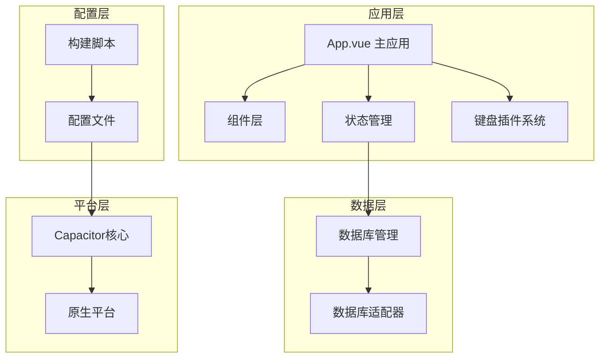
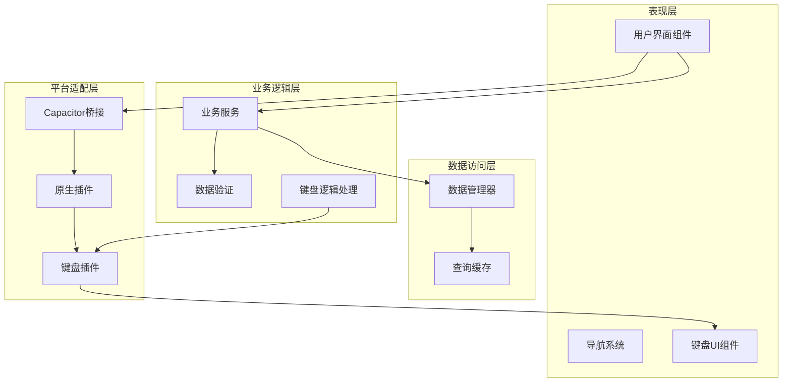
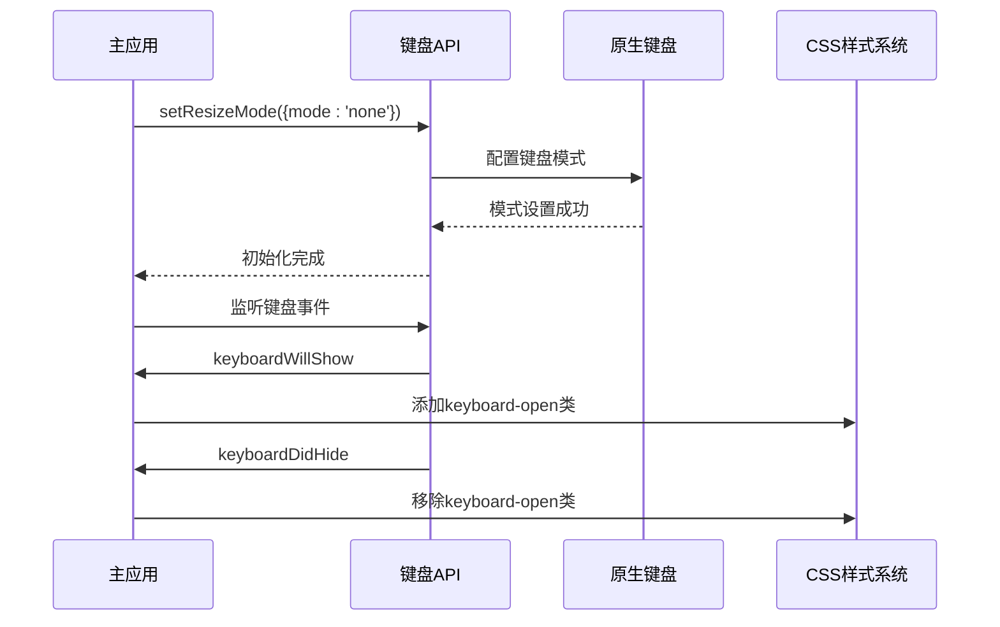
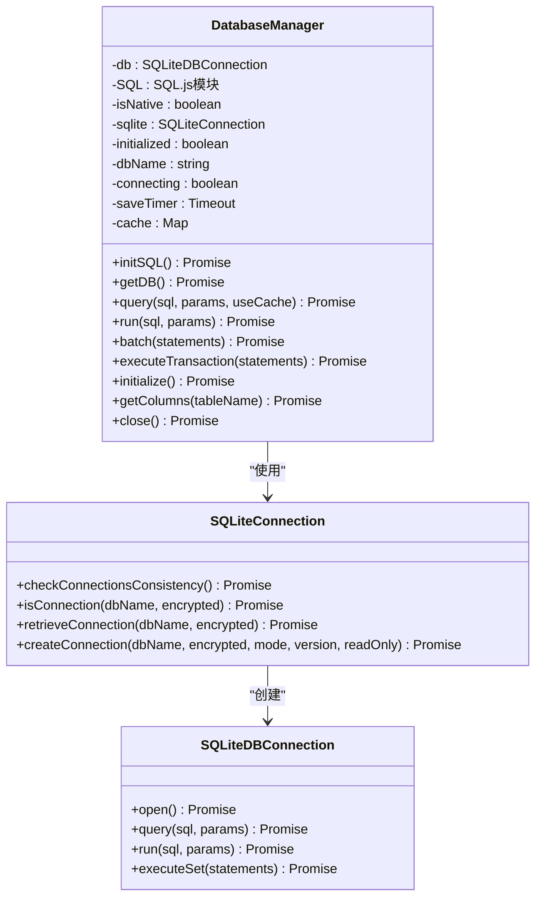
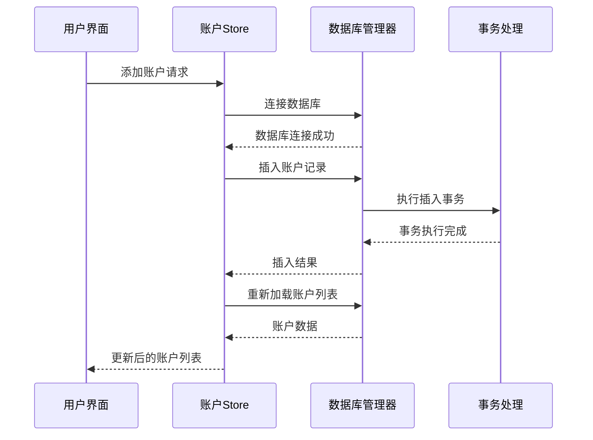
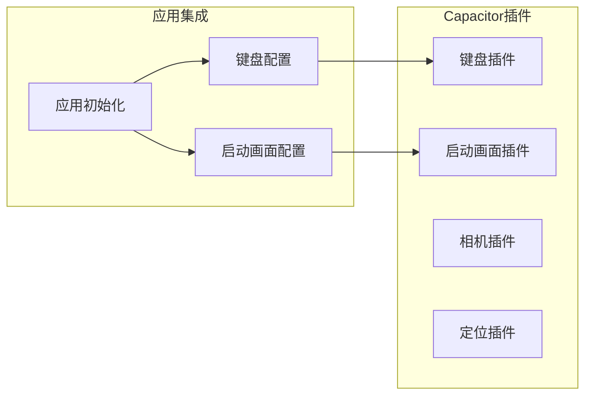
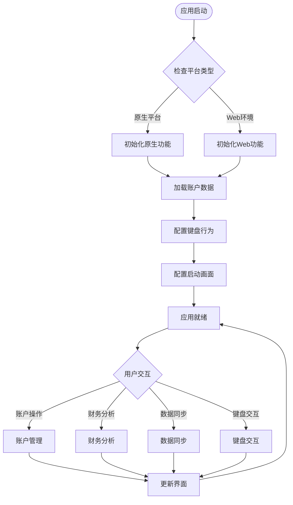

# Capacitor移动端应用

<cite>
**本文档引用的文件**
- [capacitor.config.json](file://capacitor.config.json)
- [package.json](file://package.json)
- [src/main.ts](file://src/main.ts)
- [src/App.vue](file://src/App.vue)
- [index.html](file://index.html)
- [vite.config.ts](file://vite.config.ts)
- [scripts/postinstall.js](file://scripts/postinstall.js)
- [src/components/mobile/account/AccountManagement.vue](file://src/components/mobile/account/AccountManagement.vue)
- [src/components/mobile/expense/ExpensePage.vue](file://src/components/mobile/expense/ExpensePage.vue)
- [src/components/mobile/expense/AddExpensePage.vue](file://src/components/mobile/expense/AddExpensePage.vue)
- [src/components/mobile/expense/NumberKeypad.vue](file://src/components/mobile/expense/NumberKeypad.vue)
- [src/components/mobile/account/AccountForm.vue](file://src/components/mobile/account/AccountForm.vue)
- [src/database/index.js](file://src/database/index.js)
- [src/stores/account.ts](file://src/stores/account.ts)
- [src/database/adapter.js](file://src/database/adapter.js)
</cite>

## 目录
1. [简介](#简介)
2. [项目结构](#项目结构)
3. [核心组件](#核心组件)
4. [架构概览](#架构概览)
5. [详细组件分析](#详细组件分析)
6. [依赖关系分析](#依赖关系分析)
7. [性能考虑](#性能考虑)
8. [故障排除指南](#故障排除指南)
9. [结论](#结论)
10. [附录](#附录)

## 简介
本项目是一个基于Vue 3和Capacitor的移动端财务管理应用，采用现代前端技术栈构建，支持跨平台部署到iOS和Android平台。应用实现了完整的财务管理体系，包括账户管理、收支记录、资产管理、负债管理和财务分析等功能模块。**最新更新**：集成了Capacitor键盘插件系统，通过'none'模式有效防止虚拟键盘导致的页面变形，显著提升了移动端用户体验。

## 项目结构
该项目采用模块化架构设计，主要分为以下几个层次：



**图表来源**
- [src/App.vue:1-195](file://src/App.vue#L1-L195)
- [src/database/index.js:1-800](file://src/database/index.js#L1-L800)
- [capacitor.config.json:1-23](file://capacitor.config.json#L1-L23)

**章节来源**
- [src/App.vue:1-195](file://src/App.vue#L1-L195)
- [src/main.ts:1-16](file://src/main.ts#L1-L16)
- [package.json:1-72](file://package.json#L1-L72)

## 核心组件
应用的核心组件包括主应用界面、数据库管理系统、状态管理模块、**键盘插件系统**和平台适配层。

### 主应用架构
应用采用响应式设计，通过Pinia进行状态管理，实现了完整的财务数据生命周期管理。

### 数据库系统
实现了跨平台的数据库抽象层，支持Capacitor SQLite和Web环境下的SQL.js两种实现方式。

### 键盘插件系统
**新增功能**：集成了Capacitor键盘插件，通过配置`"resize": "none"`和JavaScript API调用，有效防止虚拟键盘弹出时导致的页面变形和布局错乱。

### 插件系统
集成了多个Capacitor官方插件，包括键盘适配、启动画面等原生功能。

**章节来源**
- [src/App.vue:22-172](file://src/App.vue#L22-L172)
- [src/database/index.js:20-32](file://src/database/index.js#L20-L32)
- [src/stores/account.ts:27-32](file://src/stores/account.ts#L27-L32)

## 架构概览
应用采用分层架构设计，确保了良好的可维护性和扩展性。**最新架构**：新增了键盘插件系统层，专门处理移动端键盘交互问题。



**图表来源**
- [src/App.vue:65-117](file://src/App.vue#L65-L117)
- [src/database/index.js:199-264](file://src/database/index.js#L199-L264)
- [src/stores/account.ts:34-53](file://src/stores/account.ts#L34-L53)

## 详细组件分析

### 键盘插件系统
**新增功能**：应用集成了Capacitor键盘插件系统，专门解决移动端虚拟键盘导致的页面变形问题。



**图表来源**
- [src/App.vue:177-203](file://src/App.vue#L177-L203)
- [capacitor.config.json:10-12](file://capacitor.config.json#L10-L12)

#### 键盘配置详解
- **配置文件设置**：在`capacitor.config.json`中设置`"resize": "none"`，这是防止页面变形的关键配置
- **JavaScript初始化**：在`App.vue`中使用`Keyboard.setResizeMode({ mode: 'none' })`进行程序化配置
- **事件监听**：监听键盘显示/隐藏事件，用于日志记录和状态跟踪
- **CSS样式配合**：使用`:global(body.keyboard-open)`选择器确保键盘打开时页面布局稳定

#### 键盘交互优化
- **防止页面上移**：通过'none'模式完全阻止键盘弹出时的页面布局调整
- **固定容器高度**：确保应用容器始终保持100vh高度，不受键盘影响
- **底部导航栏可见性**：保证底部导航栏始终可见，提升用户体验
- **输入焦点管理**：仅监听键盘事件而不直接操作DOM，避免影响输入焦点

**章节来源**
- [capacitor.config.json:10-12](file://capacitor.config.json#L10-L12)
- [src/App.vue:177-203](file://src/App.vue#L177-L203)
- [src/App.vue:206-237](file://src/App.vue#L206-L237)

### 数据库管理系统
数据库管理系统是应用的核心基础设施，实现了高性能的数据持久化解决方案。



**图表来源**
- [src/database/index.js:21-190](file://src/database/index.js#L21-L190)
- [src/database/index.js:87-144](file://src/database/index.js#L87-L144)

#### 数据库连接策略
系统实现了智能的数据库连接管理，支持原生平台和Web环境的无缝切换：

1. **原生平台连接**：使用Capacitor SQLite插件，提供高性能的本地数据库访问
2. **Web环境连接**：使用SQL.js库，在浏览器中实现SQLite兼容的数据存储
3. **连接池管理**：避免重复创建数据库连接，提升应用性能
4. **缓存机制**：实现查询结果缓存，减少重复查询开销

**章节来源**
- [src/database/index.js:56-190](file://src/database/index.js#L56-L190)
- [src/database/index.js:420-776](file://src/database/index.js#L420-L776)

### 账户管理模块
账户管理模块提供了完整的财务账户生命周期管理功能。



**图表来源**
- [src/stores/account.ts:59-100](file://src/stores/account.ts#L59-L100)
- [src/stores/account.ts:163-185](file://src/stores/account.ts#L163-L185)

#### 核心功能特性
- **账户CRUD操作**：完整的增删改查功能
- **余额调整**：支持多种类型的余额调整
- **内部转账**：安全的账户间资金转移
- **事务保证**：所有金融操作都使用数据库事务确保数据一致性

**章节来源**
- [src/stores/account.ts:34-272](file://src/stores/account.ts#L34-L272)
- [src/components/mobile/account/AccountManagement.vue:158-377](file://src/components/mobile/account/AccountManagement.vue#L158-L377)

### 插件系统集成
应用集成了多个Capacitor官方插件，提供原生平台的增强功能。



**图表来源**
- [capacitor.config.json:6-13](file://capacitor.config.json#L6-L13)
- [src/App.vue:155-172](file://src/App.vue#L155-L172)

#### 插件配置详解
- **键盘插件**：禁用键盘自动调整布局，提供更好的用户体验
- **启动画面插件**：配置启动画面显示时长，提升应用加载体验

**章节来源**
- [capacitor.config.json:6-13](file://capacitor.config.json#L6-L13)
- [src/App.vue:155-172](file://src/App.vue#L155-L172)

### 移动端特化功能
应用针对移动端进行了深度优化，实现了多项移动端特有的功能。



**图表来源**
- [src/main.ts:8-11](file://src/main.ts#L8-L11)
- [src/App.vue:155-172](file://src/App.vue#L155-L172)

## 依赖关系分析

```mermaid
graph TB
subgraph "运行时依赖"
Vue[Vue 3.5.32]
Pinia[Pinia 2.1.7]
ElementPlus[Element Plus 2.13.7]
Capacitor[Capacitor 6.1.2]
KeyboardPlugin[@capacitor/keyboard 6.1.2]
end
subgraph "数据库依赖"
SQLitePlugin[@capacitor-community/sqlite 6.0.1]
SQLJS[sql.js 1.10.3]
end
subgraph "开发工具"
Vite[Vite 5.3.1]
TypeScript[TypeScript 5.2.2]
ESLint[ESLint]
PostInstall[postinstall.js]
end
subgraph "原生平台"
Android[Android 6.1.2]
iOS[iOS 6.1.2]
end
Vue --> Pinia
Vue --> ElementPlus
Vue --> Capacitor
Capacitor --> Android
Capacitor --> iOS
Capacitor --> KeyboardPlugin
Capacitor --> SQLitePlugin
KeyboardPlugin --> PostInstall
SQLitePlugin --> SQLJS
```

**图表来源**
- [package.json:19-36](file://package.json#L19-L36)
- [package.json:37-47](file://package.json#L37-L47)

**章节来源**
- [package.json:19-72](file://package.json#L19-L72)
- [scripts/postinstall.js:1-145](file://scripts/postinstall.js#L1-145)

## 性能考虑
应用在设计时充分考虑了移动端的性能特点，采用了多项优化策略：

### 内存管理优化
- **连接池管理**：避免频繁创建和销毁数据库连接
- **查询缓存**：对常用查询结果进行缓存，减少数据库访问
- **懒加载策略**：按需加载组件和数据，减少初始内存占用

### 网络和存储优化
- **批处理操作**：将多个数据库操作合并为事务，提升执行效率
- **增量更新**：只更新发生变化的数据，减少不必要的操作
- **数据压缩**：对存储的数据进行适当的压缩处理

### 用户体验优化
- **防抖机制**：对高频操作进行防抖处理，避免过度渲染
- **虚拟滚动**：对大量数据进行虚拟化处理，提升滚动性能
- **渐进式加载**：优先加载关键数据，其他数据异步加载
- **键盘交互优化**：**新增**：通过'none'模式防止键盘导致的页面变形，提升输入体验

### 键盘交互性能优化
- **事件监听优化**：仅监听必要事件，避免频繁DOM操作
- **CSS样式优化**：使用全局选择器减少样式计算开销
- **内存管理**：合理管理键盘事件监听器，避免内存泄漏

## 故障排除指南

### 常见问题诊断
1. **数据库连接失败**
   - 检查Capacitor SQLite插件是否正确安装
   - 验证数据库初始化流程是否完成
   - 确认平台兼容性设置

2. **键盘适配问题**
   - **新增**：确认Keyboard插件配置正确，检查`"resize": "none"`设置
   - 检查键盘事件监听是否正常工作
   - 验证CSS样式是否正确应用
   - 确认postinstall脚本是否正确修改了Java版本

3. **构建配置问题**
   - 检查Java版本兼容性
   - 验证Android构建选项设置
   - 确认Capacitor CLI版本匹配
   - **新增**：检查键盘插件的build.gradle文件是否正确修改

**章节来源**
- [scripts/postinstall.js:40-145](file://scripts/postinstall.js#L40-L145)
- [src/database/index.js:80-190](file://src/database/index.js#L80-L190)

## 结论
本Capacitor移动端应用展现了现代跨平台移动开发的最佳实践，通过合理的架构设计和性能优化，实现了功能完整、性能优异的财务管理应用。应用的核心优势包括：

1. **跨平台一致性**：统一的代码基础支持iOS和Android平台
2. **高性能数据处理**：智能的数据库抽象层和缓存机制
3. **原生功能集成**：完善的Capacitor插件生态系统
4. **用户体验优化**：**新增**：通过键盘插件系统有效防止页面变形，显著提升移动端输入体验
5. **键盘交互优化**：**新增**：通过'none'模式和事件监听机制，确保键盘弹出时的界面稳定性

该应用为类似的企业级财务管理应用提供了优秀的参考模板，展示了如何在保持功能完整性的同时，实现卓越的性能和用户体验。

## 附录

### 配置文件详解
应用的关键配置文件包括：

- **capacitor.config.json**：核心配置文件，定义应用标识、名称、插件配置等
- **package.json**：项目依赖和构建脚本配置
- **vite.config.ts**：Vite构建工具配置
- **tsconfig.json**：TypeScript编译配置

### 开发和部署流程
1. **开发环境搭建**：安装Node.js和npm，配置Capacitor CLI
2. **依赖安装**：执行npm install安装项目依赖
3. **平台添加**：使用Capacitor CLI添加iOS和Android平台
4. **键盘插件配置**：**新增**：确保postinstall脚本正确执行，修改键盘插件的Java版本
5. **代码构建**：使用Vite进行开发构建
6. **原生平台同步**：执行cap sync同步原生平台代码
7. **应用调试**：在模拟器或真机上进行调试测试
8. **生产构建**：生成最终的应用包

### 最佳实践建议
- 定期备份数据库文件
- 实施数据迁移策略
- 进行充分的跨平台测试
- 优化应用启动时间和内存使用
- 实施错误监控和日志记录
- **新增**：定期测试键盘交互功能，确保在不同设备上的兼容性
- **新增**：监控键盘事件监听器的内存使用情况，避免内存泄漏