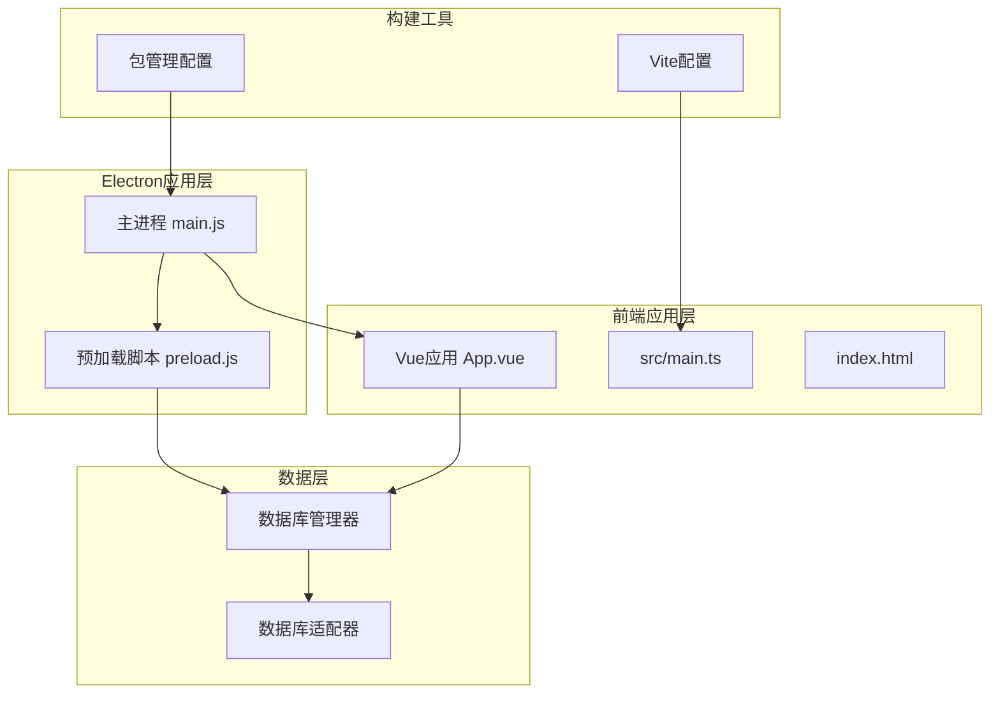
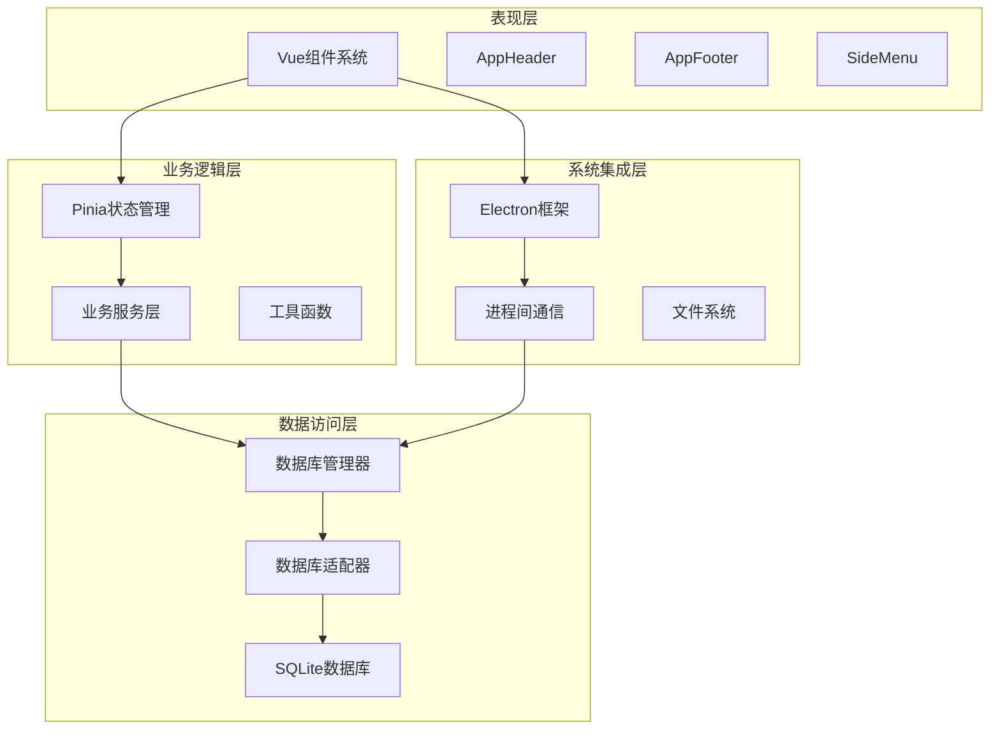
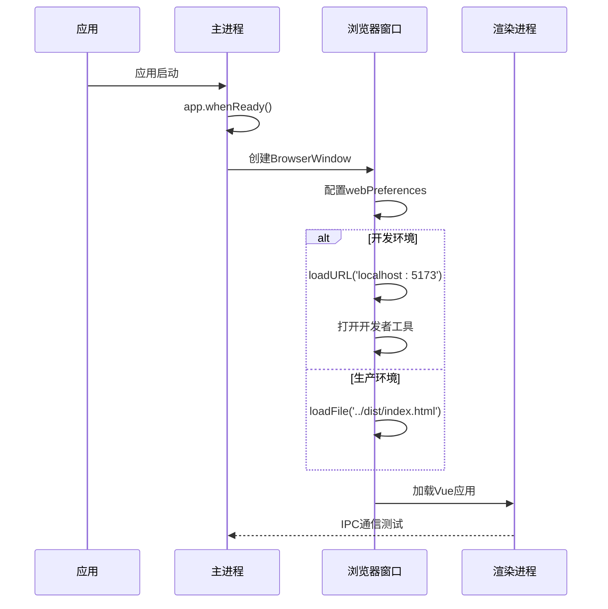
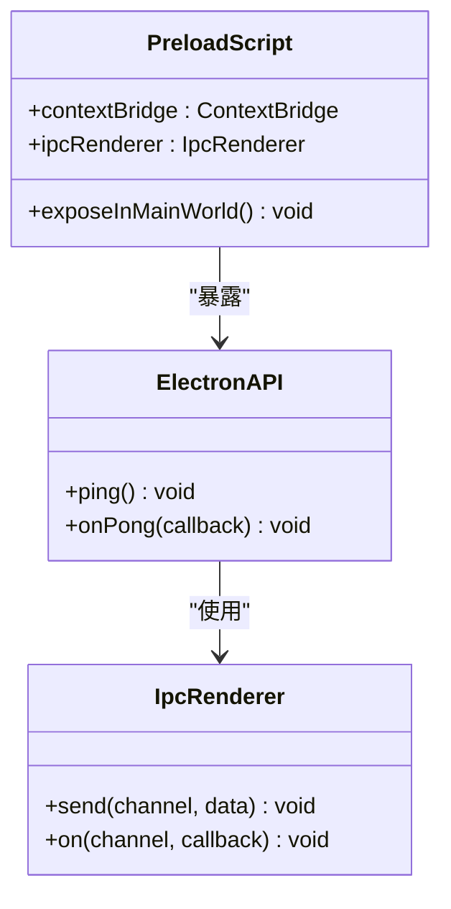
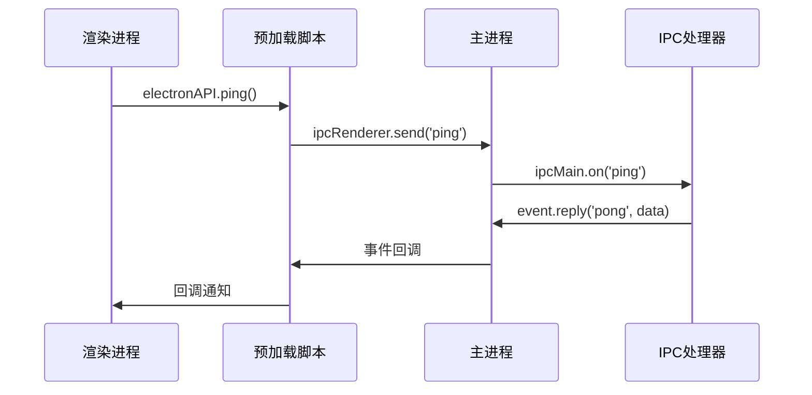
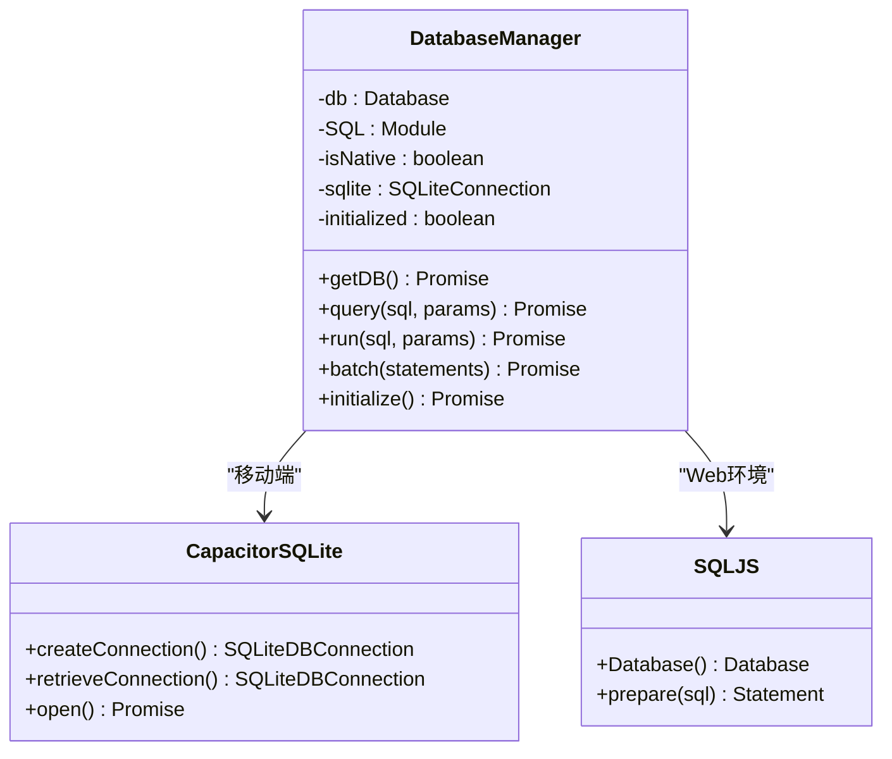
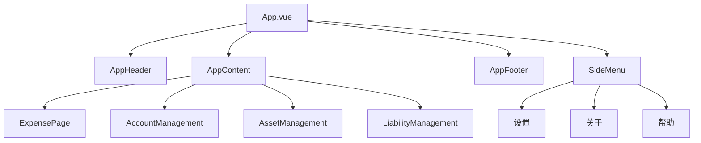

# Electron桌面应用

<cite>
**本文档引用的文件**
- [electron/main.js](file://electron/main.js)
- [electron/preload.js](file://electron/preload.js)
- [package.json](file://package.json)
- [vite.config.ts](file://vite.config.ts)
- [index.html](file://index.html)
- [src/main.ts](file://src/main.ts)
- [src/App.vue](file://src/App.vue)
- [src/database/index.js](file://src/database/index.js)
- [src/database/adapter.js](file://src/database/adapter.js)
- [scripts/postinstall.js](file://scripts/postinstall.js)
</cite>

## 目录
1. [简介](#简介)
2. [项目结构](#项目结构)
3. [核心组件](#核心组件)
4. [架构概览](#架构概览)
5. [详细组件分析](#详细组件分析)
6. [依赖关系分析](#依赖关系分析)
7. [性能考虑](#性能考虑)
8. [故障排除指南](#故障排除指南)
9. [结论](#结论)
10. [附录](#附录)

## 简介
本项目是一个基于Vue 3和Electron的桌面应用，专注于财务管理功能。应用采用现代前端技术栈，结合Electron实现桌面端原生体验，同时支持移动端特性。项目实现了完整的财务管理系统，包括账户管理、收支记录、资产管理、负债管理和财务目标等功能模块。

## 项目结构
项目采用前后端分离的架构设计，主要分为以下层次：



**图表来源**
- [electron/main.js:1-70](file://electron/main.js#L1-L70)
- [electron/preload.js:1-7](file://electron/preload.js#L1-L7)
- [src/App.vue:1-195](file://src/App.vue#L1-L195)

**章节来源**
- [package.json:1-72](file://package.json#L1-L72)
- [vite.config.ts:1-11](file://vite.config.ts#L1-L11)

## 核心组件
应用的核心组件包括主进程、预加载脚本、数据库管理层和前端Vue应用。

### 主进程组件
主进程负责应用的生命周期管理和窗口创建，采用单例模式管理主窗口实例。

### 预加载脚本组件
预加载脚本通过contextBridge安全地向渲染进程暴露API接口，实现主进程与渲染进程的安全通信。

### 数据库管理层
数据库管理器支持多种平台的SQLite实现，包括Capacitor SQLite（移动端）和sql.js（Web环境），提供统一的数据库操作接口。

**章节来源**
- [electron/main.js:13-45](file://electron/main.js#L13-L45)
- [electron/preload.js:1-7](file://electron/preload.js#L1-L7)
- [src/database/index.js:21-32](file://src/database/index.js#L21-L32)

## 架构概览
应用采用分层架构设计，各层职责明确，耦合度低：



**图表来源**
- [src/App.vue:22-172](file://src/App.vue#L22-L172)
- [src/database/index.js:8-10](file://src/database/index.js#L8-L10)
- [electron/main.js:5-7](file://electron/main.js#L5-L7)

## 详细组件分析

### 主进程实现分析
主进程负责应用的核心功能实现，包括窗口管理、生命周期控制和IPC通信。

#### 窗口创建与配置
主进程通过BrowserWindow类创建应用窗口，配置项包括窗口尺寸、webPreferences等关键参数。

#### 生命周期管理
应用实现了完整的生命周期管理，包括应用启动、窗口激活、窗口关闭等事件处理。

#### 开发环境与生产环境切换
主进程根据NODE_ENV环境变量自动切换开发服务器或打包文件，支持热重载功能。



**图表来源**
- [electron/main.js:19-45](file://electron/main.js#L19-L45)
- [electron/main.js:31-39](file://electron/main.js#L31-L39)

**章节来源**
- [electron/main.js:16-61](file://electron/main.js#L16-L61)

### 预加载脚本实现分析
预加载脚本通过contextBridge安全地暴露API给渲染进程，实现主进程与渲染进程的通信。

#### API暴露策略
预加载脚本通过contextBridge.exposeInMainWorld方法向全局作用域暴露electronAPI对象。

#### 安全上下文隔离
虽然当前配置禁用了上下文隔离，但通过预加载脚本实现了最小权限原则的API暴露。



**图表来源**
- [electron/preload.js:1-6](file://electron/preload.js#L1-L6)

**章节来源**
- [electron/preload.js:1-7](file://electron/preload.js#L1-L7)

### IPC通信机制分析
应用实现了基础的IPC通信机制，支持主进程与渲染进程之间的消息传递。

#### 消息传递模式
当前实现支持请求-响应模式，通过事件驱动的方式处理消息。

#### 安全考虑
由于禁用了上下文隔离，需要在预加载脚本中严格控制API暴露范围。



**图表来源**
- [electron/main.js:67-69](file://electron/main.js#L67-L69)
- [electron/preload.js:4-6](file://electron/preload.js#L4-L6)

**章节来源**
- [electron/main.js:63-70](file://electron/main.js#L63-L70)

### 数据库管理器实现分析
数据库管理器提供了统一的数据库操作接口，支持多平台SQLite实现。

#### 多平台支持
支持Capacitor SQLite（移动端）和sql.js（Web环境）两种实现方式。

#### 性能优化
实现了连接池管理、查询缓存、批处理等性能优化措施。



**图表来源**
- [src/database/index.js:21-32](file://src/database/index.js#L21-L32)
- [src/database/index.js:81-148](file://src/database/index.js#L81-L148)

**章节来源**
- [src/database/index.js:1-935](file://src/database/index.js#L1-L935)

### Vue应用架构分析
前端应用采用Vue 3 Composition API，实现了完整的财务管理系统界面。

#### 组件化设计
应用采用组件化架构，包括头部、底部、侧边菜单等基础组件。

#### 状态管理
使用Pinia进行状态管理，支持响应式数据绑定和组件间通信。



**图表来源**
- [src/App.vue:65-89](file://src/App.vue#L65-L89)
- [src/App.vue:119-137](file://src/App.vue#L119-L137)

**章节来源**
- [src/App.vue:1-195](file://src/App.vue#L1-L195)

## 依赖关系分析
应用的依赖关系呈现清晰的分层结构：

```mermaid
graph TB
subgraph "运行时依赖"
Electron[electron@^29.3.1]
Vue[vue@^3.5.32]
Pinia[pinia@^2.1.7]
ElementPlus[element-plus@^2.13.7]
end
subgraph "开发时依赖"
Vite[vite@^5.3.1]
TS[typescript@^5.2.2]
Builder[electron-builder@^24.13.3]
Concurrently[concurrently@^8.2.2]
end
subgraph "平台特定依赖"
CapacitorSQLite[@capacitor-community/sqlite@^6.0.1]
SQLJS[sql.js@^1.10.3]
CapacitorCore[@capacitor/core@^6.1.2]
end
Electron --> Vite
Vue --> ElementPlus
Pinia --> Vue
CapacitorSQLite --> CapacitorCore
SQLJS --> Vue
```

**图表来源**
- [package.json:19-47](file://package.json#L19-L47)

**章节来源**
- [package.json:1-72](file://package.json#L1-L72)

## 性能考虑
应用在多个层面实现了性能优化：

### 数据库性能优化
- 连接池管理：避免频繁创建数据库连接
- 查询缓存：减少重复查询的开销
- 批处理执行：批量操作提升性能
- 索引优化：为常用查询字段建立索引

### 前端性能优化
- 组件懒加载：按需加载大型组件
- 图片优化：使用合适的图片格式和尺寸
- CSS优化：移除未使用的样式
- 代码分割：拆分bundle减小体积

### Electron性能优化
- 窗口复用：避免创建过多窗口
- IPC优化：减少不必要的消息传递
- 资源管理：及时释放不需要的资源

## 故障排除指南
常见问题及解决方案：

### 开发环境问题
1. **热重载失效**
   - 检查Vite配置和端口占用
   - 确认NODE_ENV环境变量设置

2. **预加载脚本错误**
   - 验证contextBridge配置
   - 检查API暴露的权限范围

### 生产环境问题
1. **应用无法启动**
   - 检查打包配置和文件路径
   - 验证electron-builder设置

2. **数据库连接失败**
   - 确认平台检测逻辑
   - 检查SQLite插件安装情况

**章节来源**
- [scripts/postinstall.js:1-145](file://scripts/postinstall.js#L1-L145)

## 结论
本项目展示了如何构建一个功能完整的Electron桌面应用。通过合理的架构设计和多平台支持，应用能够在Windows、macOS和Linux平台上提供一致的用户体验。项目在性能优化、安全性考虑和开发体验方面都有良好的实践，为类似项目的开发提供了参考模板。

## 附录

### 开发环境配置
- Node.js版本：18+
- 包管理器：npm/pnpm
- 开发工具：VS Code + Vue DevTools

### 生产环境构建
- 打包工具：electron-builder
- 目标平台：Windows、macOS、Linux
- 输出格式：NSIS、DMG、AppImage

### 安全最佳实践
- 启用contextIsolation
- 最小权限原则暴露API
- 输入验证和输出编码
- 定期更新依赖包