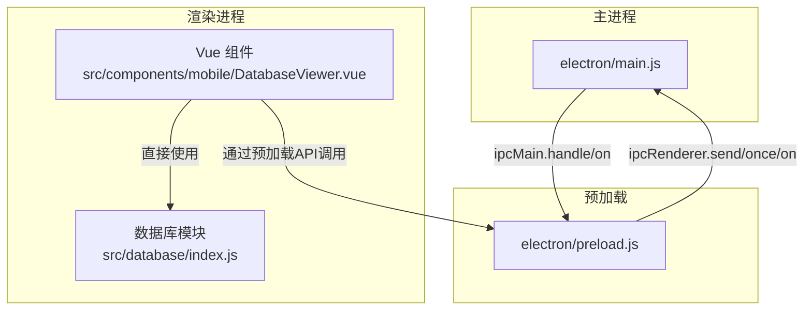
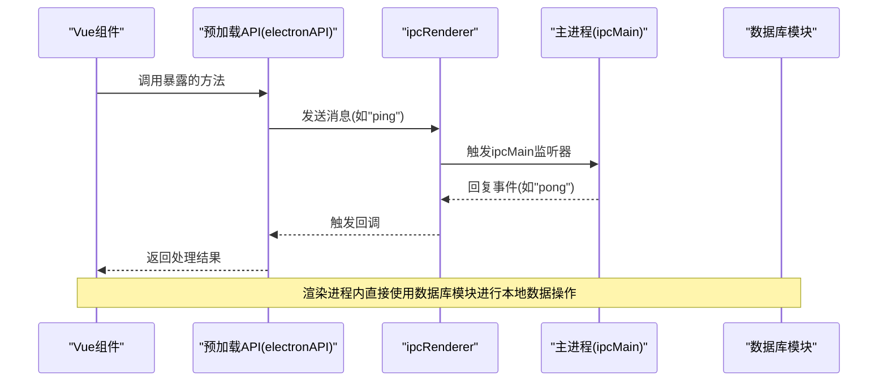
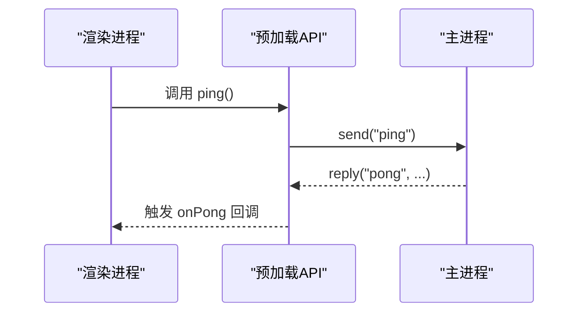
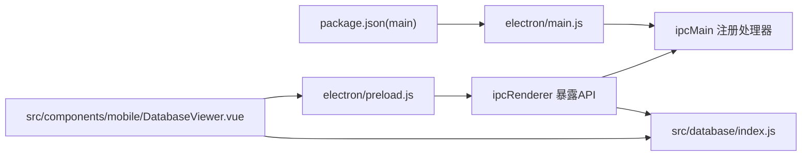

# IPC进程通信

<cite>
**本文引用的文件**
- [electron/main.js](file://electron/main.js)
- [electron/preload.js](file://electron/preload.js)
- [src/database/index.js](file://src/database/index.js)
- [src/components/mobile/DatabaseViewer.vue](file://src/components/mobile/DatabaseViewer.vue)
- [src/App.vue](file://src/App.vue)
- [package.json](file://package.json)
</cite>

## 目录
1. [简介](#简介)
2. [项目结构](#项目结构)
3. [核心组件](#核心组件)
4. [架构总览](#架构总览)
5. [详细组件分析](#详细组件分析)
6. [依赖关系分析](#依赖关系分析)
7. [性能考量](#性能考量)
8. [故障排查指南](#故障排查指南)
9. [结论](#结论)
10. [附录](#附录)

## 简介
本文件系统性梳理该Electron应用中的IPC进程通信机制，围绕主进程与渲染进程之间的消息传递展开，重点覆盖以下方面：
- 使用方式：ipcMain与ipcRenderer的典型用法、消息命名规范与事件监听
- 通信模式：请求-响应、事件广播、双向通信等
- 安全考虑：数据校验、权限控制、防止XSS等
- 实践技巧：错误处理、超时控制、批量消息处理等
- 性能优化与常见问题排查

当前仓库中存在最小可用的“ping/pong”示例，本文将以该示例为基础，扩展到更完整的IPC通信设计与最佳实践。

## 项目结构
该项目采用Electron + Vue 3前端框架，IPC相关的关键文件位于electron目录与src/database目录中：
- electron/main.js：主进程入口，负责创建BrowserWindow与注册ipcMain处理器
- electron/preload.js：预加载脚本，通过contextBridge向渲染进程暴露受控API
- src/database/index.js：数据库访问层，封装Capacitor SQLite与sql.js，提供查询、执行、批处理等能力
- src/components/mobile/DatabaseViewer.vue：演示组件，展示数据库数据读取与状态检查
- package.json：定义Electron主进程入口与构建脚本

图表来源
- [electron/main.js:19-69](file://electron/main.js#L19-L69)
- [electron/preload.js:1-6](file://electron/preload.js#L1-L6)
- [src/components/mobile/DatabaseViewer.vue:141-172](file://src/components/mobile/DatabaseViewer.vue#L141-L172)
- [src/database/index.js:199-347](file://src/database/index.js#L199-L347)

章节来源
- [electron/main.js:19-69](file://electron/main.js#L19-L69)
- [electron/preload.js:1-6](file://electron/preload.js#L1-L6)
- [src/components/mobile/DatabaseViewer.vue:141-172](file://src/components/mobile/DatabaseViewer.vue#L141-L172)
- [src/database/index.js:199-347](file://src/database/index.js#L199-L347)
- [package.json:1-72](file://package.json#L1-L72)

## 核心组件
- 主进程处理器（ipcMain）：在主进程中注册事件监听器，接收来自渲染进程的消息并进行处理，必要时通过event.reply或event.sender.send进行响应。
- 预加载桥接（contextBridge + ipcRenderer）：在预加载脚本中通过contextBridge.exposeInMainWorld向渲染进程暴露安全可控的API，渲染进程通过这些API间接使用ipcRenderer。
- 渲染进程调用方：在Vue组件中调用预加载暴露的API，发起IPC请求；同时组件内部也直接使用数据库模块进行本地数据操作。

章节来源
- [electron/main.js:67-69](file://electron/main.js#L67-L69)
- [electron/preload.js:3-6](file://electron/preload.js#L3-L6)

## 架构总览
下图展示了从渲染进程到主进程的典型IPC调用链路，以及数据库模块在渲染进程内的职责边界。

图表来源
- [electron/preload.js:3-6](file://electron/preload.js#L3-L6)
- [electron/main.js:67-69](file://electron/main.js#L67-L69)
- [src/components/mobile/DatabaseViewer.vue:141-172](file://src/components/mobile/DatabaseViewer.vue#L141-L172)

## 详细组件分析

### 主进程（electron/main.js）
- 窗口创建与生命周期：创建BrowserWindow，设置webPreferences，按开发/生产环境加载不同资源，并处理窗口关闭与应用退出。
- IPC处理器：注册名为“ping”的事件监听器，收到消息后通过event.reply向渲染进程回复“pong”。

章节来源
- [electron/main.js:19-69](file://electron/main.js#L19-L69)

### 预加载脚本（electron/preload.js）
- 暴露API：通过contextBridge.exposeInMainWorld在window对象上挂载electronAPI，包含ping与onPong两个方法。
- 通信入口：ping用于触发ipcRenderer.send("ping")，onPong用于注册对"pong"事件的监听回调。

章节来源
- [electron/preload.js:1-6](file://electron/preload.js#L1-L6)

### 渲染进程组件（src/components/mobile/DatabaseViewer.vue）
- 数据加载流程：在mounted钩子中调用checkStorageStatus与loadTableData，分别检查数据库状态与查询表数据。
- 数据查询：通过db.query执行SQL查询，获取表数据并计算列名，最终渲染到页面。
- 本地存储检查：在Web环境下检查localStorage中是否保存了SQLite数据，以判断持久化状态。

章节来源
- [src/components/mobile/DatabaseViewer.vue:141-172](file://src/components/mobile/DatabaseViewer.vue#L141-L172)
- [src/components/mobile/DatabaseViewer.vue:174-199](file://src/components/mobile/DatabaseViewer.vue#L174-L199)

### 数据库模块（src/database/index.js）
- 单例管理：DatabaseManager类负责数据库连接、初始化、查询、执行、批处理与事务。
- 平台适配：根据Capacitor.isNativePlatform()选择Capacitor SQLite或sql.js实现。
- 查询与执行：query支持参数绑定与结果缓存；run与batch分别执行写操作；executeTransaction提供事务封装。
- 性能优化：连接复用、查询缓存、Web端持久化节流、索引优化等。

章节来源
- [src/database/index.js:21-347](file://src/database/index.js#L21-L347)
- [src/database/index.js:826-890](file://src/database/index.js#L826-L890)

### 请求-响应模式（Ping/Pong）
- 渲染进程：调用electronAPI.ping触发"ping"消息。
- 主进程：ipcMain.on("ping")监听并使用event.reply("pong", ...)进行响应。
- 渲染进程：通过electronAPI.onPong注册回调接收"pong"事件。

图表来源
- [electron/preload.js:3-6](file://electron/preload.js#L3-L6)
- [electron/main.js:67-69](file://electron/main.js#L67-L69)

### 事件广播与双向通信
- 双向通信：预加载API可同时提供发送与监听方法（如ping与onPong），形成双向通道。
- 事件广播：可在主进程注册多个ipcMain监听器，向多个渲染进程分发同一事件；或在渲染进程内通过多个监听器订阅不同事件。

章节来源
- [electron/preload.js:3-6](file://electron/preload.js#L3-L6)
- [electron/main.js:67-69](file://electron/main.js#L67-L69)

### 异步处理与错误处理
- 异步查询：数据库模块的query/run/batch均返回Promise，渲染进程需await或使用try/catch处理异常。
- 错误处理：在组件中对数据库查询与状态检查进行错误捕获与降级提示，避免阻塞UI。

章节来源
- [src/database/index.js:199-347](file://src/database/index.js#L199-L347)
- [src/components/mobile/DatabaseViewer.vue:141-172](file://src/components/mobile/DatabaseViewer.vue#L141-L172)

### 批量消息处理与性能优化
- 批处理：数据库模块提供batch与executeTransaction，减少多次往返与锁竞争，提升吞吐。
- 缓存策略：query支持基于SQL与参数的缓存键，命中缓存可显著降低重复查询成本。
- Web持久化节流：debouncedSave对Web端频繁写入进行节流，避免localStorage写入风暴。

章节来源
- [src/database/index.js:315-347](file://src/database/index.js#L315-L347)
- [src/database/index.js:199-264](file://src/database/index.js#L199-L264)
- [src/database/index.js:379-408](file://src/database/index.js#L379-L408)

## 依赖关系分析
- 主进程依赖：electron/main.js依赖electron模块创建BrowserWindow与注册ipcMain处理器。
- 预加载依赖：preload.js依赖electron的contextBridge与ipcRenderer，向渲染进程暴露受控API。
- 渲染进程依赖：Vue组件依赖数据库模块进行数据读取与状态检查；同时通过预加载API与主进程通信。
- 构建与运行：package.json定义主进程入口为electron/main.js，开发脚本通过concurrently启动Vite与Electron。

图表来源
- [package.json:6](file://package.json#L6)
- [electron/main.js:5-7](file://electron/main.js#L5-L7)
- [electron/preload.js:1](file://electron/preload.js#L1)
- [src/database/index.js:8-10](file://src/database/index.js#L8-L10)
- [src/components/mobile/DatabaseViewer.vue:103](file://src/components/mobile/DatabaseViewer.vue#L103)

章节来源
- [package.json:6](file://package.json#L6)
- [electron/main.js:5-7](file://electron/main.js#L5-L7)
- [electron/preload.js:1](file://electron/preload.js#L1)
- [src/database/index.js:8-10](file://src/database/index.js#L8-L10)
- [src/components/mobile/DatabaseViewer.vue:103](file://src/components/mobile/DatabaseViewer.vue#L103)

## 性能考量
- 连接与缓存：数据库模块采用单例连接与查询缓存，减少重复初始化与查询成本。
- 批处理与事务：对多条写操作使用batch或executeTransaction，降低锁竞争与I/O次数。
- Web持久化节流：对Web端的localStorage写入进行节流，避免频繁同步导致卡顿。
- UI渲染：在大数据量场景下，建议分页或虚拟滚动，避免一次性渲染过多DOM节点。

章节来源
- [src/database/index.js:21-347](file://src/database/index.js#L21-L347)
- [src/database/index.js:379-408](file://src/database/index.js#L379-L408)

## 故障排查指南
- 无法建立IPC通信
  - 检查预加载API是否正确暴露（window.electronAPI是否存在）
  - 确认渲染进程调用的事件名与主进程监听一致
  - 查看主进程是否成功注册ipcMain监听器
- 渲染进程无法访问数据库
  - 确认数据库模块初始化与连接逻辑是否执行成功
  - 检查平台判断（Capacitor.isNativePlatform）与对应实现分支
- 性能问题
  - 关注查询缓存命中率与批量操作使用情况
  - 对高频写入场景启用节流或合并写入
- 安全问题
  - 禁止在渲染进程直接启用Node.js集成与禁用上下文隔离
  - 严格校验IPC传入参数，避免注入与越权访问

章节来源
- [electron/preload.js:3-6](file://electron/preload.js#L3-L6)
- [electron/main.js:67-69](file://electron/main.js#L67-L69)
- [src/database/index.js:21-347](file://src/database/index.js#L21-L347)

## 结论
本项目提供了最小可用的IPC示例（ping/pong），结合预加载桥接与数据库模块，形成了从渲染进程到主进程再到数据库的完整调用链。建议在此基础上完善：
- 增加更多业务相关的IPC消息类型与处理器
- 引入统一的错误码与异常包装，便于前端统一处理
- 对高频操作引入批量与缓存策略，提升整体性能
- 强化安全基线，确保预加载API只暴露必要能力

## 附录
- 最佳实践清单
  - 事件命名：使用清晰、稳定的事件名，避免冲突
  - 参数校验：在主进程与数据库层均进行输入校验
  - 错误处理：为IPC与数据库调用提供统一的错误捕获与反馈
  - 超时控制：对耗时操作设置超时，避免UI长时间无响应
  - 权限控制：限制渲染进程可调用的IPC能力范围
  - XSS防护：避免在渲染进程直接拼接不受信任的HTML内容