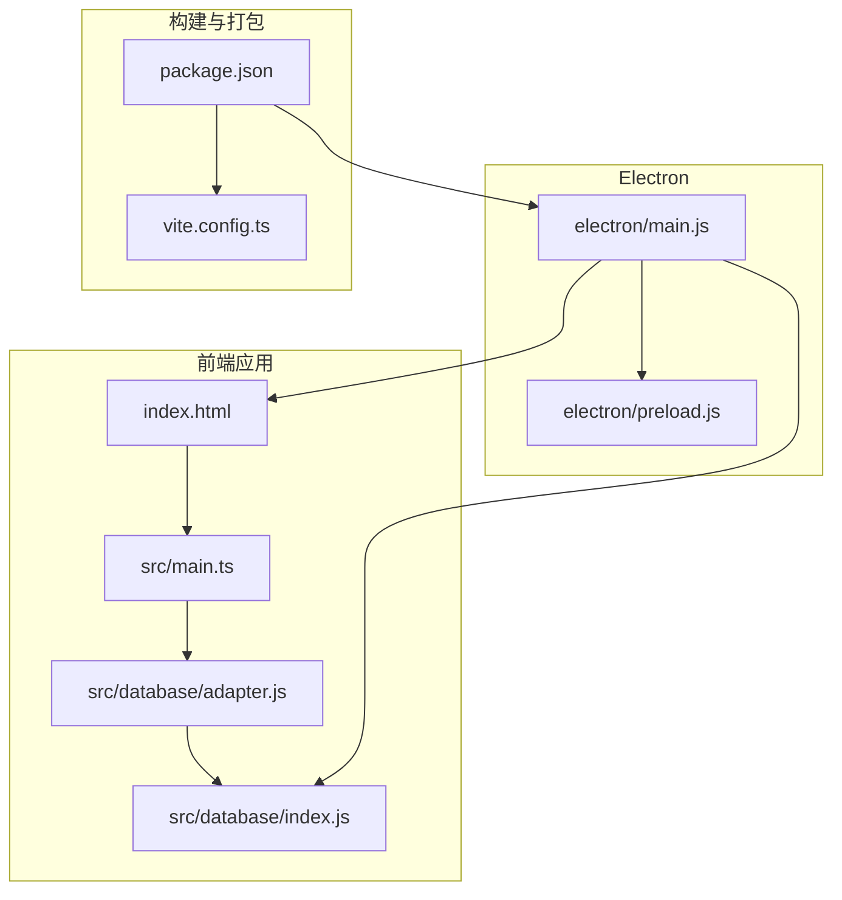
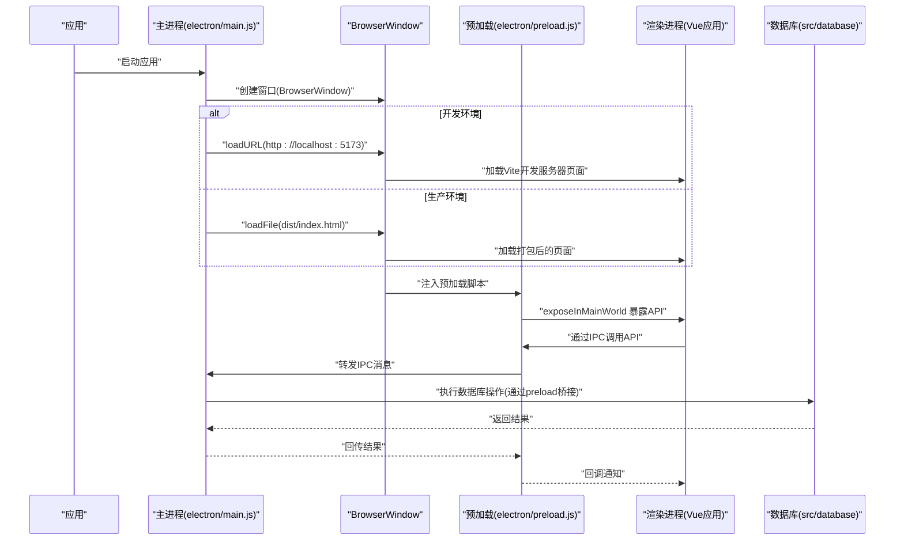
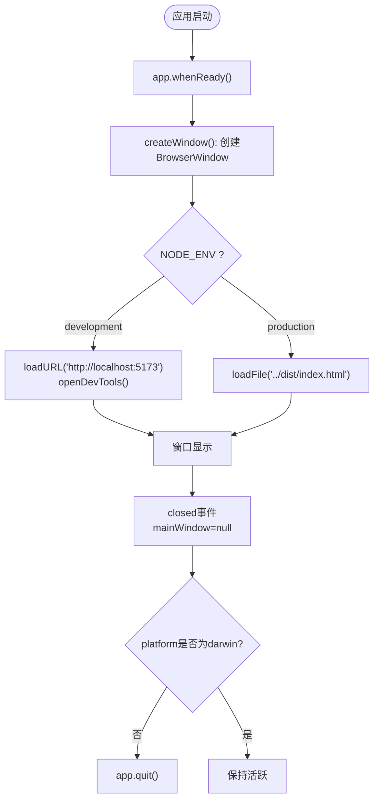
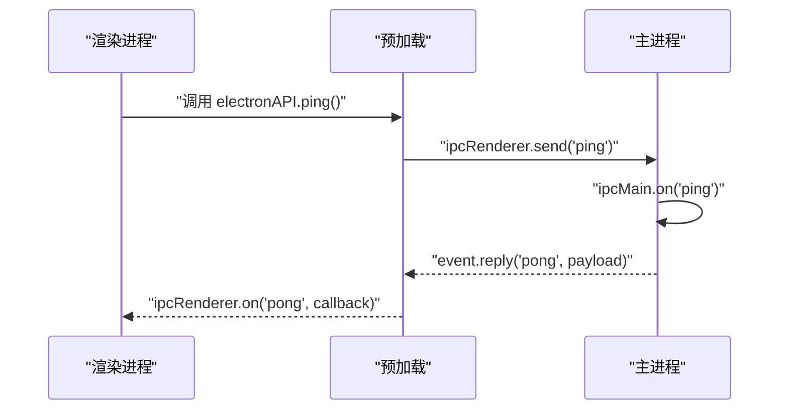
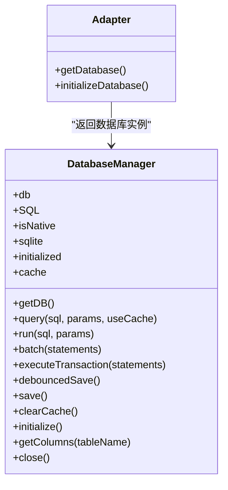
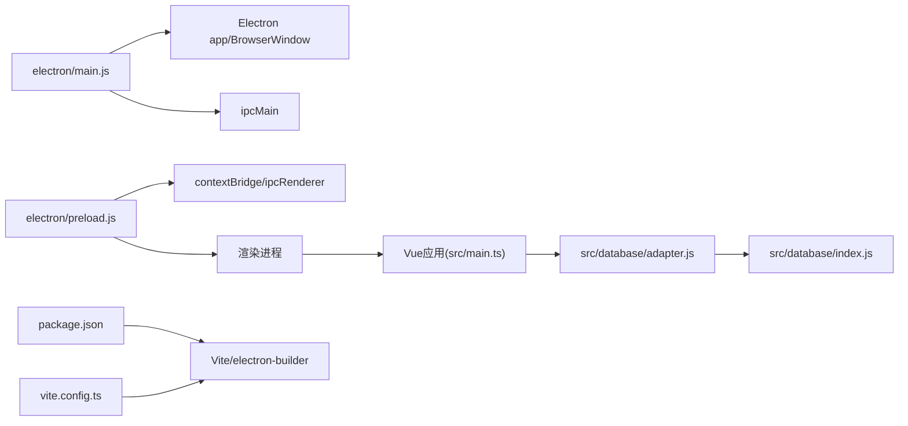

# 主进程管理

<cite>
**本文引用的文件**
- [electron/main.js](file://electron/main.js)
- [electron/preload.js](file://electron/preload.js)
- [package.json](file://package.json)
- [vite.config.ts](file://vite.config.ts)
- [src/main.ts](file://src/main.ts)
- [index.html](file://index.html)
- [src/database/adapter.js](file://src/database/adapter.js)
- [src/database/index.js](file://src/database/index.js)
- [scripts/postinstall.js](file://scripts/postinstall.js)
</cite>

## 目录
1. [简介](#简介)
2. [项目结构](#项目结构)
3. [核心组件](#核心组件)
4. [架构总览](#架构总览)
5. [详细组件分析](#详细组件分析)
6. [依赖关系分析](#依赖关系分析)
7. [性能考量](#性能考量)
8. [故障排查指南](#故障排查指南)
9. [结论](#结论)
10. [附录](#附录)

## 简介
本文件面向Electron主进程管理，系统性梳理主进程的职责边界、生命周期管理、窗口创建与销毁机制、BrowserWindow配置要点（含尺寸、webPreferences、安全策略）、事件处理体系（app事件、窗口事件、系统事件），以及开发/生产环境差异（热重载、调试工具、资源加载）。同时给出主进程与渲染进程交互的最佳实践（IPC、错误处理、内存与性能优化），并结合本仓库实际代码进行落地说明。

## 项目结构
本项目采用“前端框架 + Electron封装”的组织方式：
- 前端应用位于 src 目录，使用Vue 3 + Vite构建，入口为 src/main.ts，挂载于 index.html 的 #app 容器。
- Electron层位于 electron 目录，包含主进程入口 electron/main.js 和预加载脚本 electron/preload.js。
- 构建与打包通过 package.json 中的脚本与 electron-builder 配置；Vite配置在 vite.config.ts。
- 数据层通过 src/database 提供跨平台数据库适配（Capacitor SQLite 与 sql.js），并在主进程中通过 preload 暴露接口给渲染进程。

图表来源
- [electron/main.js:1-70](file://electron/main.js#L1-L70)
- [electron/preload.js:1-7](file://electron/preload.js#L1-L7)
- [src/main.ts:1-16](file://src/main.ts#L1-L16)
- [index.html:1-13](file://index.html#L1-L13)
- [src/database/adapter.js:1-34](file://src/database/adapter.js#L1-L34)
- [src/database/index.js:1-800](file://src/database/index.js#L1-L800)
- [package.json:1-72](file://package.json#L1-L72)
- [vite.config.ts:1-11](file://vite.config.ts#L1-L11)

章节来源
- [package.json:1-72](file://package.json#L1-L72)
- [vite.config.ts:1-11](file://vite.config.ts#L1-L11)

## 核心组件
- 主进程入口：负责创建 BrowserWindow、根据环境加载开发/生产资源、注册应用级事件监听、处理IPC。
- 预加载脚本：通过 contextBridge 暴露受控API给渲染进程，避免直接暴露完整Electron能力。
- 前端入口：Vue应用初始化、插件注册、挂载根组件。
- 数据库适配：统一抽象不同平台的SQLite实现，支持Capacitor SQLite（移动端）与 sql.js（Web/桌面）。
- 构建配置：Vite用于开发与打包，package.json定义脚本与electron-builder打包配置。

章节来源
- [electron/main.js:1-70](file://electron/main.js#L1-L70)
- [electron/preload.js:1-7](file://electron/preload.js#L1-L7)
- [src/main.ts:1-16](file://src/main.ts#L1-L16)
- [src/database/adapter.js:1-34](file://src/database/adapter.js#L1-L34)
- [src/database/index.js:1-800](file://src/database/index.js#L1-L800)
- [package.json:1-72](file://package.json#L1-L72)
- [vite.config.ts:1-11](file://vite.config.ts#L1-L11)

## 架构总览
下图展示主进程、预加载、渲染进程、数据库层之间的交互关系与数据流向。

图表来源
- [electron/main.js:19-45](file://electron/main.js#L19-L45)
- [electron/preload.js:1-7](file://electron/preload.js#L1-L7)
- [src/database/index.js:1-800](file://src/database/index.js#L1-L800)

## 详细组件分析

### 主进程生命周期与窗口管理
- 应用就绪：使用 app.whenReady() 触发窗口创建。
- 窗口创建：BrowserWindow构造时指定尺寸与 webPreferences，绑定预加载脚本。
- 环境区分：开发环境加载本地Vite服务，自动打开开发者工具；生产环境加载打包后的 dist/index.html。
- 窗口关闭：监听 closed 事件，释放主窗口引用。
- macOS激活：app.activate 事件用于恢复窗口。
- 全部窗口关闭：非macOS平台退出应用。

图表来源
- [electron/main.js:48-61](file://electron/main.js#L48-L61)
- [electron/main.js:19-45](file://electron/main.js#L19-L45)

章节来源
- [electron/main.js:19-61](file://electron/main.js#L19-L61)

### BrowserWindow配置要点
- 尺寸：固定宽高，适合桌面应用界面布局。
- webPreferences：
  - preload：指向预加载脚本路径。
  - nodeIntegration：启用Node能力（存在安全风险）。
  - contextIsolation：禁用上下文隔离（与nodeIntegration配合使用）。
- 其他建议：可考虑开启 sandbox、disableRemoteModule、nativeWindowOpen 等以提升安全性；如需Node能力，应严格限制preload暴露的API范围。

章节来源
- [electron/main.js:20-28](file://electron/main.js#L20-L28)

### 预加载与IPC桥接
- 预加载通过 contextBridge.exposeInMainWorld 暴露有限API至渲染进程，避免直接访问Electron/Node能力。
- 渲染进程通过 ipcRenderer 发送消息，主进程在 ipcMain 注册处理器进行响应。
- 当前示例：渲染进程发送 'ping'，主进程回复 'pong'。

图表来源
- [electron/preload.js:1-7](file://electron/preload.js#L1-L7)
- [electron/main.js:67-69](file://electron/main.js#L67-L69)

章节来源
- [electron/preload.js:1-7](file://electron/preload.js#L1-L7)
- [electron/main.js:63-69](file://electron/main.js#L63-L69)

### 开发与生产环境差异
- 开发环境：
  - Vite本地服务地址作为窗口加载源。
  - 自动打开开发者工具便于调试。
- 生产环境：
  - 加载打包后的 dist/index.html。
  - 无自动打开开发者工具。
- 构建目标与基础路径：Vite配置目标为ES2015，基础路径为相对路径，保证打包后静态资源正确解析。

章节来源
- [electron/main.js:30-39](file://electron/main.js#L30-L39)
- [vite.config.ts:5-11](file://vite.config.ts#L5-L11)

### 数据库层与主进程交互
- 数据库适配器根据运行平台选择不同实现：
  - 原生平台：使用 Capacitor SQLite。
  - Web/桌面：使用 sql.js。
- 数据库管理类提供单例连接、查询、执行、批处理、事务、缓存、延迟持久化等能力。
- 主进程通过预加载桥接调用数据库API，避免在渲染进程直接访问底层实现细节。

图表来源
- [src/database/index.js:21-800](file://src/database/index.js#L21-L800)
- [src/database/adapter.js:14-33](file://src/database/adapter.js#L14-L33)

章节来源
- [src/database/adapter.js:1-34](file://src/database/adapter.js#L1-L34)
- [src/database/index.js:1-800](file://src/database/index.js#L1-L800)

### 事件处理机制
- 应用事件：
  - app.whenReady：应用准备完成后创建窗口。
  - app.activate：macOS激活事件，必要时重建窗口。
  - app.window-all-closed：所有窗口关闭时退出（macOS除外）。
- 窗口事件：
  - BrowserWindow.closed：释放窗口引用。
- 系统事件：
  - 可扩展：如窗口最大化/最小化、聚焦/失焦、菜单事件等，按需在主进程中注册监听。

章节来源
- [electron/main.js:48-61](file://electron/main.js#L48-L61)

### 与渲染进程交互最佳实践
- 仅通过预加载暴露必要API，避免直接暴露Electron/Node全局对象。
- 使用严格的IPC命名空间与参数校验，防止误用。
- 对敏感操作（数据库写入、文件系统）在主进程执行，渲染进程只负责UI与业务逻辑。
- 错误处理：在主进程捕获异常并通过IPC回传错误信息；在渲染进程显示友好提示。
- 内存管理：及时清理事件监听、释放窗口引用、避免大对象泄漏。
- 性能优化：数据库查询结果缓存、批量执行、延迟持久化（Web环境）。

章节来源
- [electron/preload.js:1-7](file://electron/preload.js#L1-L7)
- [electron/main.js:63-69](file://electron/main.js#L63-L69)
- [src/database/index.js:199-309](file://src/database/index.js#L199-L309)

## 依赖关系分析
- 主进程依赖 Electron 的 app、BrowserWindow、ipcMain。
- 预加载依赖 contextBridge、ipcRenderer。
- 前端应用依赖 Vue、Element Plus、Pinia等。
- 数据库层依赖 Capacitor SQLite 与 sql.js。
- 构建链路依赖 Vite、electron-builder。

图表来源
- [electron/main.js:5-7](file://electron/main.js#L5-L7)
- [electron/preload.js:1](file://electron/preload.js#L1)
- [src/main.ts:1-16](file://src/main.ts#L1-L16)
- [src/database/adapter.js:1-34](file://src/database/adapter.js#L1-L34)
- [src/database/index.js:1-800](file://src/database/index.js#L1-L800)
- [package.json:1-72](file://package.json#L1-L72)
- [vite.config.ts:1-11](file://vite.config.ts#L1-L11)

章节来源
- [package.json:1-72](file://package.json#L1-L72)
- [vite.config.ts:1-11](file://vite.config.ts#L1-L11)

## 性能考量
- 数据库性能：
  - 单例连接避免重复建立连接。
  - 查询缓存减少重复查询。
  - 批处理与事务提升写入效率。
  - Web环境延迟持久化，降低频繁IO。
- 前端性能：
  - Vite目标ES2015，保证兼容性与性能平衡。
  - 相对路径基础配置，避免资源404导致的重试与错误。
- 主进程稳定性：
  - 窗口引用及时释放，避免内存泄漏。
  - 事件监听按需注册与清理。

章节来源
- [src/database/index.js:12-18](file://src/database/index.js#L12-L18)
- [src/database/index.js:56-190](file://src/database/index.js#L56-L190)
- [src/database/index.js:379-408](file://src/database/index.js#L379-L408)
- [vite.config.ts:8-10](file://vite.config.ts#L8-L10)

## 故障排查指南
- 开发环境无法加载页面
  - 确认Vite服务已启动且端口为5173。
  - 检查 NODE_ENV 是否为 development。
- 生产环境白屏
  - 确认 dist/index.html 已生成。
  - 检查基础路径配置与静态资源路径。
- 预加载API不可用
  - 确认 BrowserWindow 的 webPreferences.preload 正确指向预加载脚本。
  - 确认 contextBridge.exposeInMainWorld 已在预加载中正确暴露。
- 数据库初始化失败
  - 检查平台判断逻辑与依赖安装情况。
  - 查看控制台错误日志定位具体SQL或连接问题。
- Android构建问题
  - postinstall脚本会修改相关build.gradle的Java版本与namespace，若失败请检查文件是否存在与权限。

章节来源
- [electron/main.js:30-39](file://electron/main.js#L30-L39)
- [electron/main.js:23-28](file://electron/main.js#L23-L28)
- [electron/preload.js:1-7](file://electron/preload.js#L1-L7)
- [src/database/index.js:420-776](file://src/database/index.js#L420-L776)
- [scripts/postinstall.js:1-145](file://scripts/postinstall.js#L1-L145)

## 结论
本项目的主进程以简洁清晰的方式实现了窗口生命周期管理、开发/生产环境差异化加载、以及通过预加载桥接的IPC通信。数据库层通过适配器抽象了多平台差异，主进程负责安全边界与关键操作，渲染进程专注UI与业务逻辑。建议在后续迭代中逐步收紧安全策略（如启用contextIsolation与sandbox），并完善错误处理与监控埋点，以进一步提升稳定性与可观测性。

## 附录
- 构建与运行脚本
  - 开发：npm run dev 启动Vite，npm run electron:dev 同时启动Electron。
  - 打包：npm run electron:build 使用 electron-builder 打包。
- 打包配置
  - electron-builder appId、productName、输出目录与目标平台已在 package.json 中配置。

章节来源
- [package.json:7-17](file://package.json#L7-L17)
- [package.json:48-70](file://package.json#L48-L70)