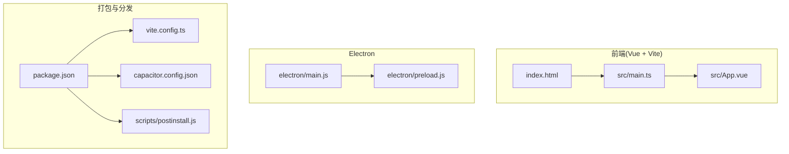
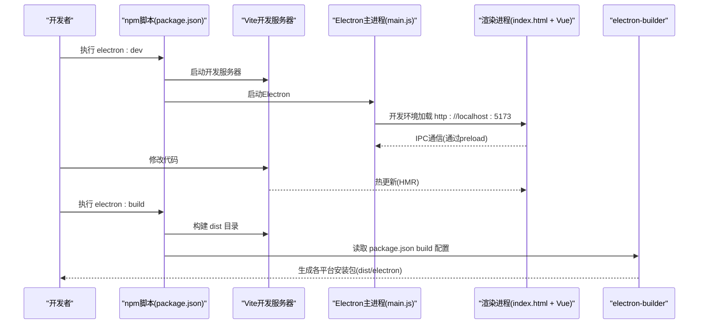
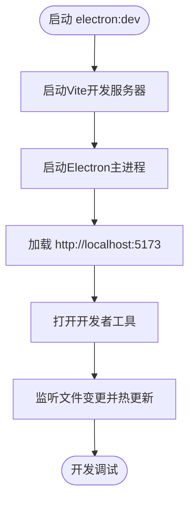
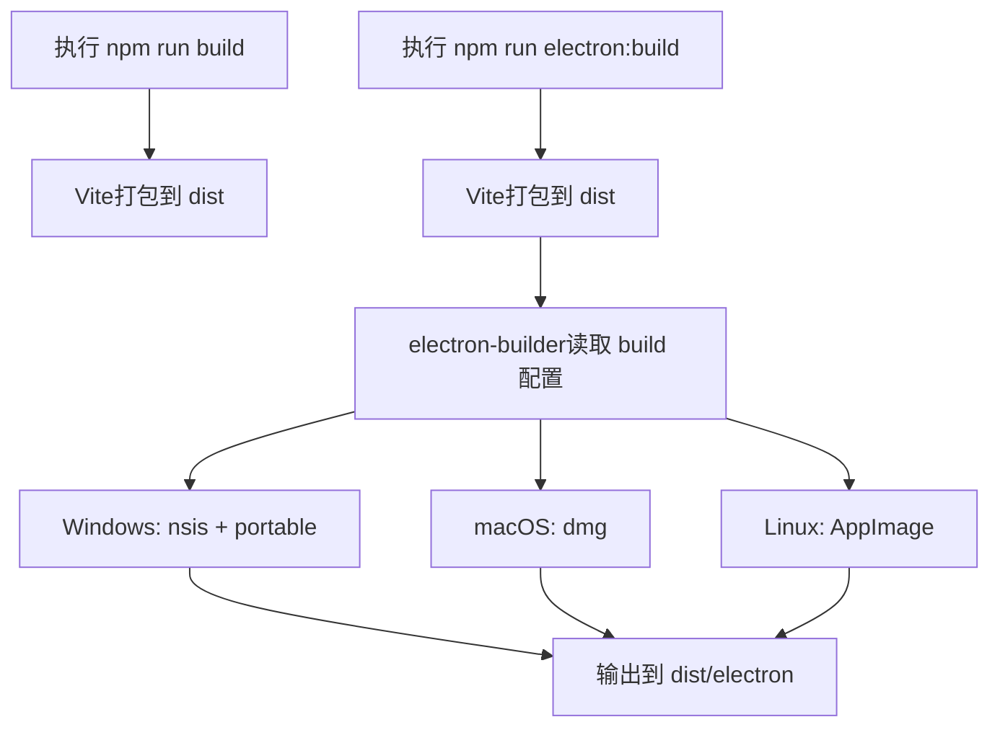
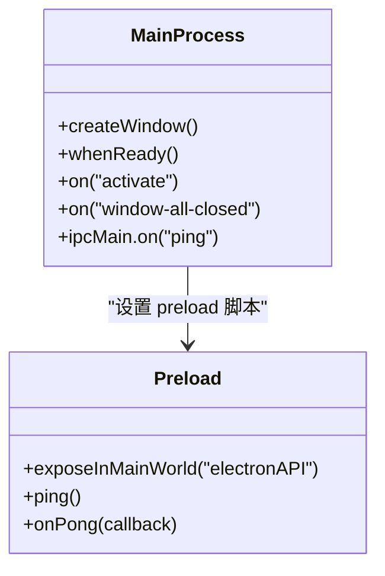
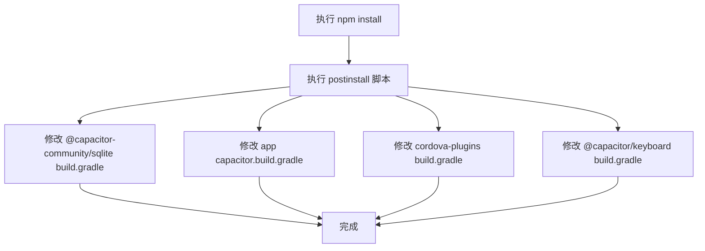
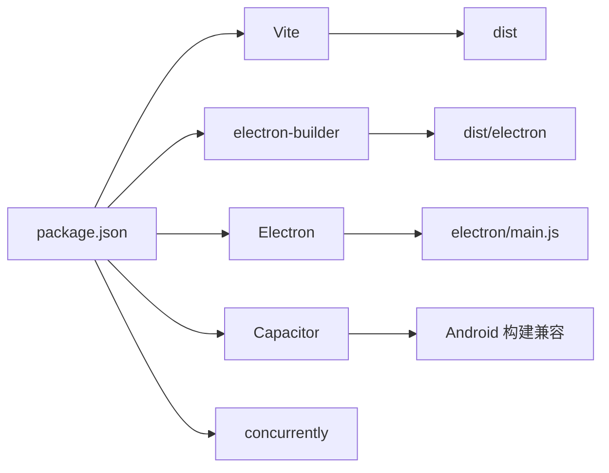

# 构建与打包

<cite>
**本文引用的文件**
- [package.json](file://package.json)
- [vite.config.ts](file://vite.config.ts)
- [electron/main.js](file://electron/main.js)
- [electron/preload.js](file://electron/preload.js)
- [index.html](file://index.html)
- [capacitor.config.json](file://capacitor.config.json)
- [scripts/postinstall.js](file://scripts/postinstall.js)
- [src/main.ts](file://src/main.ts)
- [src/App.vue](file://src/App.vue)
- [src/database/index.js](file://src/database/index.js)
- [.gitignore](file://.gitignore)
- [.npmrc](file://.npmrc)
</cite>

## 目录
1. [简介](#简介)
2. [项目结构](#项目结构)
3. [核心组件](#核心组件)
4. [架构总览](#架构总览)
5. [详细组件分析](#详细组件分析)
6. [依赖分析](#依赖分析)
7. [性能考虑](#性能考虑)
8. [故障排除指南](#故障排除指南)
9. [结论](#结论)
10. [附录](#附录)

## 简介
本文件面向Electron应用的构建与打包，结合仓库中的实际配置，系统阐述开发与生产环境差异、开发服务器与热重载、调试工具、打包流程（含electron-builder）、跨平台目标（Windows/macOS/Linux）、签名与安全、资源优化、构建脚本配置与常见问题排查。文档同时兼顾非技术读者，通过图示与分层讲解帮助快速理解。

## 项目结构
该仓库采用“前端（Vue + Vite）+ Electron主进程 + 预加载桥接 + Capacitor移动端能力”的混合架构：
- 前端入口与模板：index.html、src/main.ts、src/App.vue
- 构建工具：Vite（开发服务器、打包）、electron-builder（打包分发）
- Electron运行时：electron/main.js（主进程）、electron/preload.js（预加载桥接）
- 移动端支持：Capacitor配置与Android构建兼容性脚本
- 包管理：pnpm（.npmrc），脚本在package.json中定义

图表来源
- [package.json:1-72](file://package.json#L1-L72)
- [vite.config.ts:1-11](file://vite.config.ts#L1-L11)
- [electron/main.js:1-70](file://electron/main.js#L1-L70)
- [electron/preload.js:1-7](file://electron/preload.js#L1-L7)
- [index.html:1-13](file://index.html#L1-L13)
- [capacitor.config.json:1-23](file://capacitor.config.json#L1-L23)
- [scripts/postinstall.js:1-145](file://scripts/postinstall.js#L1-L145)

章节来源
- [package.json:1-72](file://package.json#L1-L72)
- [vite.config.ts:1-11](file://vite.config.ts#L1-L11)
- [electron/main.js:1-70](file://electron/main.js#L1-L70)
- [electron/preload.js:1-7](file://electron/preload.js#L1-L7)
- [index.html:1-13](file://index.html#L1-L13)
- [capacitor.config.json:1-23](file://capacitor.config.json#L1-L23)
- [scripts/postinstall.js:1-145](file://scripts/postinstall.js#L1-L145)

## 核心组件
- 开发脚本与命令
  - 开发：npm run dev（Vite开发服务器）
  - Electron联调：npm run electron:dev（并发启动Vite与Electron）
  - 生产构建：npm run build（Vite打包）
  - Electron打包：npm run electron:build（先Vite再electron-builder）
- 构建目标与输出
  - 输出目录：dist
  - Electron输出目录：dist/electron
  - Windows：NSIS安装包与便携版
  - macOS：dmg镜像
  - Linux：AppImage
- 前端构建配置
  - 基础路径：./
  - 目标：ES2015
- Electron主进程
  - 开发环境加载本地Vite地址，自动打开开发者工具
  - 生产环境加载打包后的index.html
  - 预加载脚本启用Node集成但禁用上下文隔离
- 预加载桥接
  - 暴露轻量API给渲染进程进行IPC通信
- Capacitor配置
  - Web目录：dist
  - Android Java兼容性：17
  - 插件：SplashScreen、Keyboard

章节来源
- [package.json:7-17](file://package.json#L7-L17)
- [package.json:48-70](file://package.json#L48-L70)
- [vite.config.ts:5-11](file://vite.config.ts#L5-L11)
- [electron/main.js:19-45](file://electron/main.js#L19-L45)
- [electron/main.js:30-39](file://electron/main.js#L30-L39)
- [electron/preload.js:1-7](file://electron/preload.js#L1-L7)
- [capacitor.config.json:1-23](file://capacitor.config.json#L1-L23)

## 架构总览
下图展示从开发到打包的关键流程与组件交互：

图表来源
- [package.json:7-17](file://package.json#L7-L17)
- [electron/main.js:30-39](file://electron/main.js#L30-L39)
- [vite.config.ts:5-11](file://vite.config.ts#L5-L11)

## 详细组件分析

### 开发环境与热重载
- 开发服务器
  - Vite作为开发服务器，提供HMR与快速冷启动
  - 前端入口通过index.html加载src/main.ts与App.vue
- Electron联调
  - electron:dev脚本并发启动Vite与Electron
  - 主进程在开发模式下加载本地开发地址，并自动打开开发者工具
- 预加载桥接
  - preload暴露简化的IPC接口，便于渲染进程与主进程通信

图表来源
- [package.json](file://package.json#L11)
- [electron/main.js:30-39](file://electron/main.js#L30-L39)

章节来源
- [package.json:7-17](file://package.json#L7-L17)
- [electron/main.js:30-39](file://electron/main.js#L30-L39)
- [index.html:1-13](file://index.html#L1-L13)
- [src/main.ts:1-16](file://src/main.ts#L1-L16)
- [src/App.vue:1-195](file://src/App.vue#L1-L195)

### 生产构建与打包
- 前端构建
  - Vite按配置打包至dist目录
  - 基础路径为相对路径，确保打包后资源正确解析
- Electron打包
  - electron:build脚本顺序执行：先Vite构建，再electron-builder
  - electron-builder读取package.json中的build字段，确定目标平台与产物类型
- 输出产物
  - dist/electron：包含各平台安装包与辅助文件

图表来源
- [package.json:9-12](file://package.json#L9-L12)
- [package.json:48-70](file://package.json#L48-L70)
- [vite.config.ts:5-11](file://vite.config.ts#L5-L11)

章节来源
- [package.json:9-12](file://package.json#L9-L12)
- [package.json:48-70](file://package.json#L48-L70)
- [vite.config.ts:5-11](file://vite.config.ts#L5-L11)

### 跨平台打包策略
- Windows
  - 目标：nsis安装包与便携版(portable)
  - 适合分发与免安装场景
- macOS
  - 目标：dmg镜像
  - 适合Mac App Store或直接分发
- Linux
  - 目标：AppImage
  - 便携式应用镜像，适合多发行版

章节来源
- [package.json:58-69](file://package.json#L58-L69)

### Electron主进程与预加载
- 主进程职责
  - 创建BrowserWindow，设置预加载脚本
  - 开发模式加载本地Vite地址并开启开发者工具；生产模式加载打包后的HTML
  - 处理应用生命周期事件（ready、activate、window-all-closed）
  - 提供基础IPC示例（ping/pong）
- 预加载桥接
  - 通过contextBridge向渲染进程暴露受控API
  - 渲染进程可通过preload进行IPC通信

图表来源
- [electron/main.js:19-69](file://electron/main.js#L19-L69)
- [electron/preload.js:1-7](file://electron/preload.js#L1-L7)

章节来源
- [electron/main.js:1-70](file://electron/main.js#L1-L70)
- [electron/preload.js:1-7](file://electron/preload.js#L1-L7)

### Capacitor与Android构建兼容
- Capacitor配置
  - Web目录指向dist
  - Android构建兼容Java 17
- postinstall脚本
  - 自动修改多个Android构建文件，统一Java版本为17，避免编译冲突
  - 适用于SQLite与Keyboard等插件的构建配置

图表来源
- [scripts/postinstall.js:1-145](file://scripts/postinstall.js#L1-L145)
- [capacitor.config.json:14-21](file://capacitor.config.json#L14-L21)

章节来源
- [capacitor.config.json:1-23](file://capacitor.config.json#L1-L23)
- [scripts/postinstall.js:1-145](file://scripts/postinstall.js#L1-L145)

### 数据库与持久化（对构建的影响）
- 平台差异
  - 原生平台：Capacitor SQLite
  - Web/桌面：SQL.js + localStorage持久化
- 对打包的意义
  - 保证dist中资源完整，避免运行时缺失模块
  - 避免在打包阶段引入不必要的Node原生模块（如sqlite3）

章节来源
- [src/database/index.js:1-154](file://src/database/index.js#L1-L154)
- [src/database/index.js:156-183](file://src/database/index.js#L156-L183)

## 依赖分析
- 构建与打包
  - Vite：开发服务器与生产打包
  - electron-builder：跨平台安装包生成
  - concurrently：并发启动Vite与Electron
- 运行时
  - Electron：主进程与渲染进程运行时
  - Capacitor：移动端能力与原生插件桥接
- 前端框架与UI
  - Vue 3、Element Plus、Pinia
- 工具链
  - TypeScript、Vue TS检查、Sass嵌入式

图表来源
- [package.json:1-72](file://package.json#L1-L72)
- [vite.config.ts:1-11](file://vite.config.ts#L1-L11)

章节来源
- [package.json:1-72](file://package.json#L1-L72)

## 性能考虑
- 构建目标与体积
  - ES2015目标可减少polyfill体积，提升兼容性与打包效率
  - 相对路径基础路径有助于静态资源复用与CDN部署
- 资源优化建议
  - 图片与字体压缩、按需加载第三方库
  - 分析打包产物，移除未使用依赖
- 运行时优化
  - 数据库查询缓存、批量写入、索引优化
  - Web环境持久化节流，避免频繁localStorage写入

章节来源
- [vite.config.ts:5-11](file://vite.config.ts#L5-L11)
- [src/database/index.js:12-18](file://src/database/index.js#L12-L18)
- [src/database/index.js:199-209](file://src/database/index.js#L199-L209)

## 故障排除指南
- 开发联调无法热更新
  - 确认Vite开发服务器端口未被占用
  - 确认electron:dev脚本已正确并发启动
- 生产构建后空白页或资源404
  - 检查基础路径是否为相对路径
  - 确认dist目录包含index.html与打包资源
- Electron主进程无法加载生产页面
  - 确认主进程在生产模式下加载的是dist/index.html
- Windows安装包无法安装或便携版无法运行
  - 检查electron-builder目标配置与签名设置
- macOS DMG制作失败
  - 检查签名证书与权限
- Linux AppImage无法运行
  - 检查可执行权限与依赖
- Android构建失败（Java版本不匹配）
  - 确认postinstall脚本已执行，且所有构建文件已修改为Java 17
- .gitignore忽略的构建产物
  - 确保dist与dist/electron未被.gitignore忽略（根据实际需求调整）

章节来源
- [package.json:7-17](file://package.json#L7-L17)
- [vite.config.ts:5-11](file://vite.config.ts#L5-L11)
- [electron/main.js:30-39](file://electron/main.js#L30-L39)
- [package.json:48-70](file://package.json#L48-L70)
- [scripts/postinstall.js:1-145](file://scripts/postinstall.js#L1-L145)
- [.gitignore:1-50](file://.gitignore#L1-L50)

## 结论
本项目以Vite为前端构建核心，配合electron-builder实现跨平台分发；通过preinstall/postinstall脚本解决Android构建兼容性问题；主进程与预加载桥接保障了渲染进程与系统能力的安全交互。遵循本文档的脚本配置、平台策略与优化建议，可稳定产出体积可控、体验一致的应用安装包。

## 附录
- 常用脚本
  - 开发：npm run dev
  - Electron联调：npm run electron:dev
  - 生产构建：npm run build
  - Electron打包：npm run electron:build
- 关键配置参考
  - 构建目标与输出：vite.config.ts
  - 打包目标与输出目录：package.json build
  - Electron入口与窗口行为：electron/main.js
  - 预加载桥接：electron/preload.js
  - Capacitor与Android构建：capacitor.config.json、scripts/postinstall.js
  - 包管理器配置：.npmrc

章节来源
- [package.json:7-17](file://package.json#L7-L17)
- [vite.config.ts:5-11](file://vite.config.ts#L5-L11)
- [package.json:48-70](file://package.json#L48-L70)
- [electron/main.js:1-70](file://electron/main.js#L1-L70)
- [electron/preload.js:1-7](file://electron/preload.js#L1-L7)
- [capacitor.config.json:1-23](file://capacitor.config.json#L1-L23)
- [scripts/postinstall.js:1-145](file://scripts/postinstall.js#L1-L145)
- [.npmrc:1-3](file://.npmrc#L1-L3)