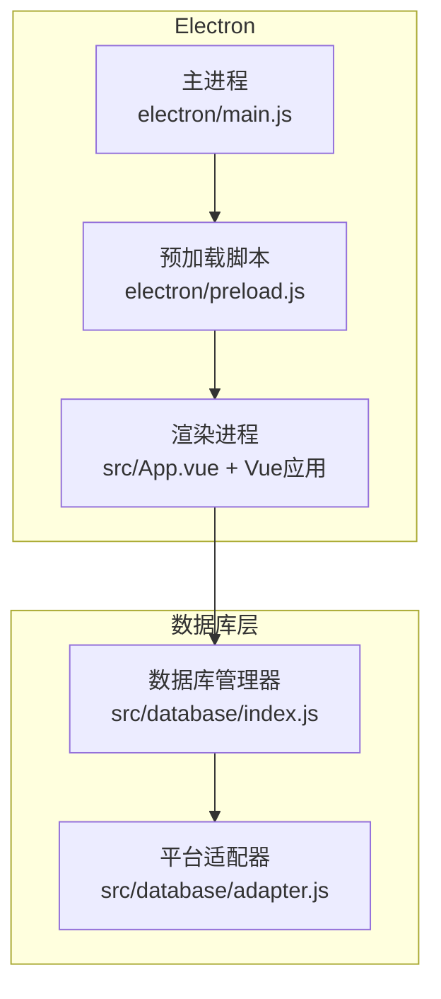
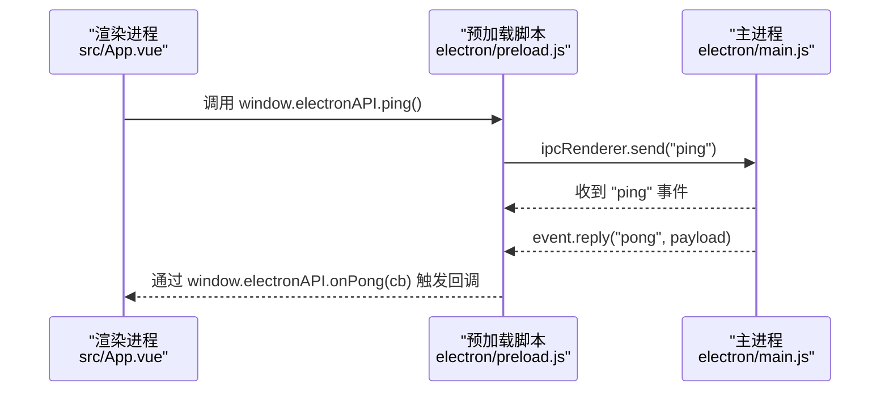
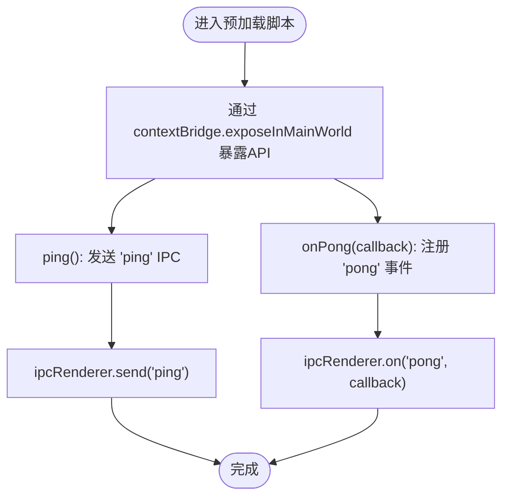
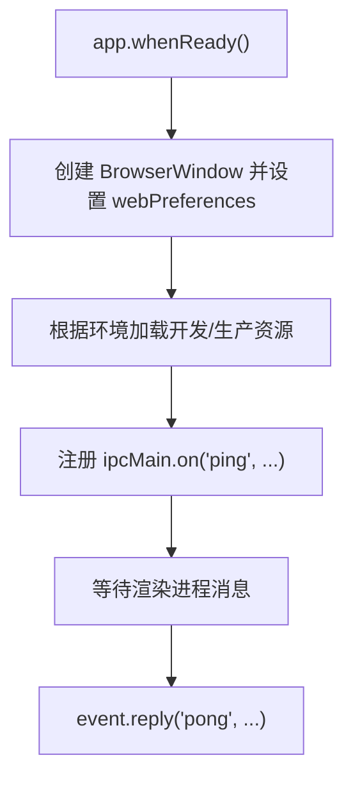
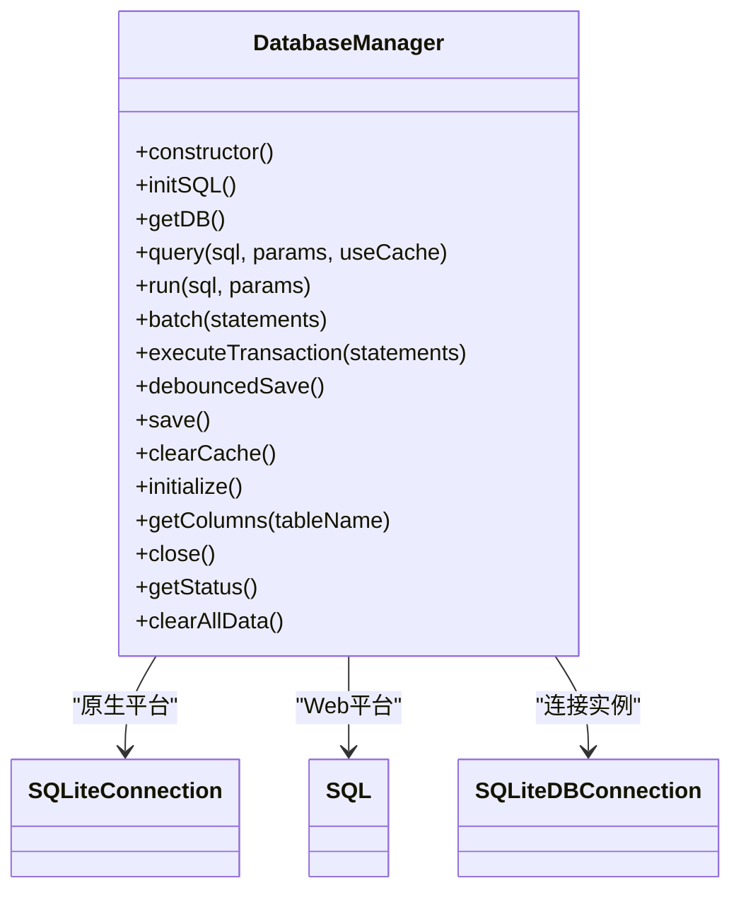
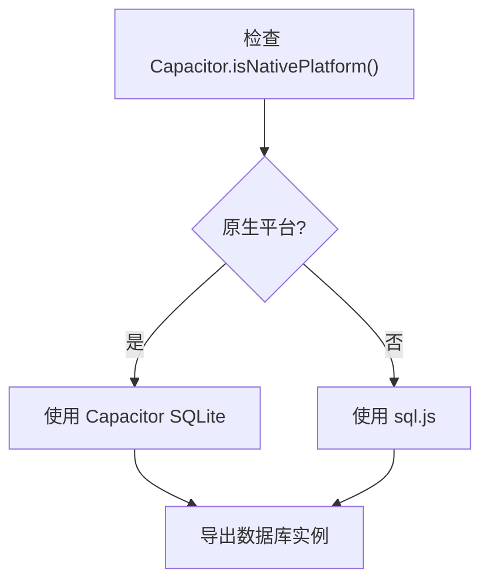
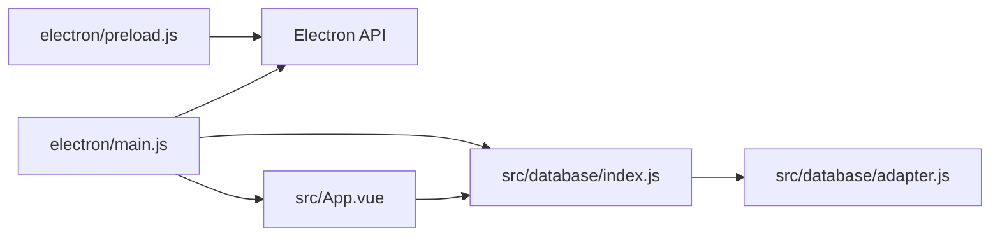

# 预加载脚本

<cite>
**本文引用的文件**
- [electron/preload.js](file://electron/preload.js)
- [electron/main.js](file://electron/main.js)
- [package.json](file://package.json)
- [src/database/index.js](file://src/database/index.js)
- [src/database/adapter.js](file://src/database/adapter.js)
- [src/App.vue](file://src/App.vue)
- [src/main.ts](file://src/main.ts)
</cite>

## 目录
1. [简介](#简介)
2. [项目结构](#项目结构)
3. [核心组件](#核心组件)
4. [架构总览](#架构总览)
5. [详细组件分析](#详细组件分析)
6. [依赖关系分析](#依赖关系分析)
7. [性能考量](#性能考量)
8. [故障排查指南](#故障排查指南)
9. [结论](#结论)
10. [附录](#附录)

## 简介
本文件聚焦于Electron应用中的“预加载脚本”（preload script），系统性阐述其在安全架构中的角色、与主进程的通信机制、以及如何通过受限API向渲染进程暴露能力。当前仓库中的预加载脚本非常精简，仅通过contextBridge将有限的IPC能力暴露给渲染进程；主进程也相应地提供了基础的IPC处理示例。本文将基于现有代码，给出安全最佳实践、编写规范、性能优化建议与常见问题排查方法，帮助读者在不牺牲安全性的前提下，构建健壮的IPC桥接层。

## 项目结构
该仓库采用典型的“前端框架 + Electron主进程 + 预加载脚本”的分层架构：
- 预加载脚本位于 electron/preload.js，负责在渲染进程启动前注入受控API。
- 主进程位于 electron/main.js，负责创建BrowserWindow、设置webPreferences、处理IPC。
- 前端应用由Vue 3 + Vite构建，入口为 src/main.ts，根组件为 src/App.vue。
- 数据访问层位于 src/database/index.js，提供跨平台（Capacitor SQLite/Web）的统一数据库抽象。

图表来源
- [electron/main.js:19-45](file://electron/main.js#L19-L45)
- [electron/preload.js:1-6](file://electron/preload.js#L1-L6)
- [src/App.vue:1-195](file://src/App.vue#L1-L195)
- [src/database/index.js:21-190](file://src/database/index.js#L21-L190)
- [src/database/adapter.js:14-33](file://src/database/adapter.js#L14-L33)

章节来源
- [electron/main.js:19-45](file://electron/main.js#L19-L45)
- [electron/preload.js:1-6](file://electron/preload.js#L1-L6)
- [src/App.vue:1-195](file://src/App.vue#L1-L195)
- [src/database/index.js:21-190](file://src/database/index.js#L21-L190)
- [src/database/adapter.js:14-33](file://src/database/adapter.js#L14-L33)

## 核心组件
- 预加载脚本（electron/preload.js）
  - 使用 contextBridge.exposeInMainWorld 将受控API暴露给渲染进程。
  - 当前暴露了两个方法：ping（发送IPC消息）、onPong（注册IPC事件回调）。
- 主进程（electron/main.js）
  - 创建BrowserWindow并启用webPreferences.preload。
  - 当前示例处理了来自渲染进程的 'ping' 消息并回复 'pong'。
- 数据库层（src/database/index.js）
  - 提供统一的数据库管理器，支持Capacitor SQLite与Web环境的sql.js。
  - 通过单例模式、连接池、缓存、事务与批处理提升性能与可靠性。
- 平台适配器（src/database/adapter.js）
  - 根据 Capacitor.isNativePlatform() 选择不同实现，保证跨平台一致性。

章节来源
- [electron/preload.js:1-6](file://electron/preload.js#L1-L6)
- [electron/main.js:67-69](file://electron/main.js#L67-L69)
- [src/database/index.js:21-190](file://src/database/index.js#L21-L190)
- [src/database/adapter.js:14-33](file://src/database/adapter.js#L14-L33)

## 架构总览
预加载脚本在渲染进程与主进程之间充当“受控桥接层”。它通过contextBridge将有限且安全的API暴露给渲染进程，避免渲染进程直接访问Node.js或Electron的敏感API。主进程通过ipcMain监听来自渲染进程的消息，并通过ipcRenderer在预加载脚本中进行转发。

图表来源
- [electron/preload.js:3-6](file://electron/preload.js#L3-L6)
- [electron/main.js:67-69](file://electron/main.js#L67-L69)

## 详细组件分析

### 预加载脚本（electron/preload.js）
- 安全职责
  - 通过contextBridge.exposeInMainWorld将API注入到渲染进程的全局命名空间，但仅暴露明确声明的方法，避免泄露底层Node/Electron能力。
  - 通过ipcRenderer.send与ipcRenderer.on实现双向通信，渲染进程只能通过受控通道与主进程交互。
- 当前暴露的API
  - ping：触发一次IPC消息（发送'ping'）。
  - onPong：注册'pong'事件回调，接收主进程回复。
- 安全性评估
  - 优点：仅暴露必要API，降低攻击面。
  - 风险点：当前未对输入进行校验、未做权限控制、未对回调生命周期进行管理。建议增加参数校验、权限检查、回调清理与错误处理。

图表来源
- [electron/preload.js:1-6](file://electron/preload.js#L1-L6)

章节来源
- [electron/preload.js:1-6](file://electron/preload.js#L1-L6)

### 主进程（electron/main.js）
- 窗口创建与webPreferences
  - 设置 preload 路径，启用 nodeIntegration 与 contextIsolation 的组合配置。
  - 当前配置为 nodeIntegration: true、contextIsolation: false，这会显著降低安全性，建议改为 contextIsolation: true 并在预加载脚本中精确暴露API。
- IPC处理
  - 监听 'ping' 事件并通过 event.reply('pong', ...) 回复渲染进程。
- 生命周期
  - 应用就绪时创建窗口，处理 macOS 激活与窗口关闭事件。

图表来源
- [electron/main.js:19-45](file://electron/main.js#L19-L45)
- [electron/main.js:67-69](file://electron/main.js#L67-L69)

章节来源
- [electron/main.js:19-45](file://electron/main.js#L19-L45)
- [electron/main.js:67-69](file://electron/main.js#L67-L69)

### 数据库层（src/database/index.js）
- 设计要点
  - 单例模式确保全局唯一连接，减少资源竞争。
  - 平台区分：Capacitor SQLite（原生）与 sql.js（Web）。
  - 性能优化：连接状态管理、查询缓存、批处理、事务、延迟持久化。
- 关键方法
  - getDB：获取数据库连接（单例+防并发）。
  - query/run/batch/executeTransaction：统一的CRUD与事务接口。
  - clearAllData：使用事务批量清空数据，保证一致性。
- 与预加载脚本的关系
  - 预加载脚本目前未直接暴露数据库API；数据库API通常由渲染进程通过IPC请求主进程，再由主进程协调数据库层执行。

图表来源
- [src/database/index.js:21-190](file://src/database/index.js#L21-L190)

章节来源
- [src/database/index.js:21-190](file://src/database/index.js#L21-L190)
- [src/database/index.js:894-935](file://src/database/index.js#L894-L935)

### 平台适配器（src/database/adapter.js）
- 功能
  - 通过 Capacitor.isNativePlatform() 判断运行环境，选择对应数据库实现。
  - 提供 getDatabase 与 initializeDatabase，简化上层调用。
- 与数据库管理器协作
  - 数据库管理器内部根据 isNative 选择 Capacitor SQLite 或 sql.js，平台适配器提供入口。

图表来源
- [src/database/adapter.js:14-33](file://src/database/adapter.js#L14-L33)

章节来源
- [src/database/adapter.js:14-33](file://src/database/adapter.js#L14-L33)

## 依赖关系分析
- 预加载脚本依赖 Electron 的 contextBridge 与 ipcRenderer。
- 主进程依赖 Electron 的 app、BrowserWindow、ipcMain。
- 数据库层依赖 Capacitor 与 sql.js，实现跨平台一致性。
- 前端应用通过Vue组件与Pinia、Element Plus构建UI与状态管理。

图表来源
- [electron/preload.js:1-6](file://electron/preload.js#L1-L6)
- [electron/main.js:5-11](file://electron/main.js#L5-L11)
- [src/database/index.js:8-10](file://src/database/index.js#L8-L10)
- [src/database/adapter.js:5-8](file://src/database/adapter.js#L5-L8)
- [src/App.vue:22-52](file://src/App.vue#L22-L52)

章节来源
- [electron/preload.js:1-6](file://electron/preload.js#L1-L6)
- [electron/main.js:5-11](file://electron/main.js#L5-L11)
- [src/database/index.js:8-10](file://src/database/index.js#L8-L10)
- [src/database/adapter.js:5-8](file://src/database/adapter.js#L5-L8)
- [src/App.vue:22-52](file://src/App.vue#L22-L52)

## 性能考量
- 数据库层
  - 单例连接与连接状态管理，避免重复建立连接带来的开销。
  - 查询缓存（Map）减少重复查询，适合高频读取场景。
  - 批处理与事务：批量执行SQL与事务提交，减少I/O次数，提升吞吐。
  - Web环境延迟持久化：通过节流定时器减少localStorage写入频率。
- 预加载脚本
  - 仅暴露必要API，避免在渲染进程中引入不必要的计算与内存占用。
  - 对回调注册与清理进行管理，防止内存泄漏。
- 主进程
  - 合理使用 event.reply 与 event.sender，避免阻塞主线程。

章节来源
- [src/database/index.js:13-18](file://src/database/index.js#L13-L18)
- [src/database/index.js:379-408](file://src/database/index.js#L379-L408)
- [src/database/index.js:316-347](file://src/database/index.js#L316-L347)
- [src/database/index.js:354-374](file://src/database/index.js#L354-L374)

## 故障排查指南
- 预加载脚本API不可用
  - 检查主进程 BrowserWindow 的 webPreferences.preload 路径是否正确。
  - 确认 contextIsolation 与 nodeIntegration 的组合配置是否符合预期。
- IPC通信异常
  - 确认渲染进程调用 window.electronAPI.ping() 是否触发。
  - 检查主进程 ipcMain.on('ping', ...) 是否注册成功。
  - 使用 event.reply(...) 正确回复消息。
- 数据库连接问题
  - 检查 Capacitor.isNativePlatform() 判断逻辑与平台适配器实现。
  - 确认数据库初始化流程（initialize）是否成功执行。
  - 关注连接状态与缓存清理，避免脏数据影响。
- 错误处理
  - 在数据库层捕获异常并抛出可读错误信息。
  - 在预加载脚本与主进程对IPC错误进行统一处理与日志记录。

章节来源
- [electron/main.js:23-28](file://electron/main.js#L23-L28)
- [electron/main.js:67-69](file://electron/main.js#L67-L69)
- [src/database/index.js:420-449](file://src/database/index.js#L420-L449)
- [src/database/index.js:260-264](file://src/database/index.js#L260-L264)

## 结论
当前仓库的预加载脚本与主进程实现了最小可行的IPC桥接，具备基本的双向通信能力。为满足生产级安全与稳定性要求，建议：
- 强制启用 contextIsolation: true，并在预加载脚本中仅暴露必要API。
- 在预加载脚本中增加参数校验、权限控制、回调生命周期管理与错误处理。
- 在主进程与数据库层完善错误传播与日志记录，确保问题可追踪。
- 逐步将数据库操作通过IPC委托给主进程，避免渲染进程直接访问底层存储。

[本节不涉及具体文件分析，无需章节来源]

## 附录

### 预加载脚本编写规范与最佳实践
- API暴露策略
  - 仅通过 contextBridge.exposeInMainWorld 暴露受控API，避免直接暴露 Node/Electron 全部能力。
  - 对外API应明确签名与返回类型，便于渲染进程消费。
- 数据验证与权限控制
  - 在预加载脚本中对传入参数进行类型与范围校验。
  - 对敏感操作（如删除、修改）增加权限校验与二次确认。
- 错误处理
  - 统一捕获IPC错误并在渲染进程侧提供友好提示。
  - 记录错误上下文（参数、时间、来源），便于定位问题。
- 回调与生命周期
  - 对注册的事件回调进行生命周期管理，避免内存泄漏。
  - 提供取消订阅或清理函数，允许渲染进程主动释放资源。
- 性能优化
  - 将频繁调用的IPC封装为批量请求或节流处理。
  - 在预加载脚本中缓存必要的状态，减少重复IPC往返。
- 安全加固
  - 禁用 nodeIntegration 或将其与 contextIsolation 配合使用。
  - 对来自渲染进程的数据进行白名单过滤与转义。
  - 严格限定IPC通道名称与消息格式，避免被恶意利用。

[本节为通用指导，不直接分析具体文件，故无章节来源]