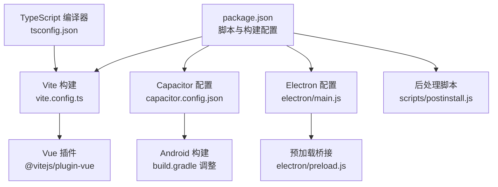
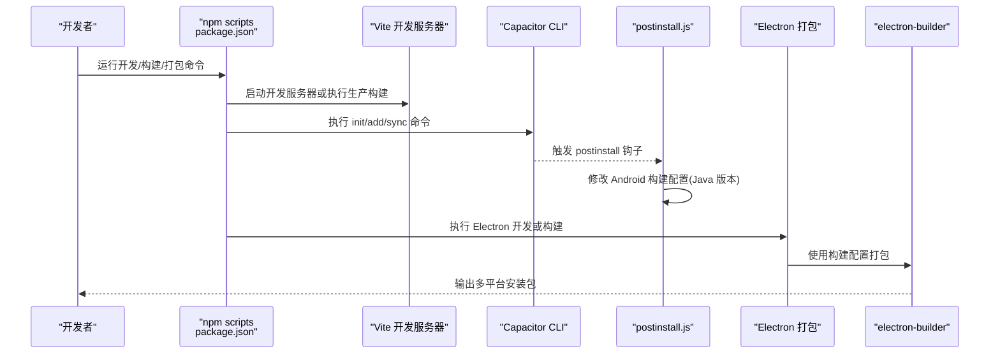
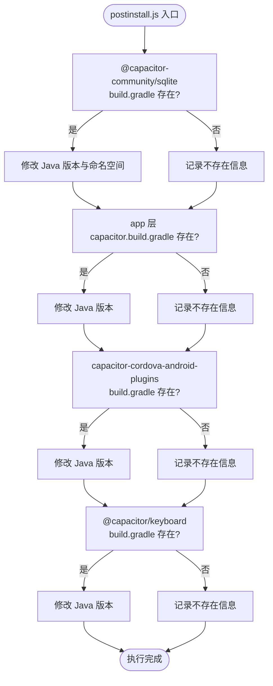
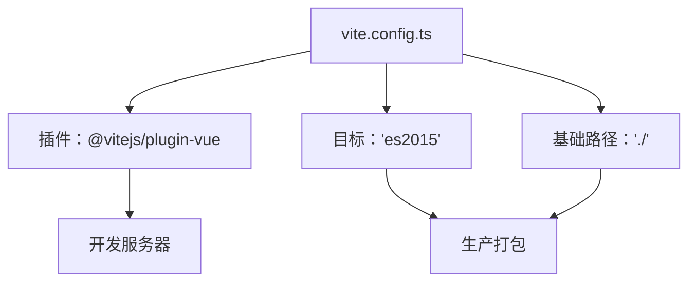
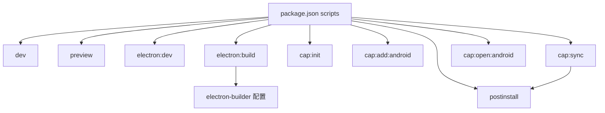
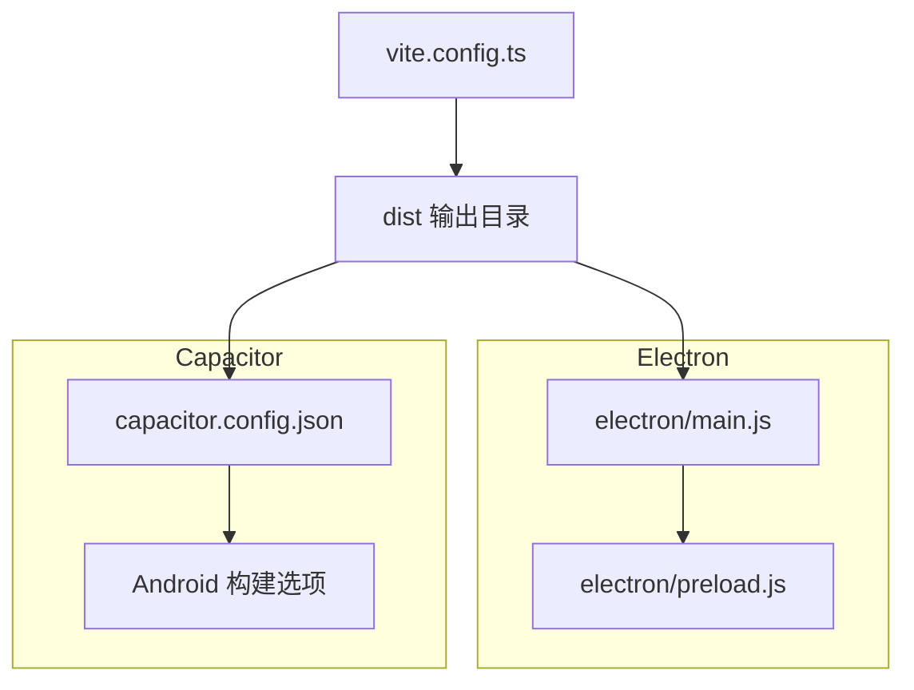
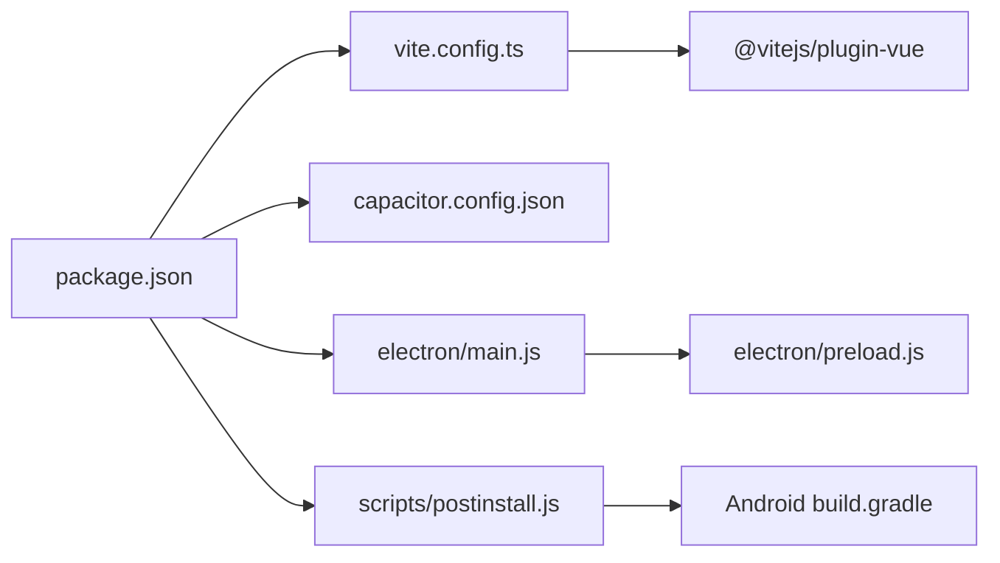

# 构建脚本与自动化

<cite>
**本文引用的文件**
- [scripts/postinstall.js](file://scripts/postinstall.js)
- [package.json](file://package.json)
- [vite.config.ts](file://vite.config.ts)
- [capacitor.config.json](file://capacitor.config.json)
- [electron/main.js](file://electron/main.js)
- [electron/preload.js](file://electron/preload.js)
- [src/main.ts](file://src/main.ts)
- [tsconfig.json](file://tsconfig.json)
</cite>

## 目录
1. [简介](#简介)
2. [项目结构](#项目结构)
3. [核心组件](#核心组件)
4. [架构总览](#架构总览)
5. [详细组件分析](#详细组件分析)
6. [依赖关系分析](#依赖关系分析)
7. [性能考量](#性能考量)
8. [故障排除指南](#故障排除指南)
9. [结论](#结论)
10. [附录](#附录)

## 简介
本文件系统性梳理该财务应用的构建脚本与自动化体系，重点覆盖以下方面：
- postinstall.js 的功能与实现：依赖安装后的后处理逻辑、平台特定的配置调整、第三方库的初始化要点
- Vite 构建配置：开发服务器设置、打包优化、插件配置、输出目录等
- package.json 中的脚本命令与构建流程：开发、测试、生产构建的阶段划分
- 多平台构建：Electron 打包、Capacitor 平台编译、资源处理的配置差异
- CI/CD 集成：自动化测试、持续部署、版本发布的建议实践
- 高级主题：构建性能优化、缓存策略、并行构建
- 错误排查与故障排除方法

## 项目结构
该项目采用前端框架 Vue 3 + Vite，结合 Capacitor 实现跨平台移动能力，并通过 Electron 提供桌面端体验。构建自动化围绕 npm scripts 展开，配合 Capacitor CLI 与 electron-builder 完成多端产物生成。

图表来源
- [package.json:1-72](file://package.json#L1-L72)
- [vite.config.ts:1-11](file://vite.config.ts#L1-L11)
- [capacitor.config.json:1-23](file://capacitor.config.json#L1-L23)
- [electron/main.js:1-70](file://electron/main.js#L1-L70)
- [scripts/postinstall.js:1-145](file://scripts/postinstall.js#L1-L145)
- [tsconfig.json:1-25](file://tsconfig.json#L1-L25)

章节来源
- [package.json:1-72](file://package.json#L1-L72)
- [vite.config.ts:1-11](file://vite.config.ts#L1-L11)
- [capacitor.config.json:1-23](file://capacitor.config.json#L1-L23)
- [electron/main.js:1-70](file://electron/main.js#L1-L70)
- [scripts/postinstall.js:1-145](file://scripts/postinstall.js#L1-L145)
- [tsconfig.json:1-25](file://tsconfig.json#L1-L25)

## 核心组件
- 构建与打包
  - Vite：负责开发服务器与生产打包，使用 Vue 插件，目标为 ES2015
  - electron-builder：用于 Electron 应用的多平台打包
- 多端集成
  - Capacitor：将 Web 应用编译为原生移动应用，支持 Android/iOS
  - Electron：在桌面端运行，使用预加载脚本进行安全桥接
- 自动化脚本
  - postinstall.js：在依赖安装后自动修改 Android 构建配置，确保 Java 版本一致
  - package.json scripts：统一入口，串联开发、同步、打包与预览流程

章节来源
- [package.json:7-17](file://package.json#L7-L17)
- [vite.config.ts:5-11](file://vite.config.ts#L5-L11)
- [scripts/postinstall.js:1-145](file://scripts/postinstall.js#L1-L145)
- [electron/main.js:19-45](file://electron/main.js#L19-L45)

## 架构总览
下图展示从开发到多平台分发的整体流程，以及各组件之间的交互关系。

图表来源
- [package.json:7-17](file://package.json#L7-L17)
- [scripts/postinstall.js:1-145](file://scripts/postinstall.js#L1-L145)
- [electron/main.js:31-39](file://electron/main.js#L31-L39)
- [package.json:48-70](file://package.json#L48-L70)

## 详细组件分析

### postinstall.js：依赖安装后的后处理与平台适配
- 目标与职责
  - 在依赖安装完成后，自动修改 Capacitor 相关 Android 模块的构建配置，确保 Java 版本一致性，避免构建失败
  - 涉及模块包括：@capacitor-community/sqlite、@capacitor/keyboard、app 层 capacitor.build.gradle、capacitor-cordova-android-plugins
- 关键实现点
  - 路径解析：基于 node_modules 与 android 目录定位 build.gradle 文件
  - 条件检查：仅在文件存在时进行修改，避免误操作
  - 正则替换：对 Java 版本兼容性字段进行统一升级
  - 日志输出：清晰提示每个步骤的执行状态
- 平台特定配置
  - Capacitor Android 构建选项已在 Capacitor 配置中声明 Java 版本，postinstall.js 作为补充保障
- 第三方库初始化要点
  - 通过修改 build.gradle，确保 SQLite 等插件在新版本 Java 环境下的兼容性
  - 与 Capacitor CLI 的 sync 流程配合，保证构建链路稳定

图表来源
- [scripts/postinstall.js:40-142](file://scripts/postinstall.js#L40-L142)

章节来源
- [scripts/postinstall.js:1-145](file://scripts/postinstall.js#L1-L145)
- [capacitor.config.json:14-21](file://capacitor.config.json#L14-L21)

### Vite 构建配置：开发、打包与插件
- 插件配置
  - 使用 @vitejs/plugin-vue 对 Vue 单文件组件进行编译与热更新
- 开发服务器
  - 默认启动本地开发服务器，支持热更新与源码映射
- 打包优化
  - 目标浏览器兼容性：ES2015
  - 基础路径：相对路径，便于多端部署
- 输出目录
  - 生产构建输出至 dist（由 Capacitor 配置与 electron-builder 配置共同决定）

图表来源
- [vite.config.ts:5-11](file://vite.config.ts#L5-L11)

章节来源
- [vite.config.ts:1-11](file://vite.config.ts#L1-L11)

### package.json：脚本命令与构建流程
- 开发与预览
  - dev：启动 Vite 开发服务器
  - preview：本地预览生产构建产物
- Electron 集成
  - electron:dev：并行启动开发服务器与 Electron 主进程
  - electron:build：先执行生产构建，再使用 electron-builder 打包
- Capacitor 工作流
  - cap:init / cap:add:android：初始化与添加 Android 平台
  - cap:sync：同步 Web 构建产物并执行 postinstall 钩子
  - cap:open:android：打开 Android Studio 进行原生工程调试
- 构建配置
  - build：electron-builder 的应用标识、产品名称、输出目录、目标平台（Windows NSIS/AppImage、macOS DMG 等）
- 依赖与工具
  - 依赖：Capacitor 生态、Vue、图表库、状态管理等
  - 开发依赖：Vite、Vue 插件、TypeScript、Sass、Electron、electron-builder、并发执行工具等

图表来源
- [package.json:7-17](file://package.json#L7-L17)
- [package.json:48-70](file://package.json#L48-L70)

章节来源
- [package.json:1-72](file://package.json#L1-L72)

### 多平台构建：Electron 与 Capacitor
- Electron
  - 主进程：根据环境加载开发服务器或生产 HTML；启用 Node 集成与禁用上下文隔离（开发用途）
  - 预加载：通过 contextBridge 暴露安全 API，实现渲染进程与主进程通信
- Capacitor
  - 配置：应用 ID、应用名、Web 目录、插件行为（如键盘 resize、启动屏）
  - Android：声明 Java 版本兼容性，确保与 Gradle 修改一致
- 资源处理
  - Vite 输出 dist 目录，Capacitor 将其作为 Web 资源目录；electron-builder 也以 dist 为基础打包

图表来源
- [electron/main.js:19-45](file://electron/main.js#L19-L45)
- [electron/preload.js:1-7](file://electron/preload.js#L1-L7)
- [capacitor.config.json:1-23](file://capacitor.config.json#L1-L23)
- [vite.config.ts:7-10](file://vite.config.ts#L7-L10)

章节来源
- [electron/main.js:1-70](file://electron/main.js#L1-L70)
- [electron/preload.js:1-7](file://electron/preload.js#L1-L7)
- [capacitor.config.json:1-23](file://capacitor.config.json#L1-L23)
- [vite.config.ts:1-11](file://vite.config.ts#L1-L11)

### TypeScript 编译配置
- 目标与模块解析
  - 目标：ES2020
  - 模块解析：bundler，支持导入 TS/JS/Vue 等扩展
- 严格模式与检查
  - 严格模式开启，启用未使用变量/参数检查与无穷推断检查
- 与 Vite 的协作
  - Vite 使用 vue-tsc 进行类型检查，tsconfig.json 为类型系统提供统一入口

章节来源
- [tsconfig.json:1-25](file://tsconfig.json#L1-L25)

## 依赖关系分析
- 组件耦合
  - package.json 的 scripts 是中枢，串联 Vite、Capacitor、Electron、electron-builder
  - postinstall.js 与 Capacitor Android 构建配置强关联，确保 Java 版本一致
- 外部依赖
  - Capacitor 生态：@capacitor-community/sqlite、@capacitor/keyboard、@capacitor/android
  - Vue 技术栈：Vue 3、Element Plus、Chart.js、ECharts
  - 打包与桌面：Vite、electron-builder、Electron
- 可能的循环依赖
  - 当前结构以脚本驱动为主，未见直接代码循环依赖

图表来源
- [package.json:1-72](file://package.json#L1-L72)
- [vite.config.ts:1-11](file://vite.config.ts#L1-L11)
- [capacitor.config.json:1-23](file://capacitor.config.json#L1-L23)
- [electron/main.js:1-70](file://electron/main.js#L1-L70)
- [scripts/postinstall.js:1-145](file://scripts/postinstall.js#L1-L145)

章节来源
- [package.json:1-72](file://package.json#L1-L72)
- [scripts/postinstall.js:1-145](file://scripts/postinstall.js#L1-L145)

## 性能考量
- 构建性能优化
  - 使用 Vite 的按需编译与热更新，减少开发等待时间
  - 在 electron-builder 中合理配置增量构建与缓存目录，缩短打包时间
- 缓存策略
  - 利用 npm/pnpm 的依赖缓存与 Vite 的模块缓存
  - Capacitor 同步后复用已编译的原生模块，避免重复下载与编译
- 并行构建
  - 使用并发执行工具在开发阶段并行启动多个服务（如开发服务器与 Electron 主进程）
  - 在 CI 环境中并行执行不同平台的打包任务

## 故障排除指南
- Capacitor 构建失败（Java 版本不匹配）
  - 现象：Android 构建报错，提示 Java 版本不兼容
  - 排查：确认 Capacitor 配置与 postinstall.js 是否正确修改了 build.gradle 的 Java 版本
  - 处理：重新执行 Capacitor 同步与 postinstall 钩子
- Electron 开发环境无法加载
  - 现象：开发模式下 Electron 无法访问本地开发服务器
  - 排查：确认开发服务器端口与 Electron 加载地址一致；检查网络代理与防火墙
  - 处理：重启开发服务器与 Electron 主进程
- 预加载桥接无效
  - 现象：渲染进程无法调用主进程暴露的 API
  - 排查：确认预加载脚本是否正确暴露 API；检查上下文隔离与 Node 集成设置
  - 处理：修正预加载桥接逻辑并重新加载页面
- 类型检查问题
  - 现象：类型检查报错或遗漏
  - 排查：核对 tsconfig.json 的严格模式与模块解析设置
  - 处理：修复类型定义或调整编译选项

章节来源
- [scripts/postinstall.js:40-142](file://scripts/postinstall.js#L40-L142)
- [electron/main.js:31-39](file://electron/main.js#L31-L39)
- [electron/preload.js:1-7](file://electron/preload.js#L1-L7)
- [tsconfig.json:1-25](file://tsconfig.json#L1-L25)

## 结论
该构建系统以 npm scripts 为核心，结合 Vite、Capacitor 与 Electron，实现了从开发到多平台分发的完整闭环。postinstall.js 作为关键后处理脚本，确保了 Android 构建链路的稳定性；Vite 提供高效的开发与打包体验；Electron 与 Capacitor 分别满足桌面端与移动端需求。通过合理的缓存与并行策略，可进一步提升整体构建效率。

## 附录
- CI/CD 集成建议
  - 自动化测试：在 CI 中执行类型检查与单元测试，确保变更质量
  - 持续部署：针对 Windows/macOS/Linux 平台分别触发 electron-builder 打包
  - 版本发布：结合版本标记文件与构建产物，自动化上传与发布
- 多平台差异
  - Windows：NSIS 与便携版安装包
  - macOS：DMG 包
  - Linux：AppImage 包
- 资源处理
  - 将 dist 作为统一的 Web 资源目录，确保 Capacitor 与 Electron 的一致性