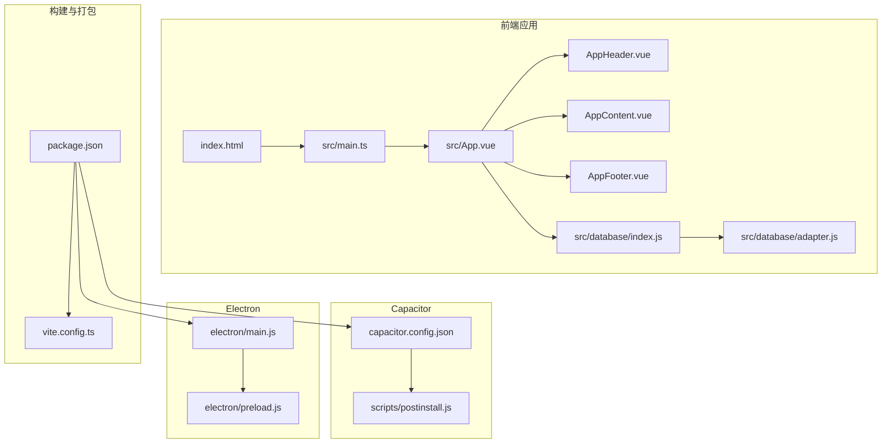
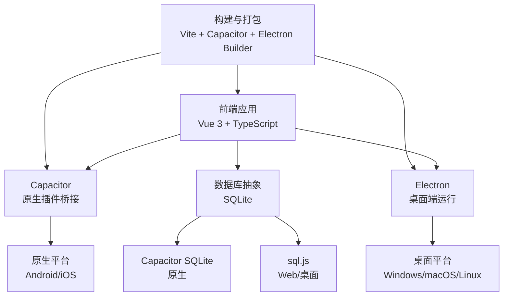
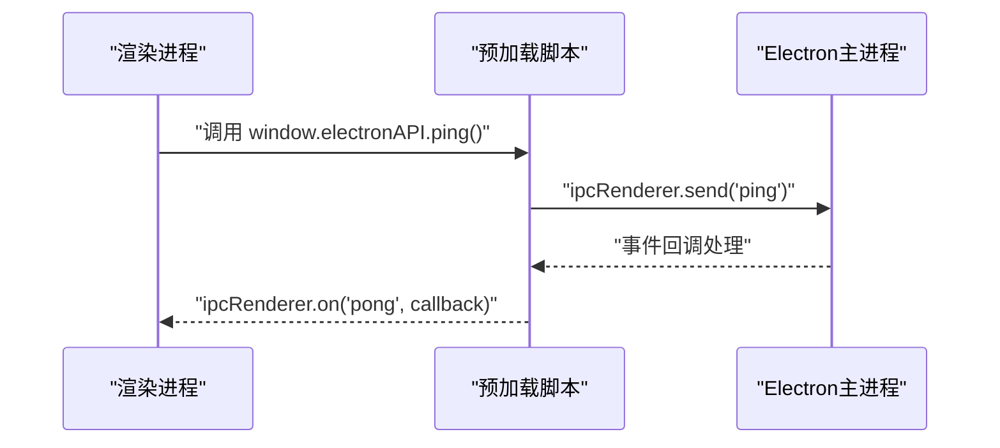
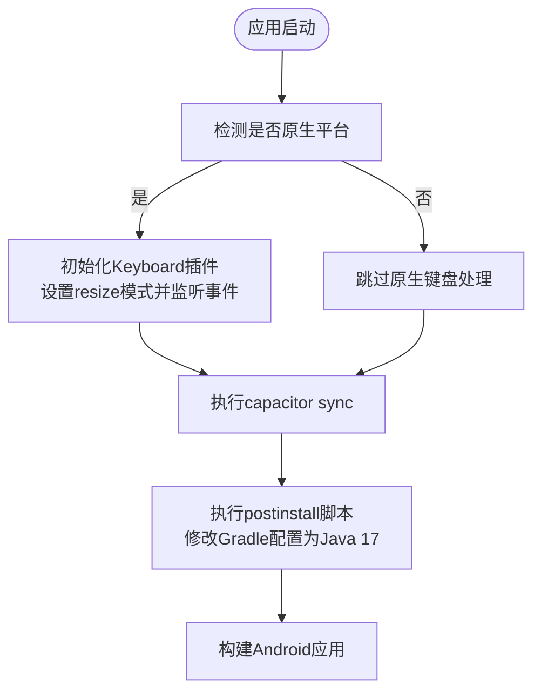
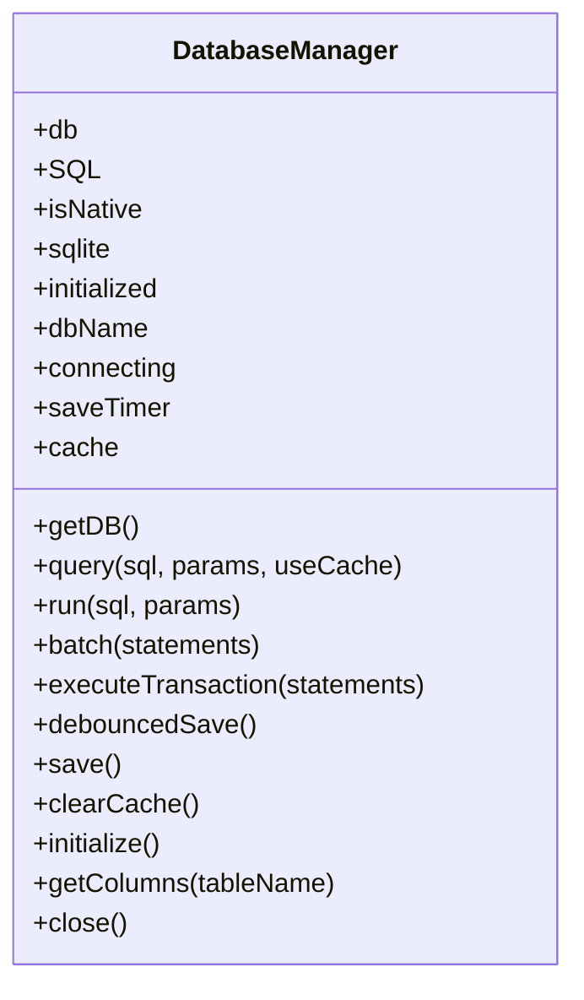
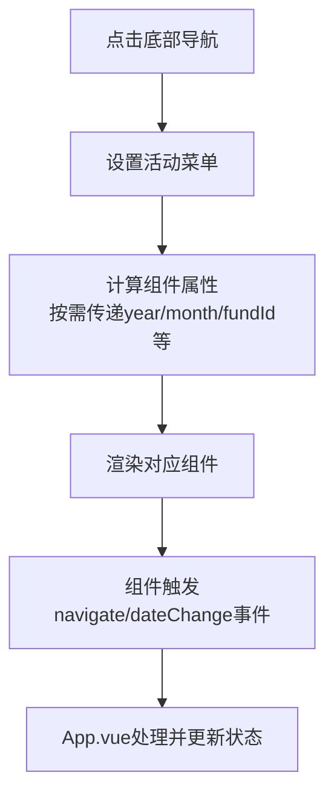
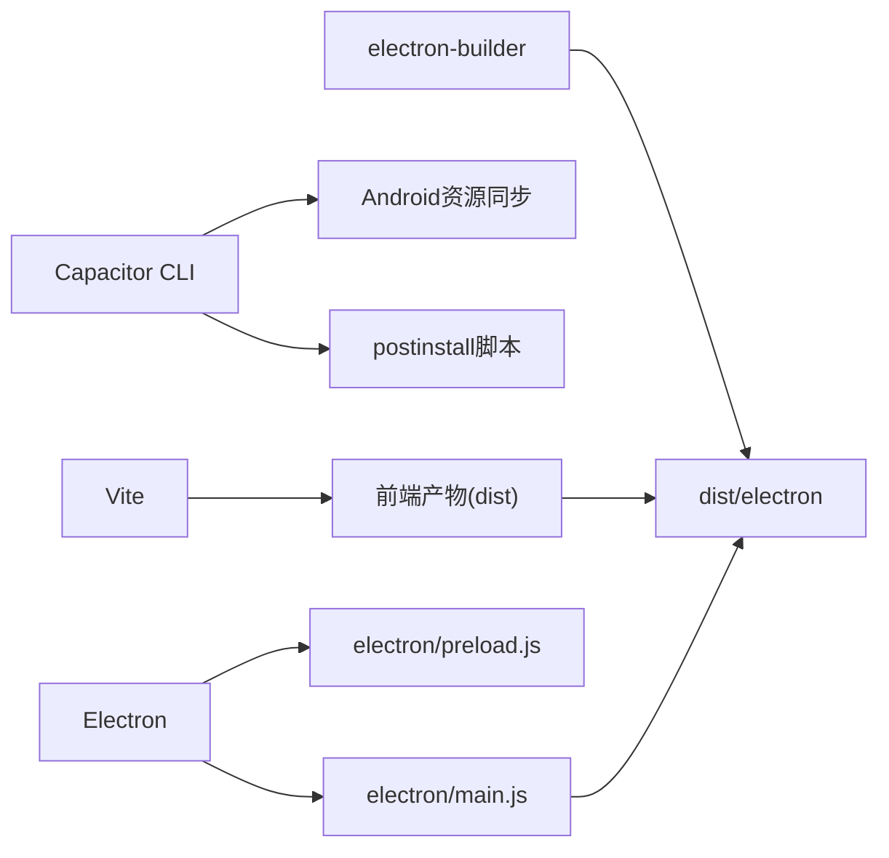

# 跨平台支持

<cite>
**本文引用的文件**
- [package.json](file://package.json)
- [capacitor.config.json](file://capacitor.config.json)
- [vite.config.ts](file://vite.config.ts)
- [index.html](file://index.html)
- [electron/main.js](file://electron/main.js)
- [electron/preload.js](file://electron/preload.js)
- [src/main.ts](file://src/main.ts)
- [src/App.vue](file://src/App.vue)
- [src/components/common/AppHeader.vue](file://src/components/common/AppHeader.vue)
- [src/components/common/AppContent.vue](file://src/components/common/AppContent.vue)
- [src/components/common/AppFooter.vue](file://src/components/common/AppFooter.vue)
- [src/database/index.js](file://src/database/index.js)
- [src/database/adapter.js](file://src/database/adapter.js)
- [scripts/postinstall.js](file://scripts/postinstall.js)
</cite>

## 目录
1. [简介](#简介)
2. [项目结构](#项目结构)
3. [核心组件](#核心组件)
4. [架构总览](#架构总览)
5. [详细组件分析](#详细组件分析)
6. [依赖关系分析](#依赖关系分析)
7. [性能考虑](#性能考虑)
8. [故障排查指南](#故障排查指南)
9. [结论](#结论)
10. [附录](#附录)

## 简介
本项目是一个跨平台金融应用，采用前端技术栈 Vue 3 + TypeScript 构建核心界面，并通过 Capacitor 实现移动端能力与原生插件集成；同时提供 Electron 桌面端运行方式，利用预加载脚本在渲染进程中安全暴露有限的原生能力。项目支持多平台打包与发布，涵盖 Windows、macOS、Linux（桌面端）以及 Android（移动端）。数据库层统一使用 SQLite，通过 Capacitor SQLite（原生）与 sql.js（Web/桌面）两种实现适配不同运行环境。

## 项目结构
项目采用“前端工程 + 平台桥接”的组织方式：
- 前端工程位于 src 目录，使用 Vite 构建，入口为 index.html 和 src/main.ts。
- Capacitor 配置位于根目录，定义应用 ID、名称、Web 目录、插件与平台选项。
- Electron 主进程与预加载脚本位于 electron 目录，负责桌面端窗口与 IPC 通信。
- 数据库抽象位于 src/database，统一处理原生与 Web 环境的 SQLite 访问。
- 构建与发布脚本通过 package.json 的 scripts 字段集中管理，包含 Electron 打包与 Capacitor 同步。

**图表来源**
- [index.html](file://index.html)
- [src/main.ts](file://src/main.ts)
- [src/App.vue](file://src/App.vue)
- [src/components/common/AppHeader.vue](file://src/components/common/AppHeader.vue)
- [src/components/common/AppContent.vue](file://src/components/common/AppContent.vue)
- [src/components/common/AppFooter.vue](file://src/components/common/AppFooter.vue)
- [src/database/index.js](file://src/database/index.js)
- [src/database/adapter.js](file://src/database/adapter.js)
- [capacitor.config.json](file://capacitor.config.json)
- [scripts/postinstall.js](file://scripts/postinstall.js)
- [package.json](file://package.json)
- [vite.config.ts](file://vite.config.ts)
- [electron/main.js](file://electron/main.js)
- [electron/preload.js](file://electron/preload.js)

**章节来源**
- [package.json:1-72](file://package.json#L1-L72)
- [capacitor.config.json:1-23](file://capacitor.config.json#L1-L23)
- [vite.config.ts:1-11](file://vite.config.ts#L1-L11)
- [index.html:1-13](file://index.html#L1-L13)

## 核心组件
- 应用入口与平台检测：src/main.ts 在应用启动时检测是否运行于原生平台，并初始化全局状态与 UI 框架。
- 页面容器与导航：src/App.vue 作为顶层容器，组合头部、内容区、底部导航与侧边菜单，负责组件切换与参数传递。
- 移动端键盘适配：在原生平台挂载时，通过 Capacitor Keyboard 插件设置键盘行为并监听显示/隐藏事件。
- 数据库管理：src/database/index.js 提供统一的数据库连接、查询、执行、批处理与事务接口，自动区分原生与 Web 环境。
- Capacitor 配置：capacitor.config.json 定义应用标识、Web 目录、插件行为与 Android 构建选项。
- Electron 主进程与预加载：electron/main.js 负责窗口创建与生命周期管理，electron/preload.js 通过 contextBridge 安全暴露有限 IPC 能力。

**章节来源**
- [src/main.ts:1-16](file://src/main.ts#L1-L16)
- [src/App.vue:1-195](file://src/App.vue#L1-L195)
- [src/database/index.js:1-800](file://src/database/index.js#L1-L800)
- [capacitor.config.json:1-23](file://capacitor.config.json#L1-L23)
- [electron/main.js:1-70](file://electron/main.js#L1-L70)
- [electron/preload.js:1-7](file://electron/preload.js#L1-L7)

## 架构总览
该应用采用“统一前端 + 平台桥接”的架构：
- 前端层：Vue 3 + TypeScript，组件化设计，响应式布局，适配移动端与桌面端。
- 平台层：Capacitor 提供原生能力（如 SQLite、键盘、SplashScreen），Electron 提供桌面端窗口与 IPC。
- 数据层：统一 SQLite 抽象，原生平台使用 Capacitor SQLite，Web/桌面使用 sql.js 或 Node.js SQLite（由数据库模块内部适配）。
- 构建层：Vite 负责开发与生产构建，Capacitor 同步资源，Electron Builder 负责桌面端打包。

**图表来源**
- [src/App.vue:1-195](file://src/App.vue#L1-L195)
- [src/database/index.js:1-800](file://src/database/index.js#L1-L800)
- [capacitor.config.json:1-23](file://capacitor.config.json#L1-L23)
- [electron/main.js:1-70](file://electron/main.js#L1-L70)
- [package.json:1-72](file://package.json#L1-L72)

## 详细组件分析

### Electron 主进程与预加载
- 主进程职责：创建窗口、加载开发/生产资源、处理窗口生命周期、注册 IPC 事件。
- 预加载脚本：通过 contextBridge 暴露受限 API，仅暴露必要的 IPC 方法，避免直接启用 Node 集成与上下文隔离关闭带来的安全风险。
- 安全建议：当前配置禁用了上下文隔离并启用了 Node 集成，建议在生产环境中重新评估安全策略，尽量减少 Node 集成，开启上下文隔离并通过白名单暴露 API。

**图表来源**
- [electron/main.js:67-69](file://electron/main.js#L67-L69)
- [electron/preload.js:3-6](file://electron/preload.js#L3-L6)

**章节来源**
- [electron/main.js:1-70](file://electron/main.js#L1-L70)
- [electron/preload.js:1-7](file://electron/preload.js#L1-L7)

### Capacitor 集成与平台适配
- 配置项：应用 ID、名称、Web 目录、插件（如 SplashScreen、Keyboard）、Android 构建兼容性（Java 版本）。
- 键盘插件：在原生平台挂载时设置键盘行为并监听显示/隐藏事件，提升移动端输入体验。
- 同步与构建：通过 Capacitor CLI 同步平台资源，postinstall 脚本自动修改第三方插件的 Gradle 配置以匹配 Java 17。

**图表来源**
- [src/App.vue:155-172](file://src/App.vue#L155-L172)
- [capacitor.config.json:14-22](file://capacitor.config.json#L14-L22)
- [scripts/postinstall.js:1-145](file://scripts/postinstall.js#L1-L145)

**章节来源**
- [src/App.vue:1-195](file://src/App.vue#L1-L195)
- [capacitor.config.json:1-23](file://capacitor.config.json#L1-L23)
- [scripts/postinstall.js:1-145](file://scripts/postinstall.js#L1-L145)

### 数据库抽象与平台适配
- 统一接口：提供连接获取、查询、执行、批处理、事务、缓存与持久化等方法。
- 环境适配：原生平台使用 Capacitor SQLite，Web/桌面使用 sql.js；在 Web 环境下通过延迟保存至 localStorage 实现持久化。
- 性能优化：连接复用、查询缓存、索引优化、批处理与事务封装。
- 结构迁移：自动检查并迁移表结构，保证现有用户数据兼容。

**图表来源**
- [src/database/index.js:21-800](file://src/database/index.js#L21-L800)

**章节来源**
- [src/database/index.js:1-800](file://src/database/index.js#L1-L800)
- [src/database/adapter.js:1-34](file://src/database/adapter.js#L1-L34)

### 页面容器与导航
- AppHeader：展示应用标识与用户头像，触发侧边菜单。
- AppContent：动态组件容器，根据当前路由组件进行渲染，并透传参数。
- AppFooter：底部导航，提供主要功能入口。
- App.vue：顶层容器，维护活动菜单、导航参数、日期选择状态，负责组件映射与事件分发。

**图表来源**
- [src/components/common/AppFooter.vue:1-98](file://src/components/common/AppFooter.vue#L1-L98)
- [src/components/common/AppContent.vue:1-51](file://src/components/common/AppContent.vue#L1-L51)
- [src/App.vue:65-172](file://src/App.vue#L65-L172)

**章节来源**
- [src/components/common/AppHeader.vue:1-135](file://src/components/common/AppHeader.vue#L1-L135)
- [src/components/common/AppContent.vue:1-51](file://src/components/common/AppContent.vue#L1-L51)
- [src/components/common/AppFooter.vue:1-98](file://src/components/common/AppFooter.vue#L1-L98)
- [src/App.vue:1-195](file://src/App.vue#L1-L195)

## 依赖关系分析
- 构建与运行：Vite 负责开发与生产构建；Electron 用于桌面端运行；Capacitor 用于移动端能力与资源同步。
- 依赖管理：package.json 定义了 Electron、electron-builder、Capacitor 及其 CLI、Vue 生态与数据库相关依赖。
- 打包配置：electron-builder 通过 package.json 的 build 字段配置目标平台与输出目录。

**图表来源**
- [package.json:7-47](file://package.json#L7-L47)
- [package.json:48-70](file://package.json#L48-L70)
- [vite.config.ts:1-11](file://vite.config.ts#L1-L11)
- [electron/main.js:1-70](file://electron/main.js#L1-L70)
- [electron/preload.js:1-7](file://electron/preload.js#L1-L7)

**章节来源**
- [package.json:1-72](file://package.json#L1-L72)
- [vite.config.ts:1-11](file://vite.config.ts#L1-L11)

## 性能考虑
- 数据库性能：连接复用、查询缓存、索引优化、批处理与事务封装，降低频繁 I/O 对主线程的影响。
- Web 环境持久化：通过延迟保存与节流控制，避免频繁写入 localStorage 导致的卡顿。
- 前端性能：组件按需渲染、动态组件切换、滚动区域隐藏滚动条但保留滚动功能，减少不必要的重绘与回流。
- 构建优化：Vite 目标 ES2015，配合现代浏览器特性提升加载速度。

**章节来源**
- [src/database/index.js:13-18](file://src/database/index.js#L13-L18)
- [src/database/index.js:379-408](file://src/database/index.js#L379-L408)
- [src/components/common/AppContent.vue:43-50](file://src/components/common/AppContent.vue#L43-L50)
- [vite.config.ts:8-10](file://vite.config.ts#L8-L10)

## 故障排查指南
- Electron 预加载安全问题：当前配置禁用了上下文隔离并启用了 Node 集成，存在潜在安全风险。建议在生产环境启用上下文隔离，最小化暴露 API。
- Capacitor Android 构建失败：若遇到 Java 版本或命名空间冲突，请确认 postinstall 脚本已正确修改 Gradle 文件，并确保 Android 构建工具链版本一致。
- 数据库初始化异常：检查数据库模块的连接逻辑与表结构迁移，确保在 Web 环境下 sql.js 正常加载，在原生环境 Capacitor SQLite 已正确初始化。
- 键盘事件未生效：确认在原生平台挂载时已正确初始化 Keyboard 插件并监听事件。

**章节来源**
- [electron/main.js:23-27](file://electron/main.js#L23-L27)
- [scripts/postinstall.js:40-145](file://scripts/postinstall.js#L40-L145)
- [src/database/index.js:80-190](file://src/database/index.js#L80-L190)
- [src/App.vue:155-172](file://src/App.vue#L155-L172)

## 结论
本项目通过 Capacitor 与 Electron 实现了跨平台的一致体验：前端统一、原生能力可选、数据库抽象清晰。建议在生产环境中加强 Electron 预加载脚本的安全策略，完善移动端键盘与系统交互的适配，并持续优化数据库与前端性能，以提升整体稳定性与用户体验。

## 附录
- 构建与发布要点
  - 桌面端：使用 electron-builder，按平台配置输出（NSIS、便携版、DMG、AppImage）。
  - 移动端：通过 Capacitor CLI 同步资源，执行 postinstall 脚本修正第三方插件的构建配置，再进行平台构建。
  - 测试与调试：结合 Vite 开发服务器、Electron 开发模式与 Capacitor Live Reload/Logs 进行联调。
- 平台特定功能实现建议
  - 文件系统访问：在原生平台通过 Capacitor 文件系统插件实现，Web 端可通过下载与导入机制替代。
  - 设备传感器：通过 Capacitor 传感器插件接入，注意权限申请与降级处理。
  - 网络状态：使用 Capacitor 网络插件监听状态变化，结合 UI 提示与离线策略。
- 跨平台测试与调试
  - 使用 Vite Dev Server 进行快速迭代，结合 Electron DevTools 与 Capacitor Dev Mode。
  - 在真实设备上验证触摸交互、键盘行为与数据库性能。
- 部署与发布流程差异
  - 桌面端：打包后分发各平台安装包，必要时进行签名与公证。
  - 移动端：Android 通过 Gradle 构建签名包，iOS 通过 Xcode 或 fastlane 进行签名与分发。