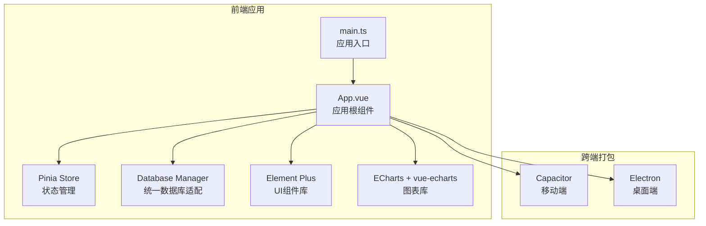
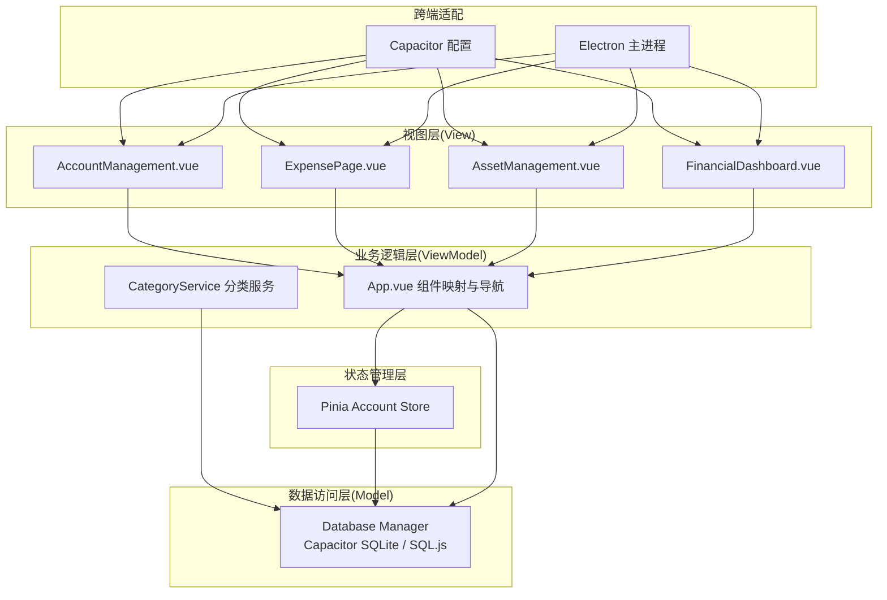
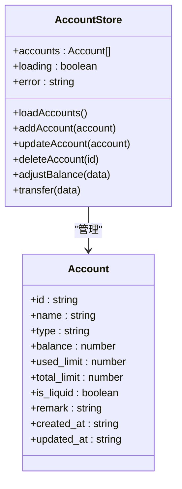
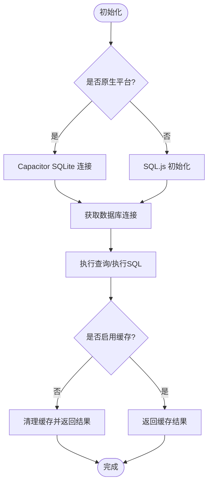
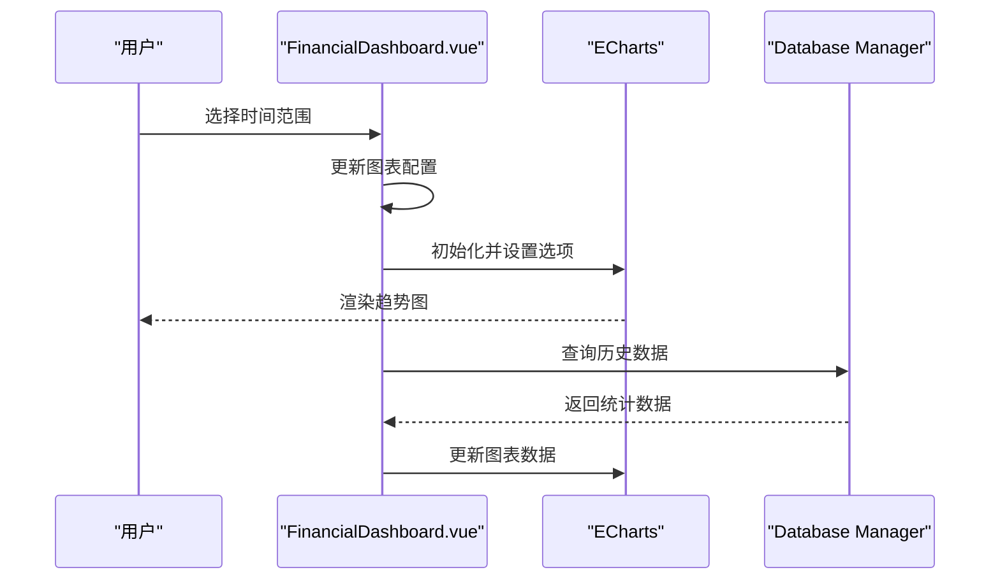
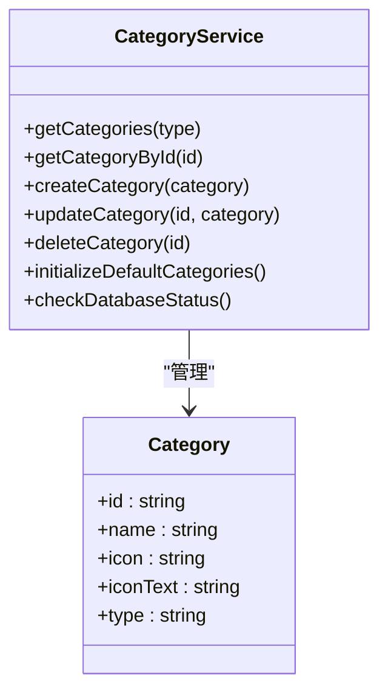
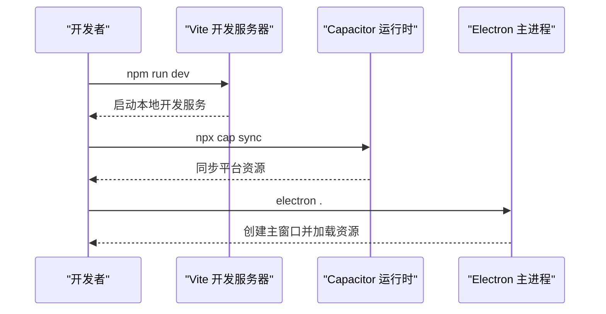
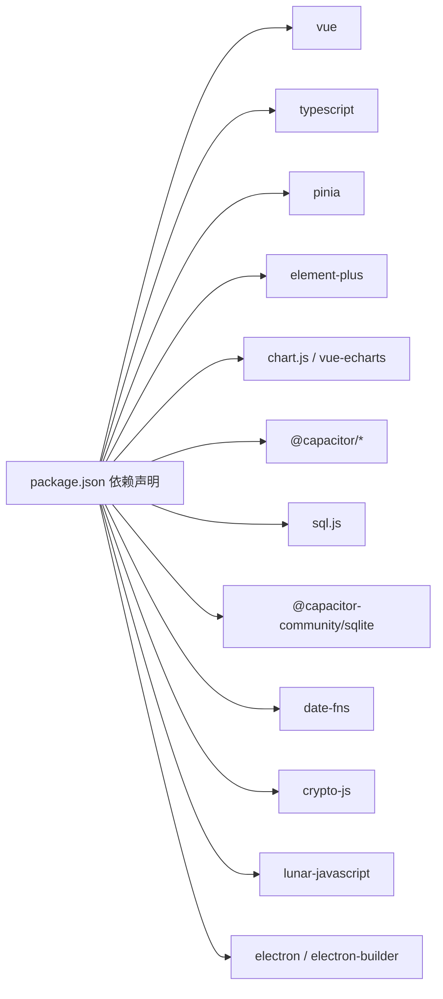

# 项目概述

<cite>
**本文档引用的文件**
- [package.json](file://package.json)
- [capacitor.config.json](file://capacitor.config.json)
- [vite.config.ts](file://vite.config.ts)
- [electron/main.js](file://electron/main.js)
- [src/main.ts](file://src/main.ts)
- [src/App.vue](file://src/App.vue)
- [src/stores/account.ts](file://src/stores/account.ts)
- [src/database/index.js](file://src/database/index.js)
- [src/components/mobile/financial/FinancialDashboard.vue](file://src/components/mobile/financial/FinancialDashboard.vue)
- [src/data/categories.ts](file://src/data/categories.ts)
- [src/services/categoryService.ts](file://src/services/categoryService.ts)
- [src/utils/dictionaries.ts](file://src/utils/dictionaries.ts)
- [src/components/mobile/account/AccountManagement.vue](file://src/components/mobile/account/AccountManagement.vue)
- [src/components/mobile/asset/AssetManagement.vue](file://src/components/mobile/asset/AssetManagement.vue)
- [src/components/mobile/expense/ExpensePage.vue](file://src/components/mobile/expense/ExpensePage.vue)
</cite>

## 目录
1. [简介](#简介)
2. [项目结构](#项目结构)
3. [核心组件](#核心组件)
4. [架构总览](#架构总览)
5. [详细组件分析](#详细组件分析)
6. [依赖关系分析](#依赖关系分析)
7. [性能考虑](#性能考虑)
8. [故障排除指南](#故障排除指南)
9. [结论](#结论)

## 简介
本项目是一个基于 Vue 3 + TypeScript 构建的跨平台财务管理系统，支持桌面端（Electron）和移动端（Capacitor + Cordova）部署。系统围绕个人/家庭财务管理需求，提供账户管理、收支管理、资产管理、负债管理、财务分析等核心功能模块，采用 MVVM 架构与组件化设计，结合 Pinia 状态管理与统一数据库适配层，实现数据持久化与跨端一致体验。

## 项目结构
项目采用“前端单页应用 + 跨端打包”架构：
- 前端核心：Vue 3 + TypeScript + Vite，使用 Composition API 和单文件组件组织业务界面
- 状态管理：Pinia Store 管理账户、收支等业务状态
- 数据持久化：统一数据库适配层，支持 Capacitor SQLite（原生）与 SQL.js（Web）双引擎
- 跨端打包：Capacitor 配置移动端；Electron 配置桌面端
- 图表展示：ECharts + vue-echarts 实现财务可视化

**图示来源**
- [src/App.vue:1-195](file://src/App.vue#L1-L195)
- [src/main.ts:1-16](file://src/main.ts#L1-L16)
- [capacitor.config.json:1-23](file://capacitor.config.json#L1-L23)
- [electron/main.js:1-70](file://electron/main.js#L1-L70)

**章节来源**
- [package.json:1-72](file://package.json#L1-L72)
- [capacitor.config.json:1-23](file://capacitor.config.json#L1-L23)
- [vite.config.ts:1-11](file://vite.config.ts#L1-L11)
- [src/main.ts:1-16](file://src/main.ts#L1-L16)

## 核心组件
- 应用根组件与路由分发：通过 App.vue 的组件映射与导航逻辑，将不同功能页面动态渲染，支持年月维度的数据筛选与页面间参数传递
- 账户管理：提供账户列表、余额调整、内部转账、信用卡与流动资金分类展示
- 收支管理：提供月度统计、周度收支、支出记录与预算组件
- 资产管理：支持通用资产、股票、基金的卡片式展示与交易记录
- 负债管理：负债列表与状态管理（预留）
- 财务分析：财务健康仪表板与净资产增长趋势图
- 数据字典与分类：账户类型、负债类型、还款方式、交易类型等字典管理；收支分类初始化与服务封装

**章节来源**
- [src/App.vue:64-137](file://src/App.vue#L64-L137)
- [src/stores/account.ts:1-273](file://src/stores/account.ts#L1-L273)
- [src/components/mobile/account/AccountManagement.vue:1-650](file://src/components/mobile/account/AccountManagement.vue#L1-L650)
- [src/components/mobile/expense/ExpensePage.vue:1-88](file://src/components/mobile/expense/ExpensePage.vue#L1-L88)
- [src/components/mobile/asset/AssetManagement.vue:1-381](file://src/components/mobile/asset/AssetManagement.vue#L1-L381)
- [src/components/mobile/financial/FinancialDashboard.vue:1-279](file://src/components/mobile/financial/FinancialDashboard.vue#L1-L279)
- [src/data/categories.ts:1-45](file://src/data/categories.ts#L1-L45)
- [src/services/categoryService.ts:1-260](file://src/services/categoryService.ts#L1-L260)
- [src/utils/dictionaries.ts:1-90](file://src/utils/dictionaries.ts#L1-L90)

## 架构总览
系统采用 MVVM + 组件化 + 状态管理的设计理念：
- 视图层（View）：Vue 单文件组件，负责 UI 呈现与交互
- 业务逻辑层（ViewModel）：通过 Composition API 与 Store 抽象页面行为，协调数据与视图
- 数据访问层（Model）：统一数据库适配层，屏蔽 Capacitor SQLite 与 SQL.js 的差异
- 状态管理层：Pinia Store 管理账户、收支等全局状态
- 跨端适配层：Capacitor 配置移动端能力，Electron 配置桌面端窗口与 IPC

**图示来源**
- [src/App.vue:64-137](file://src/App.vue#L64-L137)
- [src/stores/account.ts:27-273](file://src/stores/account.ts#L27-L273)
- [src/services/categoryService.ts:1-260](file://src/services/categoryService.ts#L1-L260)
- [src/database/index.js:21-800](file://src/database/index.js#L21-L800)
- [capacitor.config.json:1-23](file://capacitor.config.json#L1-L23)
- [electron/main.js:1-70](file://electron/main.js#L1-L70)

## 详细组件分析

### 账户管理模块
账户管理模块提供账户列表、余额调整、内部转账、信用卡与流动资金分类展示等功能。核心特性包括：
- 账户余额计算与负债率统计
- 信用卡额度与已用额度管理
- 余额调整与转账事务处理
- 流动资金与其他资金分类展示

**图示来源**
- [src/stores/account.ts:11-273](file://src/stores/account.ts#L11-L273)

**章节来源**
- [src/stores/account.ts:1-273](file://src/stores/account.ts#L1-L273)
- [src/components/mobile/account/AccountManagement.vue:1-650](file://src/components/mobile/account/AccountManagement.vue#L1-L650)

### 数据库适配层
数据库适配层统一处理 Capacitor SQLite（原生）与 SQL.js（Web）两种运行环境，提供连接管理、查询执行、批处理、事务执行与缓存机制，同时支持延迟持久化与索引优化。

**图示来源**
- [src/database/index.js:56-374](file://src/database/index.js#L56-L374)

**章节来源**
- [src/database/index.js:1-935](file://src/database/index.js#L1-L935)

### 财务分析模块
财务分析模块提供财务健康仪表板与净资产增长趋势图，支持多时间粒度切换与状态分级展示。

**图示来源**
- [src/components/mobile/financial/FinancialDashboard.vue:77-170](file://src/components/mobile/financial/FinancialDashboard.vue#L77-L170)
- [src/database/index.js:199-264](file://src/database/index.js#L199-L264)

**章节来源**
- [src/components/mobile/financial/FinancialDashboard.vue:1-279](file://src/components/mobile/financial/FinancialDashboard.vue#L1-L279)

### 分类与字典管理
分类与字典管理模块提供默认分类初始化、分类 CRUD、字典数据集中管理，支撑收支分类与业务枚举的一致性。

**图示来源**
- [src/services/categoryService.ts:8-260](file://src/services/categoryService.ts#L8-L260)
- [src/data/categories.ts:1-45](file://src/data/categories.ts#L1-L45)
- [src/utils/dictionaries.ts:1-90](file://src/utils/dictionaries.ts#L1-L90)

**章节来源**
- [src/services/categoryService.ts:1-260](file://src/services/categoryService.ts#L1-L260)
- [src/data/categories.ts:1-45](file://src/data/categories.ts#L1-L45)
- [src/utils/dictionaries.ts:1-90](file://src/utils/dictionaries.ts#L1-L90)

### 跨端打包与启动流程
- Capacitor：通过配置文件定义应用标识、Web 目录、插件与 Android 构建选项；在移动端运行时初始化键盘与启动画面插件
- Electron：主进程负责创建窗口、加载开发/生产资源、处理窗口生命周期与 IPC 通信

**图示来源**
- [package.json:7-17](file://package.json#L7-L17)
- [capacitor.config.json:1-23](file://capacitor.config.json#L1-L23)
- [electron/main.js:19-45](file://electron/main.js#L19-L45)

**章节来源**
- [package.json:1-72](file://package.json#L1-L72)
- [capacitor.config.json:1-23](file://capacitor.config.json#L1-L23)
- [electron/main.js:1-70](file://electron/main.js#L1-L70)

## 依赖关系分析
项目关键依赖与作用：
- Vue 3 + TypeScript：构建响应式单页应用
- Element Plus：提供企业级 UI 组件
- Pinia：轻量级状态管理
- Chart.js / vue-echarts：图表可视化
- @capacitor/*：跨端能力与原生插件
- sql.js：Web 环境下的嵌入式数据库
- @capacitor-community/sqlite：原生 SQLite 连接
- date-fns：日期处理
- crypto-js：加密工具
- lunar-javascript：农历工具
- electron / electron-builder：桌面端打包与发布

**图示来源**
- [package.json:19-47](file://package.json#L19-L47)

**章节来源**
- [package.json:1-72](file://package.json#L1-L72)

## 性能考虑
- 数据库连接与并发：数据库适配层采用单例连接与连接状态标记，避免重复连接与竞态
- 查询缓存：查询结果缓存与键值管理，减少重复查询开销
- 批处理与事务：批量执行与事务封装，保证数据一致性与性能
- Web 环境持久化：SQL.js 延迟保存至 localStorage，降低频繁写入成本
- 移动端键盘优化：Capacitor 键盘插件禁用自动调整，减少布局抖动
- 图表渲染：ECharts 按需初始化与配置更新，避免不必要的重绘

[本节为通用性能建议，无需特定文件引用]

## 故障排除指南
- 数据库连接失败：检查 Capacitor SQLite 插件初始化与连接一致性校验；若失败回退至内存模式并提示用户
- SQL 执行异常：捕获并抛出带明确错误信息的异常，便于定位问题
- Web 环境持久化失败：捕获保存异常并记录日志，不影响应用继续运行
- 转账事务回滚：在转账过程中如提交失败则尝试回滚，确保数据一致性
- Electron 窗口加载失败：检查开发/生产环境资源路径与预加载脚本配置

**章节来源**
- [src/database/index.js:420-776](file://src/database/index.js#L420-L776)
- [src/stores/account.ts:191-270](file://src/stores/account.ts#L191-L270)

## 结论
本项目以 Vue 3 + TypeScript 为核心，结合 Pinia 状态管理与统一数据库适配层，实现了账户、收支、资产、负债与财务分析等核心功能模块。通过 Capacitor 与 Electron 的跨端打包策略，满足桌面端与移动端的部署需求。整体架构清晰、模块职责明确、数据持久化与跨端兼容性良好，适合进一步扩展更多财务场景与报表分析能力。